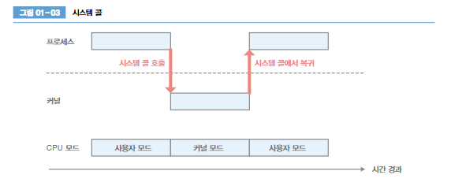

# 그림으로 배우는 리눅스 구조

## 커널
- `커널모드`와 `사용자 모드`를 통해 프로세스의 저장 장치 접근을 제한 -- 명령 실행 순서 제어를 위하여
- 사용자 모드에서 실행되는 프로세스는 `사용자 공간`에서 프로세스를 실행
- `커널모드` 로 동작하면 시스템 자원 관리 및 배분 기능을 제공

## 시스템 콜
- 프로세스가 커널에 처리를 요청
    - 프로세스 생성,삭제
    - 메모리 확보,해제
    - 통신 처리
    - 파일 시스템 조작
    - 장치 조작

- 시스템 콜을 호출하면 예외라는 이벤트 발생
- 사용자 모드에서 커널 모드로 변경

- strace 함수를 이용하여 시스템 콜 내용을 확인 할 수 있다.
