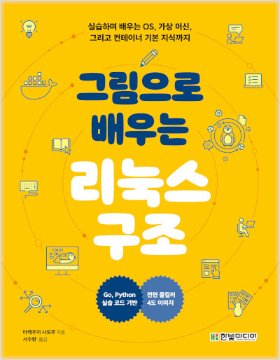
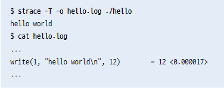
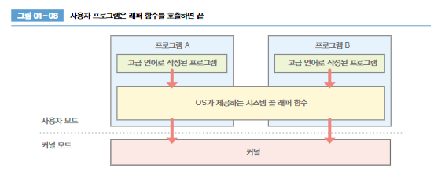
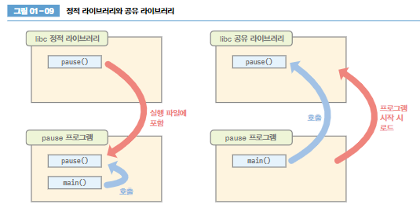
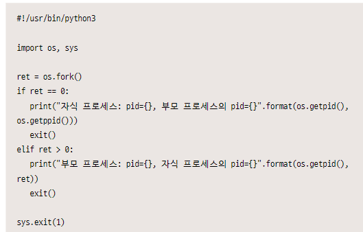

# 그림으로 배우는 리눅스 구조

## 커널
- `커널모드`와 `사용자 모드`를 통해 프로세스의 저장 장치 접근을 제한 -- 명령 실행 순서 제어를 위하여
- 사용자 모드에서 실행되는 프로세스는 `사용자 공간`에서 프로세스를 실행
- `커널모드` 로 동작하면 시스템 자원 관리 및 배분 기능을 제공

## 시스템 콜
- 프로세스가 커널에 처리를 요청
    - 프로세스 생성,삭제
    - 메모리 확보,해제
    - 통신 처리
    - 파일 시스템 조작
    - 장치 조작

    - 
- 시스템 콜을 호출하면 예외라는 이벤트 발생
- 사용자 모드에서 커널 모드로 변경

- strace 함수를 이용하여 시스템 콜 내용을 확인 할 수 있다.

- tasket -c 논리cpu번호 명령어
- %system 비율을 통해 cpu모드 시간 존재 확인

- 시스템 콜 소요 시간 확인

## 라이브러리
- C 언어 표준 라이브러리 gilbc 혹은 libc 를 리눅스 에서 활용

### 시스템 콜 래퍼 함수
- getppid() 함수 같이 libc 라이브러리에서 지원

- 콜래퍼 함수 지원으로 호환 문제 없음
- 없다면 각 프로그램에서 어셈블리 언어로 직접 작성하여 시스템 콜 호출 해야함 (아키텍처를 변경 시 동작 보장 못함)

### 정적 라이브러리, 동적(공유) 라이브러리

- 라이브러리 함수를 프로그램에 가져오면 정적
  - 용량이 커짐
- 링크로 이어서 사용한다면 동적
  - 용량이 상대적으로 작다
  - 라이브러리 문제 시 수정된 동적 라이브러리로 교체만 하면 해결 가능

# 프로세스 관리

## 프로세스 생성

- fork() 함수 이용
- 부모프로세스는 자신의 프로세스 id 와 자식 프로세스 id를 출력 후 종료, 자식프로세스는 자신 프로레스id 출력 종료

- ret ==0 인 경우는 자식프로세스가 실행, 부모프로세스 id 부르는 함수 getppid() 호출
- ret >0 일 때는 부모프로세스가 실행, ret 에 자식프로세스 id가 저장되어 있다.

