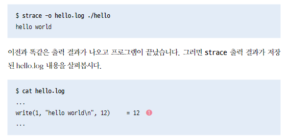
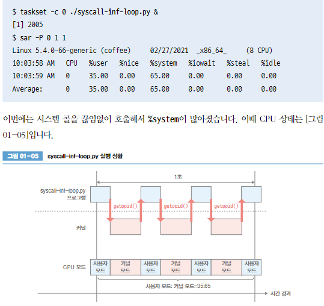
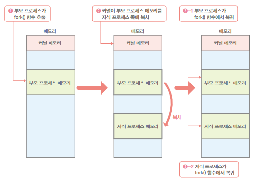
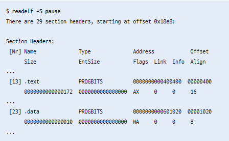
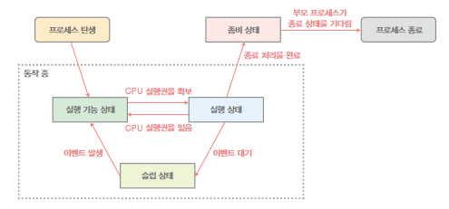

# 그림으로 배우는 리눅스 구조

## 커널
- `커널모드`와 `사용자 모드`를 통해 프로세스의 저장 장치 접근을 제한 -- 명령 실행 순서 제어를 위하여
- 사용자 모드에서 실행되는 프로세스는 `사용자 공간`에서 프로세스를 실행
- `커널모드` 로 동작하면 시스템 자원 관리 및 배분 기능을 제공

## 시스템 콜
- 프로세스가 커널에 처리를 요청
    - 프로세스 생성,삭제
    - 메모리 확보,해제
    - 통신 처리
    - 파일 시스템 조작
    - 장치 조작

    - 
- 시스템 콜을 호출하면 예외라는 이벤트 발생
- 사용자 모드에서 커널 모드로 변경

- strace 함수를 이용하여 시스템 콜 내용을 확인 할 수 있다.

- tasket -c 논리cpu번호 명령어
- %system 비율을 통해 cpu모드 시간 존재 확인

- 시스템 콜 소요 시간 확인

## 라이브러리
- C 언어 표준 라이브러리 gilbc 혹은 libc 를 리눅스 에서 활용

### 시스템 콜 래퍼 함수
- getppid() 함수 같이 libc 라이브러리에서 지원

- 콜래퍼 함수 지원으로 호환 문제 없음
- 없다면 각 프로그램에서 어셈블리 언어로 직접 작성하여 시스템 콜 호출 해야함 (아키텍처를 변경 시 동작 보장 못함)

### 정적 라이브러리, 동적(공유) 라이브러리

- 라이브러리 함수를 프로그램에 가져오면 정적
  - 용량이 커짐
- 링크로 이어서 사용한다면 동적
  - 용량이 상대적으로 작다
  - 라이브러리 문제 시 수정된 동적 라이브러리로 교체만 하면 해결 가능

# 프로세스 관리

## 프로세스 생성

### fork()

- fork() 함수 이용
- 부모프로세스는 자신의 프로세스 id 와 자식 프로세스 id를 출력 후 종료, 자식프로세스는 자신 프로레스id 출력 종료

- ret ==0 인 경우는 자식프로세스가 실행, 부모프로세스 id 부르는 함수 getppid() 호출
- ret >0 일 때는 부모프로세스가 실행, ret 에 자식프로세스 id가 저장되어 있다.

### execve()
- execve() 함수 호출한곳의 메모리를 새로운 파일로 대체 하는 함수

#### execve() 실행 시 보유 데이터
- 프로그램 코드와 코드 영역의 파일 오프셋,크기 및 메모리 맵 시작 주소
- 데이터 영역의 파일 오프셋, 크기 및 메모리 맵 시작 주소
- 최초로 실행할 명령의 메모리 주소

- 프로그램의 데이터 저장 위치 및 오프셋등 정보를 확인 가능하다.

### ASLR
- -no-pie 옵션으로 aslr을 통한 프로그램 실행할 때마다 각 섹션을 다른 주소에 맵핑하는 것을 멈춤
- aslr 을 통해 공격 대상 코드나 데이터가 고정된 특정 주소에 존재한다는 조건의 공격이 어려워짐

## 프로세스의 부모 자식 관계

- systemd pid=1 부모 프로세스로 부터 자식프로세스들이 생성된 것을 확인 가능

### fork 함수 와 execve 함수 동시 작동
- posix_spawn() 라는 POSIX c언어 인터페이스 규격 활용
- 하지만 fork 함수 와 execve 함수 동시 작동 하는 경우가 아니라면 사용 피할 것

## 프로세스 상태

- 프로세스는 실행 후 이벤트 발생 전까지 `슬립상태`
- ps aux  --> stat 이 S 로 시작하면 슬립상태
- stat 이 R 로 시작하면 실행 상태
- 프로세스를 종료하면 좀비 상태(stat z)가 되어 있다가 소멸

- 모든 프로세스들이 슬립 상태 일때는 cpu는 `idle process` 를 실행 중
- cpu 소비 전력을 감소상태로 유지 한다.

## 프로세스 종료
- exit() 함수 호출 하면 exit_group() 시스템 콜 호출
- 프로세스가 종료하면 부모 프로세스는 wait() 호출 후 다음 정보를 얻는다
  - 프로세스 반환값, 함수의 인수를 256으로 나눈 나머지와 같다
  - 시그널에 따라 종료 여부
  - 종료할 때 까지 cpu 시간 정보

## 좀비 프로세스, 고아 프로세스
- 좀비 프로세스 : 부모가 종료 상태를 확인하지 않은 자식 프로세스 
  - 좀비 프로세스가 대량 존재한다면 부모 프로세스의 버그를 체크하는게 좋다
- 고아 프로세스 : 부모 프로세스는 종료되고 자식 프로세스는 남은 상태
  - 커널은 init을 부모 프로세스로 새로 지정해줌

## 시그널
- 어떤 프로세스가 다른 프로세스에 신호를 보내서 외부에서 실행 순서를 강제로 바꾸는 것
  - SIGINT : ctrl + c 누르면 프로세스 종료
  - KILL -INT <PID> : 해당 pid 종료
  - SIGCHLD : 자식 프로세스 종료 시 부모 프로세스에 보내는 시그널
  - SIGSTOP : 프로세스 실행 일시 정지 , ctrl + z
  - SIGCONT : 정지한 프로세스 실행을 재게
-  시그널 핸들러 : 프로세스는 미리 등록해놓으며, 해당하는 시그널을 수신하면 실행 중인 처리 중단 후, 시그널 핸들러에 등록한 처리를 동작 하고 다시 원래 동작 개시
- 시그널을 무시하도록 설정도 가능  `signal.siganl(signal.SIGIN,signal.SIG_IGN)` -- SIGINT 시그널 무시 설정
- SIGKILL : 프로세스 종료의 최후 수단
  - uninterruptible sleep 상태 (stat D)의 프로세스는 sigkill 로 종료가 안되는 상태 (손 쓸 방법이 없는 상태)

