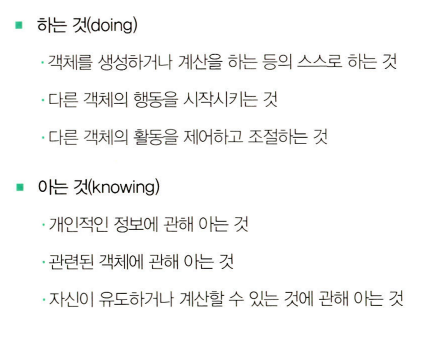

# 객체지향의 사실과 오해

- 객체 : 역할 책임 협력
- 역할과 책임은 유사한 것이 아닌가? 라고 생각 할 쯤에 책에서 역할이 있으면 책임을 지닌다 라는 묘사를 해줘서 역시나 했다.
- 객체간 협력은 요청과 응답의 과정
- 객체들은 동일한 역할을 할수도 있고 역할은 대체 가능해야 한다.
- 상태와 행동은 중요 :  상태를 저장 해서 그 이전에 했던 과정을 모두 기억하지 않아도 된다.
- 행동을 통해 상태를 바꾸면서 진행
- 변하지 않는 프로피티와 변하는 프로피티 값
- 객체의 프로피티에는 단순값 속성과 객체를 참조하는 링크로 구분 가능
- 객체간의 메세지는 곧 캡슐화를 보장한다. (외부에 자신의 상태 변경을 알 수 없기 때문이다.)
- 캡슐화는 객체의 자율성을 높여 객체간의 협력을 추구하게 한다.

***

- 객체는 식별자로 구분 가능 하고 식별의 기준이 되는 프로피티를 식별자라 함
- 동일성 : 식별자가 같다
- 동등성 : 상태가 같다
- 객체는 상태를 가지며 변화 가능, 행동에 따라 상태 변화, 객체는 어떤 상황에도 식별가능
- 객체는 상태가 아닌 행동을 우선시해서 만들어야함 -- 캡슐화와 재사용성을 향상
- 객체는 현실세계의 은유지 모방이 아니다
- 은유는 곧 추상화 -- 물체들의 공통점을 찾고 중요한 부분을 강조 (차이점은 일반화로 단순하게, 불필요한 세부사항 제거)
- 공통점을 묶는 것이 중요함
***

추상화 
- 그룹으로 나누기 - 개념을 기준으로 분류 , 객체는 그 개념의 인스턴스 ,  
    - 개념 : 심볼 : 이름 , 내연 : 구체적 설명, 외연 : 객체 집합들
  
- 분류 : 객체에 특정한 개념을 적용하는 작업 --> 개념 적용시 그 객체를 특정한 집합의 멤버로 분류하고 있는 것 (추상화의 도구)

***

- 타입은 개념, 어떤 객체에 타입을 적용할 수 있을 때 그 객체를 타입의 인스턴스라고 한다.
#### 데이터 타입
- 메모리 안에 저장된 데이터 종류를 분류하는 데 사용하는 메모리 집합에 관한 메타데이터

#### 객체와 타입
- 객체가 어떤 타입에 속하는지는 수행하는 행동에 따라 정해진다
-  객체 내부적인 표현은 외부에 숨긴다.
- 같은 타입에 객체는 행동만 동일하다면 데이터가 달라도 된다.
- 동일한 행동은 동일한 책임, 동일한 책임은 동일한 메세지 수신을 의미
- 동일한 메세지를 수신하더라도 내부 표현방식이 다르다 --> 다형성을 이용한다.
- 객체가 외부에 제공해야 하는 책임을 먼저 결정 할 것 그후에 데이터

#### 일반화 특수화 관계
- 일반적인 개념은 범위가 넓지만, 특수화는 범위가 더 좁아도 추가적인 행동을 가지는것

#### 타입은 정적 모델
- 객체 다이어그램은 객체가 특정 시점에서의 상태를 보여준다 --> 동적 모델
- 타입 다이어그램은 객체가 가질 수 있는 모든 상태와 모든 행동을 시간과 독립적으로 표현 --> 정적 모델

#### 클래스는 타입을 표현하는 방법 중 하나
- 객체를 분류하는 기준은 타입, 타입의 기준은 객체가 수행하는 행동, 타입을 구현하는 한 가지 방법이 클래스

#### 객체를 만들 때는 조화를 이루며 상호작용하는 객체를 창조하는 게 중요
- 객체를 하나 떼어놓고 봤을 때 이상하더라도 협력을 이루게 만드는게 중요

#### 요청에 대한 필요한 지식과 행동 방식이 있기에 가능하다
- 요청과 응답은 협력에 참여하는 객체가 수행할 책임을 정의

#### 어떤 대상에 대한 요청은 그 대상이 요청을 처리할 책임이 있음을 암시

### 객체의 책임 두가지 범주

#### 책임은 객체의 공용 인터페이스를 구성

#### 객체가 다른 객체에게 책임을 수행하도록 요청을 보내는 것 : 메세지 전송

#### 책임의 집합 : 역할
- 한 역할에는 다양한 객체가 들어갈 수 있으며, 추상화로 생각 할 수 있다.
- 객체는 다양한 역할을 맡을 수 있다.
- 역할은 다른 객체가 대체 가능한 것이다
- 단순성 유연성 재사용성을 뒷받침

#### 객체지향 설계 기법
- 책임 주도 설계
  - 시스템의 기능을 작은 규모의 책임으로 분할 하여 객체에 할당
  - 객체의 책임과 상호작용에 집중

- 디자인 패턴
  - 반복적으로 발생하는 문제와 그 문제에 대한 해법의 쌍으로 정의
  - 역할 책임 협력의 템프릿

- 테스트 주도 개발
  - 기본 흐름을 실패하는 테스트를 작성하고, 테스트를 통과하는 가장 간단한 코드를 작성한 후, 리팩터링을 통해 중복 제거 기법
  - 책임을 수행하는 객체의 협력과 결과의 기대를 코드의 형태로 작성 후 테스트

#### 자율적인 책임
- 객체의 메세지는 수신자 객체의 책임을 부여
- 너무 구체적이면 자율성이 배제 된다.
- 너무 추상적이면 책임을 실행하기 힘들다
- 자율적인 책임은 무엇을 하는지 설명 하는 방향

#### 메시지
- 수신자,메시지 이름과 인자를 묶어 전달
- 객체들이 협력하기 위한 유일한 의사소통 수단

#### 메서드
- 메시지를 처리하는 방법
- 무엇이 실행되기를 명시
- 메시지를 처리할 수 있다고 판단되면 책임을 다하기 위해 메서드 선택

#### 다형성
- 송신자 관점에서 다형적인 수신자들을 구별할 필요가 없음
- 수신자의 종류는 상관 없이 메시지의 책임을 질 수 있다는 게 중요
- 메시지에 대한 결합도를 낮춤
- 협력이 유연해지며 확하기 쉬우며 재사용 가능

#### 다시 한 번 메시지
- 메시지를 주고 받는 객체들 커뮤니케이션에 초점을 맞추는 것이 중요
- 메시지가 개체를 선택하게 구성
- 도움이 필요하면 어떤 메시지가 필요한지 결정, 수신하기에 적합한 객체 선택
- 메시지가 수신자의 책임을 결정
 

#### 인터페이스
- 사용법만 안다면 내부 구조 몰라도 된다
- 내부구성 및 작동 방식만을 변경하는 것은 인터페이스 사용자에게 아무 영향을 주지 않는다
- 대상이 변경되어도 영향 없다

#### 공용 인터페이스
- 외부에 노출되어 있는 인터페이스
- 객체가 외부로부터 수신할 수 있는 메시지의 목록

#### 인터페이스 관련 객체지향의 세가지 원칙
- 추상적인 인터페이스 
- 최소 인터페이스 : 외부에서 사용 할 필요 없는 인터페이스를 최대한 노출하지 말것
- 인터페이스와 구현의 차이를 인지

#### 구현
- 공용 인터페이스에 포함되지 않는 것들

#### 객체가 수행하는 메시지는 간단 추상적이게

#### 기능이 우선이 아닌 구조가 우선이게 설졔 할것

#### 기능과 구조를 구별 할 것
- 기능 : 유스케이스 모델
- 구조 : 도메인 모델 : 도메인(사용자가 프로그램을 사용하는 대상 분야)
  - 디자인 모델, 사용자 모델, 두개의 총합 시스템(최종 제품) ---- 사용자 모델이 최대한 반영되도록 노력할 것

#### 현실과 객체의 차이 : 표현적 차이
- 도메인 객체들은 현실의 은유 (사용자가 도메인에 대해 생각하는 개념 -- 멘탈 모델 : 자신이 상호작용하는 사물들에 대해 갖는 모형)

#### 유스케이스는 사용자 목표가 핵심
- 사용자와 시스탐 간 상호작용을 보여주는 텍스트
- 여러 시나리오들의 집합
- 시나리오 : 유스케이스 인스턴스
- 유스케이스는 기능 설명일 뿐 객체로 만드는 건 우리가 할 일

#### 책임 주도 설계 방벙 --> 유스케이스와 도메인 모델 조합 (꼭은 아니다)
- 사용자 관점에서 시스템 기능명시
- 사용자와 설계자가 공유하는 안정적인 구조를 기반으로 기능을 책임으로 변환

#### 도메인 모델의 목표
- 사람들이 동일한 용어와 동일한 개념을 이용해 의사소통하고 코드로부터 도메인 모델을 유추 할 수 있게 하는것

- 도메인 모델과 코드를 밀접하게 연관시키기

### 객체지향 설계 세가지 관점
- 개념 관점 : 설계는 도메인 안에 존재하는 개념과 개념들 사이의 관계 표현
- 명세 관점 : 소프트웨어의 객체들 초점, 인터페이스
- 구현 관점 : 객체들이 책임을 수행하는데 필요한 동작하는 코드 작성

## 인터페이스와 구현 분리
- 도메인 개념 아래에서 명세와 구현을 분리  