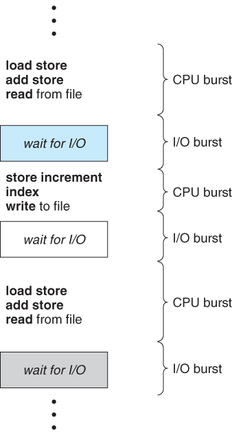

# 스케쥴링

## cpu 스케쥴링이란 
- CPU가 다음에 수행할 프로세스의 실행 순서를 정하는 것을 의미

## CPU-입/출력 버스트 사이클(CPU-I/O Burst Cycle)
- 프로세스 실행은 CPU 실행과 입/출력 대기의 사이클로 구성

## CPU 스케줄러(CPU Scheduler)
- CPU 스케줄러는 실행 준비가 되어 있는 프로세들 중에서 하나를 선택하여 CPU에게 할당해주는 역할을 수행
- 스케줄러는 실행 준비(ready)가 되어 있는 메모리 내의 프로세스들 중에서 선택하여, 이들 중 하나에게 CPU를 할당

## 선점 스케줄링(Preemptive Scheduling)과 비선점 스케줄링(Non-Preemptive Scheduling)

### 비선점 스케줄링
- CPU가 현재 실행중인 프로세스가 완료될때까지 다른 프로세스들은 대기하는 스케줄링
- 현재 실행중인 프로세스가 종료되거나 입/출력을 위하여 대기 상태(wating state)로 들어가는 경우에만 다른 프로세스들이 실행할 수 있습니다

### 선점 스케줄링
- CPU가 현재 프로세스를 실행중일때 스케줄러에 의해 현재 프로세스의 CPU 제어권을 다른 프로세스한테 넘기는 스케줄링
- 실행중인 프로세스가 다른 프로세스에게 CPU 제어권을 선점당하면 Running 상태에서 Ready 상태로 변하고 입/출력을 위하여 대기 중인 상태에서 다른 프로세스가 CPU를 선점하면 Ready 상태로 전환

#### 프로세스의 4가지 상황에 따른 CPU 스케줄링 결정
1. 한 프로세스가 실행 상태에서 대기 상태로 전환 될 때(예를 들어, 입/출력 요청 등)
2. 프로세스가 실행 상태에서 준비 완료 상태로 전환 될 때(예를 들어 다른 프로세스의 인터럽트 발생)
3. 프로세스가 대기 상태에서 준비 완료 상태로 전환 될 때(예를 들어, 입/출력의 종료)
4. 프로세스가 종료할 때

## 디스패처(Dispatcher)
-  CPU의 제어를 단기 스케줄러가 선택한 프로세스에게 주는 모듈
  - 문맥을 교환 (Context Switching)
  - 사용자 모드로 전환
  - 프로그램을 다시 시작하기 위해 사용자 프로그램의 적절한 위치로 이동(jump)

### 디스패치 지연(dispatch latency)
- 디스패처가 하나의 프로세스를 정지하고 다른 프로세스의 수행을 시작하는 데까지 소요되는 시간

##  스케줄링 기준(Scheduling Criteria)
- **CPU 이용률(CPU Utilization)** : CPU 이용률은 0에서 100%까지 이릅니다. 실제 시스템에서는 40%~90%까지의 범위를 가져야 합니다.
- **처리량(Throughput)** : 처리량은 단위 시간당 완료된 프로세스의 개수입니다. 긴 프로세스의 경우에는 이 비율은 시간 당 한 프로세스가 될 수도 있고, 짧은 트랜잭션인 경우 처리량은 초 당 10개의 프로세스가 될 수도 있습니다.
- **총처리 시간(Turnaround Time)** : 총처리 시간은 프로세스의 제출 시간과 완료 시간의 간격입니다. 즉, 메모리에 들어가기 위해 기다리며 소비한 시간과 준비 완료 큐에서 대기한 시간, CPU에서 실행하는 시간, 입/출력 시간을 합한 시간입니다.
- **대기 시간(Wating Time)** : 대기 시간은 준비 완료 큐에서 대기하면서 보낸 시간의 합입니다.
- **응답 시간(Response Time)** : 응답 시간은 하나의 요구를 제출한 후 첫번째 응답이 나올 때까지의 시간입니다.

#### CPU 이용률과 처리량을 최대화하고 총처리 시간, 대기시간, 응답시간을 최소화하는 것이 바람직

*** 
 
 

# 스케줄링 알고리즘

## 선입 선처리 스케줄링(First-Come, First-Served Scheduling)
- 선입선출 큐 자료구조에서 제일 앞에 있는 프로세스부터 처리하는 스케줄링 알고리즘
- `호송 효과(Convoy Effect)` : 만약 수행시간이 긴 프로세스가 먼저 도착한다면 뒤에 아무리 프로세스 수행시간이 짧은 프로세스가 오더라도 선입선처리 정책때문에 수행시간이 짧은 프로세스는 긴 프로세스가 끝날때까지 대기, cpu의 효율 감소
- 비선점형(Non-Preemptive)

## 최단 작업 우선 스케줄링(Shortest-Job-First Scheduling)
- CPU가 이용 가능해지면, 가장 작은 다음 CPU 버스트를 가진 프로세스에게 할당
- 만약 길이가 동일하다면 선입 선처리 스케줄링을 적용
- SJF 알고리즘의 어려움은 다음 CPU 요청의 길이를 파악하는 것
- SJF 스케줄링은 선점형이거나 또는 비선점형일 수 있다
  -  앞의 프로세스가 실행되는 동안 새로운 프로세스가 준비 완료 큐에 도착하면 선택이 발생
  - 선점형 알고리즘은 잔여 시간이 짧은 프로세스가 cpu를 선점할 것이고, 반면에 비선점형 SJF 스케줄링은 현재 실행하고 있는 프로세스가 자신의 CPU 버스트를 끝날 때까지 지속한다.

## 우선순위 스케줄링(Priority Scheduling)
-  각각의 프로세스들은 우선순위를 가지고 있으며 가장 높은 우선순위를 가진 프로세스에게 CPU 권한을 할당
### 내부적 우선순위 정의 기준
- 시간 제한
- 메모리 요구
- 열린 파일의 수
- 평균 입/출력 버스트의 평균 CPU 버스트에 대한 비율

### 외부적 우선순위 정의 기준
#### 우선순위 스케줄링의 선점형/비선점형
- 선점형 우선순위  스케줄링 알고리즘은 새로 도착한 프로세스의 우선순위가 현재 실행되는 프로세스의 우선순위보다 높다면 CPU를 선점합니다. 비선점형 우선순위 스케줄링 알고리즘은 단순히 준비 완료 큐의 머리 부분에 새로운 프로세스를 넣습니다. 

### 우선순위 스케줄링 알고리즘의 문제점
- 주요 문제는 `무한 봉쇄(indefinite blocking)` 또는 `기아 상태(starvation)`
- 낮은 우선순위 프로세스들이 CPU를 무한히 대기하는 경우가 발생
- 해결방안 : 낮은 우선순위의 프로세들을 무한히 봉쇄하는 문제에 대한 한 해결 방안은 `노화(aging)`이 있습니다. 노화란 오랫동안 시스템에서 대기하는 프로세스들의 우선순위를 점진적으로 증가시키는 기법

 
 

## 라운드 로빈 스케줄링(Round-Robin Scheduling)
-  선입 선처리(FCFS) 스케줄링과 유사하지만 프로세스들 사이를 옮겨다니기 위해 선점이 추가된 스케줄링
- `시간 할당량(time quantum)` 또는 `시간 조각(time slice)`이라고 하는 작은 단위의 시간을 정의
- CPU 스케줄러는 준비 완료 큐를 돌면서 한번에 한 프로세스에게 한번의 시간 할당량 동안 CPU를 할당

### 프로세스의 CPU 버스트 길이가 시간 할당량 보다 짧은 경우
- 프로세스 자신이 CPU를 자발적으로 방출
- 스케줄러는 준비 완료 큐에 있는 다음 프로세스로 진행함

### 프로세스의 CPU 버스트 길이가 시간 할당량 보다 긴 경우
- 타이머가 끝나면 운영체제에게 인터럽트를 발생시킴
- 문맥 교환(Context Swtich) 수행
- 실행하던 프로세스는 준비 완료 큐의 꼬리(tail)에 넣음

#### 라운드 로빈 스케줄링 방식하의 평균 대기 시간은 종종 길어질 수 있습니다
#### 라운드 로빈 스케줄링의 성능은 시간 할당량의 크기에 매우 많은 영향을 받습니다
 
 

##  다단계 큐 스케줄링(Multilevel Queue Scheduling)
- 준비 완료 큐를 다수의 별도의 큐로 분류하여 수행하는 방식     -- (메모리 크기, 프로세스의 우선순위 혹은, 프로세스 유형(포어그라운드, 백그라운드)과 같은 특성에 따라 다수의 큐 중 한 개의 큐에 영구적으로 할당)
- 프로세스들간의 우선순위를 정의하고 각 우선순위간의 큐를 생성하여 수행하는 방식
- 높은 우선순위의 큐의 프로세스가 비어있지 않으면 낮은 우선순위 큐의 프로세스는 실행될 수 없습니다.
- 일반적으로 프로세스들이 시스템 진입 시에 영구적으로 하나의 큐에 할당, 프로세스들은 한 큐에서 다른 큐로 이동하지 못합니다
- 적은 스케줄링 오버헤드가 장점이지만 융통성이 적다는 단점이 존재

## 다단계 피드백 큐 스케줄링(Multilevel Feedback Queue Scheduling)
-  프로세스가 큐들 사이로 이동하는 것을 허용
-  어떤 프로세스가 CPU 시간을 너무 많이 사용하면, 낮은 우선순위의 큐로 이동
- 입/출력 중심의 프로세스와 대화형 프로세스들은 높은 우선순위의 큐에 넣습니다
- 낮은 우선순위의 큐에서 너무 오래 대기하는 프로세스는 높은 우선순위의 큐로 이동할 수 있습니다

 
 

# 다중 처리기 스케줄링
- cpu 코어가 여러개 일때 스케줄링
## 다중 처리기 스케줄링 대한 접근 방법 

### 비대칭 다중 처리(asymmetric multiprocessing)
- 하나의 처리기가 모든 스케줄링 결과 입/출력 처리 그리고 다른 시스템으로의 이동을 취급, 다른 처리기들은 사용자 코드만을 수행
-  단지 하나의 처리기만이 시스템 자료 구조를 접근하여 자료 공유의 필요성을 배제하기 때문에 간단하다는 특징

### 대칭 다중 처리(symmetric multiprocessing, SMP)
- 각의 처리기가 독자적으로 스케줄링
- 여러개의 처리기가 공동 자료 구조에 접근하여 갱신한다면 스케줄러는 신중하게 프로그램되어야함
- 두 처리기가 같은 프로세스를 선택하지 않도록 해야함

## 처리기  친화성(Processor Affinity)
- 대칭 다중 처리 시스템이 한 처리기에서 다른 처리기로의 이주를 피하고 대신 같은 처리기에서 프로세스를 실행시키려고 하는 현상
- 원인 : 현재 처리기의 캐시 메모리를 삭제하고 이주하는 처리기의 캐시 메모리를 다시 채우는 작업은 비용이 많이 들기 때문에 처리기 친화성 현상이 발생

### 처리기 친화성의 종류
1. 약한 친화성(soft affinity)
    - 운영체제가 동일한 처리기에서 프로세스를 실행시키려고 노력하는 정책을 가지고 있지만 보장하지는 않을 때, 이 경우 프로세스가 처리기 사이에서 이주하는 것이 가능함
2. 강한 친화성(hard affinity)
    - 시스템 호출을 통하여 프로세스는 다른 처리기로 이주하지 않겠다고 명시적으로 지정할 수 있음

## 부하 균등화(Load Balancing)
- SMP(대칭 다중 처리) 시스템의 모든 처리기 사이에 부하가 고르게 배분되도록 시도하는 것을 의미

### 부하 균등화의 두가지 방식
1. push 이주(migration)
    -  특정 테스크가 주기적으로 각 처리기의 부하를 검사하고 만일 불균형 상태로 밝혀지면 과부하인 처리기에서 쉬고 있거나 덜 바쁜 처리기로 프로세스를 이동(또는 push)시킴으로써 부하를 분배하는 방식
2. pull 이주
   -  쉬고 있는 처리기가 바쁜 처리기에서 기다리고 있는 프로세스를 가져오는 방식

##  대칭적 다중 쓰레딩(Symmetric Multithreading)
- 여러개의 물리적 cpu 에 각각 여러개의 논리적 cpu를 생성, 각 논리적 cpu 는 구조 상태를 가지며, 인터럽트는 물리cpu가 아닌 각 논리 cpu에 전달되고 처리하는 것

 
 

# 쓰레드 스케줄링  

### 1. 경쟁범위
- 다대일과 다대다 모델을 구현하는 시스템에서는 쓰레드 라이브러리가 사용자 수준 쓰레드를 가용한 `LWP(Light Weight Process)` 상에서 스케줄링
- 동일한 프로세스에 속한 쓰레드들 사이에서 CPU를 경쟁하기 때문에 프로세스-경쟁-범위(process-contention scope, PCS)
- 사용자 수준 쓰레드는 쓰레드 라이브러리가 사용이 가능한 LWP에 사용자 수준 쓰레드를 스케줄링하는 것
- 프로세스-경쟁-범위(PCS)는 동일한 프로세스 범위에서 프로세스에 속한 쓰레드들이 CPU를 할당받기 위해 경쟁

-  실제로 CPU 상에서 실행되기 위해서는 운영체제가 커널 쓰레드를 물리적인 CPU로 스케줄하는 것을 필요로 합니다
- CPU 상에 어느 커널 쓰레드를 스케줄할 것인지 결정하기 위해서는 커널은 시스템-경쟁 범위(system-contention scope, SCS)를 사용

### 2. C 언어 기반 Pthread 스케줄링 예제

- POSIX Pthread API는 쓰레드를 생성하면서 PCS 또는 SCS를 지정할 수 있습니다

- PTHREAD_SCOPE_PROCESS : PCS 스케줄링을 사용하여 쓰레드를 스케줄링
- PTHREAD_SCOPE_SYSTEM : SCS 스케줄링을 사용하여 쓰레드를 스케줄링

