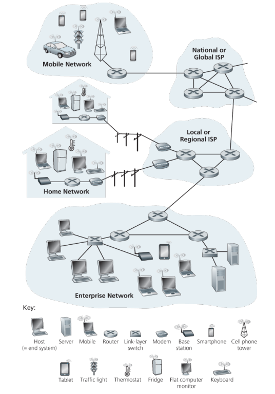

# 1. 인터넷이란 무엇인가

## 1.1 A Nuts-and-Bolts Description (인터넷의 구성 요소)

### 1. 인터넷 : 수억 디바이스들의 연결된 컴퓨터 네트워크
   1. host, end system
      - 네트워크에 연결된 모든 디바이스들
      - `통신 링크` 혹은 `패킷 스위치`로 서로 연결되어 있음
   2. 통신 링크
      - 동축 케이블, 구리선, 광섬유 및 라디오 스펙트럼을 포함한 물리적 매체
      - bits/sec 으로 측정
      - 연결 종류에 따라 다른 다른 속도로 데이터 전송, 전송률
   3. 패킷
      - 송신 종단 시스템에서 수신 종단 시스템(목적지)으로 보내진다
      - 송신 종단 시스템이 보내고자 하는 데이터를 `세그먼트(segment)`로 나누고, 각 세그먼트에 `헤더(header)`를 부착하여 수신 종단 시스템으로 전송
      - 패킷은 목적지에서 원래의 데이터로 다시 조립
   4. 패킷 교환기, 패킷 스위치
      - 패킷의 중간지점, 오는 패킷을 받아서 출력 통신 링크로 최종 목적지를 향하게 패킷을 전달
      - `라우터` : 네트워크 코어에서 이용 , `링크 계층 스위치(link-layer switch)` : 접속망, 라우터로 가기전 네트워크
   5. 경로(route, path)
      - 패킷이 송신 종단 시스템에서 보내진 후 수신 종단 시스템에 도달하는 동안 거쳐온 일련의 통신 링크와 패킷 스위치
   6. ISP(Internet Service Providers)
      - 종단 시스템에게 다양한 네트워크 접속을 제공한다. (가정용 초고속 접속, 고속 LAN 접속, 이동 무선 접속 등)
      - 하위 계층 ISP는 국가 & 국제 상위 계층 ISP를 통해 서로 연결한다. - 상위 계층 ISP들은 서로 직접 연결된다.
      - 각 ISP 네트워크는 따로 관리되고, IP 프로토콜을 수행하며, 네이밍(naming)과 주소배정 방식을 따른다.
   7. 프로토콜
      - 인터넷에서 정보의 송수신을 제어
      - 가장 중요한 프로토콜 둘을 통칭하여 `TCP/IP` (Transmission Control Protocol)
      - `IP (Internet Protocol)` : 라우터와 종단 시스템 사이에서 송수신되는 패킷 포맷을 기술
   8. 표준
      - IETF(Internet Engineering Task Force)
        - 국제 인터넷 표준화 기구
        - RFC(Requests for Comment) : IETF 표준 문서
        - TCP, IP, HTTP, SMTP 같은 프로토콜을 정의
      - IEEE 802 LAN 표준위원회
        - 이더넷과 무선 와이파이 표준을 기술

### 2. 서비스 측면에서 본 인터넷

#### infrastructure that provides services to applications (애플리케이션에 서비스를 제공하는 기반 시설)
- 애플리케이션은 서로 데이터를 교환하는 많은 종단 시스템을 포함하고 있기 때문에 `분산 애플리케이션(distributed application)`이라고 부른다.
- 애플리케이션은 종단 시스템에서 작동, 네트워크 코어에 있는 패킷스위치에서 작동 하지 않는다. 패킷 스위치는 애플리케이션 자체에 관여 하지 않는다. 

#### 소켓 인터페이스(socket interface)
- 송신 프로그램이 따라야 하는 규칙의 집합이며, 인터넷은 이 규칙에 따라 데이터를 목적지 프로그램으로 전달하게 된다.

### 3. 프로토콜 이란?
원서 33p