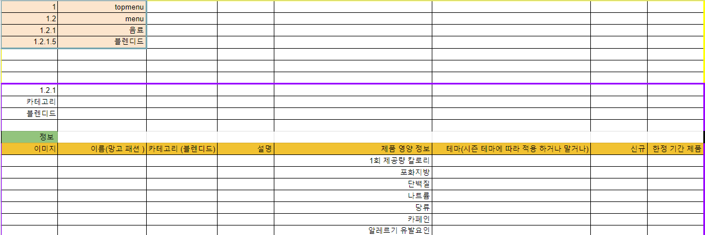
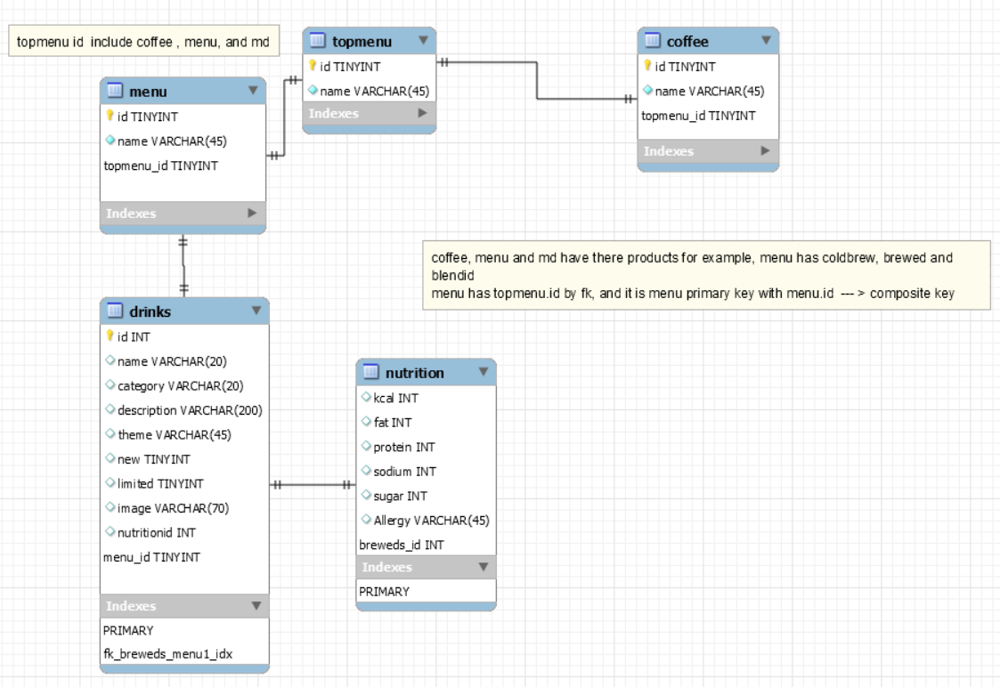

# 스타벅스 음료 모델링

## 요구사항
### <스타벅스 MENU 음료 페이지와 회원가입 모델링>
- 필수 구현 사항 : 음료, 카테고리, 영양 정보, 알러지, 음료 이미지, 음료 설명, 신상 여부
- 구현 제외 사항 : 프로모션, 음료 사이즈
  - 이름
  - 테이블 이름은 복수로 지어야 하고, 소문자로 지어야 한다.
  - ex) category → categorys

- id 이름은 id같은 의미로 모든 이름에 테이블 이름은 빼시오.
- ex) category_id → id
- ex) name_cate → name이름에 있는 공백은 언더바로 나타내라.
- 작은 숫자를 쓸 때 tiny_int 활용하세요.
- 이미지의 데이터 타입은 실제 url로 들어갈 수 있게끔 varchar을 사용합니다.
- 숫자 데이터가 들어가더라도 소수점을 표현 할 수도 있고 여러 경우의 수가 있는 경우에는 안전한게 varchar을 써주세요.

## 스타벅스 음료 데이터

### 포함관계 
1. topmenu 테이블 (Coffee, menu, store, responsibility ...) 
2. menu 테이블 (음료, 푸드, 상품 ...)
3. 음료 테이블 (콜드 브루 커피, 브루드 커피, 에스프레소, 프라푸치노, 블렌디드 ...)
4. 블렌디드 테이블 : 음료 테이블 내부에 음료들은 공통된 테이블을 가지고 있다.
   -  이미지, 이름, 카테고리, 설명,	제품 영양 정보, 테마, 신규,	한정 기간 제품
5. 제품 영양 정보 
    - 1회 제공량 칼로리, 포화지방, 단백질, 나트륨, 당류, 카페인, 알레르기 유발요인

1. 각각의 테이블은 상위 테이블에 저장되어 있는 자신의 고유 id를 외래키로 저장하고 있는다. 
    - topmenu는 최상위테이블이라 없다
    - 데이터 중복이지만, 현재 테이블 하나로 상위 메뉴로 접근이 용이하기 때문에 허용하기로 했다.
2. coldbrews 와 같은 상품에는 new, limited 칸은 boolean 으로 표한 하고자 tinyint 를 선택했다.
