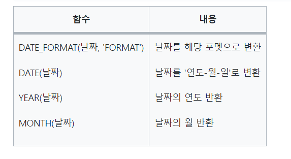

## 프로그래머스 datbase 실습 문제

### [`select 1번`](https://school.programmers.co.kr/learn/courses/30/lessons/151136)
```
SELECT FLOOR(AVG(DAILY_FEE)) AS AVERAGE_FEE
FROM CAR_RENTAL_COMPANY_CAR WHERE CAR_TYPE = 'SUV'
```

***


### [`select 2번`](https://school.programmers.co.kr/learn/courses/30/lessons/144853)

```agsl
SELECT BOOK_ID,DATE_FORMAT(PUBLISHED_DATE, '%Y-%m-%d') AS PUBLISHED_DATE
FROM BOOK
WHERE CATEGORY = '인문' AND PUBLISHED_DATE LIKE '2021%' ORDER BY PUBLISHED_DATE;
```

- DATE_FORMAT 을 통해 날짜 출력을 지정할 수 있다.

***

### [`select 3번`](https://school.programmers.co.kr/learn/courses/30/lessons/132201)
```agsl
SELECT PT_NAME,PT_NO,GEND_CD,AGE,IFNULL(TLNO,'NONE') AS TLNO 
FROM PATIENT WHERE GEND_CD='W' AND AGE<=12 
ORDER BY AGE DESC,PT_NAME ASC;
```

- select 문에서 `IFNULL(column,value)` 을 작성하여 null 인 값에 원하는 값을 출력할 수 있다. 

***

### [`select 4번`](https://school.programmers.co.kr/learn/courses/30/lessons/131120)
- `SELECT DATE_FORMAT('2019-09-16 20:23:12', '%Y/%M/%D')`
- date_formate 은 뒤에 시간 까지 여서 조절하고 싶으면 위에 문장 처럼 조절

***

### [`select 5번`](https://school.programmers.co.kr/learn/courses/30/lessons/133024)
```sql
SELECT flavor from first_half group by flavor order by sum(total_order) desc, shipment_id asc;
```
- 손쉽게 정답

***

### [`select 6번`](https://school.programmers.co.kr/learn/courses/30/lessons/132203)
```sql
SELECT DR_NAME,DR_ID,MCDP_CD,date_format(HIRE_YMD,'%Y-%m-%d')HIRE_YMD from doctor where MCDP_CD in('cs','gs') order by HIRE_YMD desc,dr_name;
```
- date_format 은 소문자로 양식해야 숫자로 나오고, 대문자로 하면 march april 이런거 나온다.

***

### [`select 6번`](https://school.programmers.co.kr/learn/courses/30/lessons/164673)

```sql
SELECT TITLE,a.BOARD_ID,b.REPLY_ID,b.WRITER_ID,b.CONTENTS,DATE_FORMAT(b.CREATED_DATE , "%Y-%m-%d") as CREATED_DATE
from USED_GOODS_BOARD a join USED_GOODS_REPLY b on a.BOARD_ID = b.BOARD_ID
where a.CREATED_DATE between "2022-10-01" and "2022-10-31"
order by b.CREATED_DATE,a.TITLE;
```
- 게시물 작정이 8월이고 댓글이 10월일 수도 있는데 댓글 작성 날짜 기준으로 검색한 내 잘못

***

### [`select 7번`](https://school.programmers.co.kr/learn/courses/30/lessons/133025)
```sql
SELECT a.FLAVOR from FIRST_HALF a join ICECREAM_INFO b on a.flavor = b.flavor
where INGREDIENT_TYPE = 'fruit_based'
group by flavor having sum(total_order) > 3000;
```
***

### [`select 8번`](https://school.programmers.co.kr/learn/courses/30/lessons/131118)
```sql
SELECT b.REST_ID,REST_NAME,FOOD_TYPE,FAVORITES,ADDRESS, round(avg(review_score),2) SCORE
from REST_INFO a join REST_REVIEW b on a.REST_ID=b.REST_ID
group by b.REST_ID  having address like '서울%'
order by avg(review_score) desc,favorites desc;
```
- 서울 앞에 %는 정답이 아닌 이유는 알 수 없다.

***

### [`select 8번`](https://school.programmers.co.kr/learn/courses/30/lessons/131118)
```sql
SELECT FACTORY_ID,FACTORY_NAME,ADDRESS
from FOOD_FACTORY
where ADDRESS like '강원도%';
```
***

### [`select 9번`](https://school.programmers.co.kr/learn/courses/30/lessons/131536)

```sql
SELECT USER_ID,PRODUCT_ID
from ONLINE_SALE
group by USER_ID,PRODUCT_ID having count(*)>=2
order by user_id,PRODUCT_ID desc;
```
***
### [`select 10번`](https://school.programmers.co.kr/learn/courses/30/lessons/59034)
```sql
SELECT ANIMAL_ID,ANIMAL_TYPE,DATETIME,INTAKE_CONDITION,NAME,SEX_UPON_INTAKE
from ANIMAL_INS
```
***

### [`select 11번`](https://school.programmers.co.kr/learn/courses/30/lessons/131537)
```sql
SELECT date_format(SALES_DATE,'%Y-%m-%d') as SALES_DATE,PRODUCT_ID,USER_ID,SALES_AMOUNT
from ONLINE_SALE
where SALES_DATE like '2022-03%'
union
(SELECT date_format(SALES_DATE,'%Y-%m-%d') as SALES_DATE,PRODUCT_ID, NULL as USER_ID,SALES_AMOUNT
from OFFLINE_SALE
where SALES_DATE like '2022-03%')
order by SALES_DATE,PRODUCT_ID,USER_ID;
```
- 1) union 을 활용 해야 할때가 있다

***

### [`select 12번`](https://school.programmers.co.kr/learn/courses/30/lessons/59035)
```sql
SELECT NAME,DATETIME
from ANIMAL_INS
order by ANIMAL_ID desc;
```
***

### [`select 13번`](https://school.programmers.co.kr/learn/courses/30/lessons/59036)
```sql
SELECT ANIMAL_ID,NAME
from ANIMAL_INS
where INTAKE_CONDITION='Sick'
order by ANIMAL_ID;
```
***

### [`select 14번`](https://school.programmers.co.kr/learn/courses/30/lessons/59037)
```sql
SELECT ANIMAL_ID,NAME
from ANIMAL_INS
where INTAKE_CONDITION not in ('aged')
order by ANIMAL_ID;
```
***

### [`select 15번`](https://school.programmers.co.kr/learn/courses/30/lessons/59403)
```sql
SELECT ANIMAL_ID,NAME
from ANIMAL_INS
order by ANIMAL_ID;
```
***

### [`select 16번`](https://school.programmers.co.kr/learn/courses/30/lessons/59404)
```sql
SELECT ANIMAL_ID,NAME,DATETIME
from ANIMAL_INS
order by NAME,DATETIME desc;
```
***

### [`select 17번`](https://school.programmers.co.kr/learn/courses/30/parts/17042)
```sql
SELECT NAME
from ANIMAL_INS
where DATETIME <= all (select DATETIME from ANIMAL_INS);
-- 두개 방법
SELECT NAME
from ANIMAL_INS
order by datetime limit 1;
```
***

### [`select 18번`](https://school.programmers.co.kr/learn/courses/30/parts/131535)
```sql
SELECT count(*) USERS
from USER_INFO
where joined like '2021%' and age between 20 and 29;
```
***




```sql
SELECT member_id,member_name,gender,DATE_FORMAT(DATE_OF_BIRTH,'%Y-%m-%d') AS DATE_OF_BIRTH
from member_profile
where date_of_birth like '%03%'  and tlno is not null and gender='w'
order by member_id;

```

***

### [`join 1번`](https://school.programmers.co.kr/learn/courses/30/lessons/133027)

```sql
-- 코드를 입력하세요
-- select * from first_half;
-- select * from july;

 SELECT fh.flavor from first_half as fh join july as ju on fh.flavor = ju.flavor
 group by ju.flavor
 order by sum(fh.total_order+ju.total_order) desc limit 3;

```
- 내용물을 확인을 하자....... 테이블에 딸기가 두번 입력되어 있는 경우가 있다,, 그룹을 해줘야 한다.
- 그래서 order by 에서도 sum 함수를 해야한다. 

***

### [`group by 1번`](https://school.programmers.co.kr/learn/courses/30/lessons/131123)
```sql
SELECT food_type,rest_id,rest_name,favorites from REST_INFO 
where (food_type, favorites ) in (select food_type,max(favorites)
      from rest_info group by food_type)
order by food_type desc;
```
- where 문에 다중으로 타입을 비교 가능하다.

***

### [`group by 2번`](https://school.programmers.co.kr/learn/courses/30/lessons/164668)
```sql
SELECT USER_ID,NICKNAME, sum(price) TOTAL_SALES
from USED_GOODS_BOARD join USED_GOODS_USER on writer_id = USER_ID
where status = 'done'
group by user_id
having sum(price) >= 700000
order by TOTAL_SALES;
```

***

### [`group by 3번`](https://school.programmers.co.kr/learn/courses/30/lessons/144856)
```sql
SELECT a.AUTHOR_ID,AUTHOR_NAME,CATEGORY, sum(PRICE*SALES) TOTAL_SALES
from AUTHOR a join BOOK b on a.AUTHOR_ID=b.AUTHOR_ID
join BOOK_SALES c on c.BOOK_ID = b.BOOK_ID
where SALES_DATE like '2022-01%'
group by AUTHOR_ID,CATEGORY
order by AUTHOR_ID,CATEGORY desc;
```

***

### [`group by 4번`](https://school.programmers.co.kr/learn/courses/30/lessons/144855)
```sql
SELECT CATEGORY, sum(sales) TOTAL_SALES
from BOOK a join BOOK_SALES b on a.BOOK_ID = b.BOOK_ID
where SALES_DATE like '2022-01%'
group by CATEGORY
order by category;
```

***

### [`group by 5번`](https://school.programmers.co.kr/learn/courses/30/lessons/157340)
```sql
SELECT CAR_ID, 
case When car_id in(
    select car_id
    from CAR_RENTAL_COMPANY_RENTAL_HISTORY
    where '2022-10-16' between START_DATE and END_DATE)
    then '대여중'
    else '대여 가능'
    end as AVAILABILITY
from CAR_RENTAL_COMPANY_RENTAL_HISTORY
group by car_id
order by CAR_ID desc;
```

***

### [`group by 6번`](https://school.programmers.co.kr/learn/courses/30/lessons/132202)
```sql
SELECT MCDP_CD 진료과코드, count(PT_NO) 5월예약건수
from APPOINTMENT
where APNT_YMD like '2022-05%'
group by MCDP_CD
order by count(PT_NO),MCDP_CD
```

***
### [`group by 7번`](https://school.programmers.co.kr/learn/courses/30/lessons/151137)
```sql
SELECT CAR_TYPE,count(CAR_TYPE) CARS
from CAR_RENTAL_COMPANY_CAR
WHERE OPTIONS LIKE '%열선시트%' OR OPTIONS LIKE '%통풍시트%' OR OPTIONS LIKE '%가죽시트%'
group by CAR_TYPE
order by CAR_TYPE;
```

***

### [`group by 8번`](https://school.programmers.co.kr/learn/courses/30/lessons/151139)
```sql

```

***


### [`SUM, MAX, MIN 1번`](https://school.programmers.co.kr/learn/courses/30/lessons/131115)
```sql
SELECT product_id,product_name,product_cd,category,price as price 
from food_product where price = (select max(price) from food_product )
```

- where 절을 통해 찾고자 하는 튜플의 범위를 좁혀야한다.

***

### [`SUM, MAX, MIN 2번`](https://school.programmers.co.kr/learn/courses/30/lessons/131697)
```sql
SELECT max(price) MAX_PRICE
from PRODUCT
```
***

### [`SUM, MAX, MIN 3번`](https://school.programmers.co.kr/learn/courses/30/lessons/131697)
```sql
SELECT max(DATETIME) 시간
from ANIMAL_INS
```
***

### [`SUM, MAX, MIN 4번`](https://school.programmers.co.kr/learn/courses/30/lessons/59038)
```sql
SELECT min(DATETIME) 시간
from ANIMAL_INS
```
***

### [`SUM, MAX, MIN 5번`](https://school.programmers.co.kr/learn/courses/30/lessons/59406)
```sql
SELECT count(*)
from ANIMAL_INS
```
***

### [`SUM, MAX, MIN 6번`](https://school.programmers.co.kr/learn/courses/30/lessons/59406)
```sql
SELECT count(distinct name)
from ANIMAL_INS
```
***


### [`IS NULL 1번`](https://school.programmers.co.kr/learn/courses/30/lessons/131114)
```sql
SELECT WAREHOUSE_ID,warehouse_name,ADDRESS, 
CASE   WHEN freezer_yn IS NULL THEN "N"
        ELSE freezer_yn
    END AS freezer_yn 
    from FOOD_WAREHOUSE
where address like '경기도%'
order by warehouse_id;
```
```sql
CASE   WHEN freezer_yn IS NULL THEN "N"
  ELSE freezer_yn
  END AS freezer_yn 
```
 - `case when` 칼럼 조건 `then` 넣을 값  `else` 넣을 값 `end` as 별명

***

### [`String,Date 1번`](https://school.programmers.co.kr/learn/courses/30/lessons/151138)

```sql
SELECT HISTORY_ID, CAR_ID, DATE_FORMAT(START_DATE, "%Y-%m-%d"), DATE_FORMAT(END_DATE, "%Y-%m-%d"),
    CASE WHEN DATEDIFF(END_DATE, START_DATE)+1 < 30 THEN "단기 대여" ELSE "장기 대여" END AS RENT_TYPE
    FROM CAR_RENTAL_COMPANY_RENTAL_HISTORY
    WHERE START_DATE BETWEEN "2022-09-01" AND "2022-09-30"
    ORDER BY HISTORY_ID DESC
```
- 이 부분은 외워야 할 것이 많다.
1. `DATE_FORMAT(START_DATE, "%Y-%m-%d")` date_format 사용 방법
2. `CASE WHEN DATEDIFF(END_DATE, START_DATE)+1 < 30 THEN "단기 대여" ELSE "장기 대여" END AS RENT_TYPE`
   - datediff(end_date, start_date) : 날짜 차이 값 보여주는 함수
   - case when 조건식 then true값 반환 else false 값 반환 end as 타입값
***