# 데이터 모델링

- 현실 세계 개념을 추상화 하여 데이터베이스로 구현 하는 과정


### 데이터베이스 생명주기
1. 요구사항 수집 및 분석
  - 사용자들의 요구사항을 듣고 분석하여 데이터베이스 구축의 범위를 정함
2. 설계
  - 분석된 요구사항을 기초로 주요 개념과 업무 프로세스 등을 식별하고(개념적 설계), 사용하는DBMS의 종류에 맞게 변환(논리적 설계)한 후, 데이터베이스 스키마를 도출(물리적 설계)함
3. 구현
  - 설계 단계에서 생성한 스키마를 실제 DBMS에 적용하여 테이블 및 관련 객체(뷰, 인덱스 등)를만듦
4. 운영
  - 구현된 데이터베이스를 기반으로 소프트웨어를 구축하여 서비스를 제공함
5. 감시 및 개선
  - 데이터베이스 운영에 따른 시스템의 문제를 관찰하고 데이터베이스 자체의 문제점을 파악하여개선함
<br>
<br>
<br>
- 생명주기는 반복 된다.

*** 
## 데이터 모델링 과정
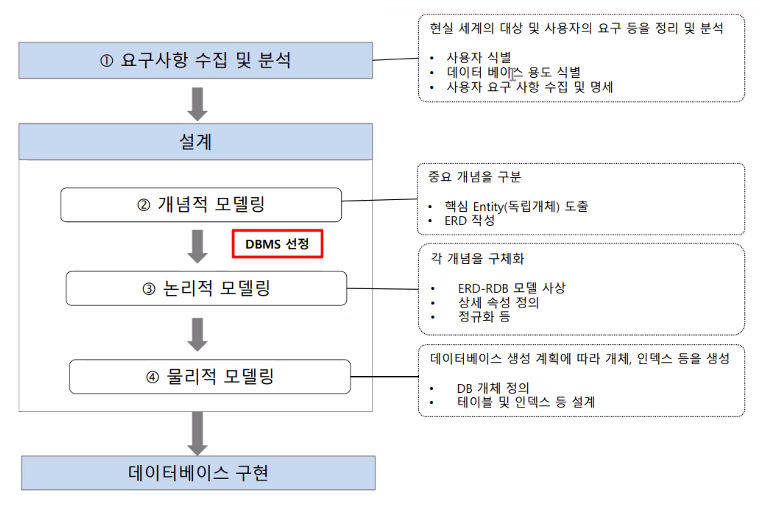
<br>
<br>
<br>
### 개념적 모델링
- 요구사항을 수집하고 분석한 결과를 토대로 업무의 핵심적인 `개념을 구분`하고 전체적인 `뼈대`를 만드는 과정
- 핵심개념의 전체적인 레이아웃 만드는 과정
- `개체(entity)`를 추출 , `관계`를 정의 ER 다이어그램(ERD, Entity Relationship Diagram)을 만드는 과정


### 논리적 모델링
- ER 다이어그램을 사용하려는 DBMS에 맞게 `사상(매핑, mapping)`하여 실제 데이터베이스로 구현하기 위한 모델을 만드는 과정

### 물리적 모델링
- 논리적 모델을 실제 컴퓨터의 저장 장치에 저장하기 위한 물리적 구조를 정의하고 구현하는 과정


## ER 모델
- 세상의 사물을 개체(entity)와 개체 간의 관계(relationship)로 표현
### 개체
- 독립적인 의미를 지니고 있는 유무형
- 속성(attribute)에 의해 식별

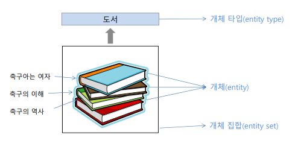

#### 개체 타입의 유형
- 강한 개체(strong entity) : 다른 개체의 도움 없이 독자적으로 존재할 수 있는 개체
- 약한 개체(weak entity) : 독자적으로는 존재할 수 없고 반드시 상위 개체 타입을 가짐

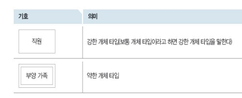


<br>
<br>
<br>

#### 속성
- 개체가 가진 성질

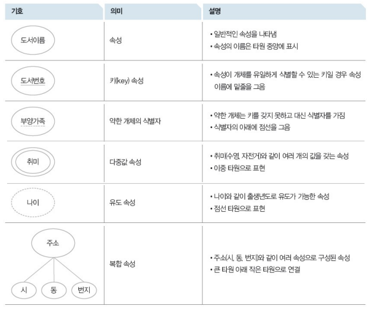
<br>
<br>
<br>

## 관계와 관계타입
- 관계(relationship) : 개체 사이의 연관성을 나타내는 개념
- 관계 타입(relationship type) : 개체 타입과 개체 타입 간의 연결 가능한 관계를 정의한 것
- 관계 집합(relationship set) : 관계로 연결된 집합을 의미함

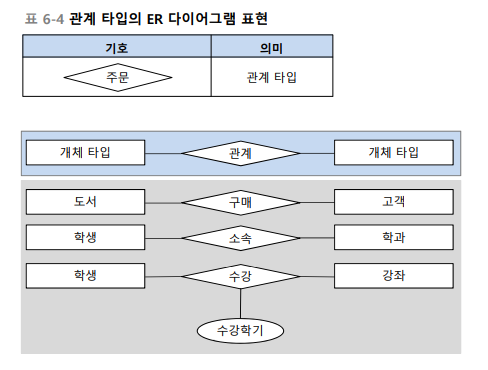
<br>
<br>
- 마름모 안에 있는게 관계 타입

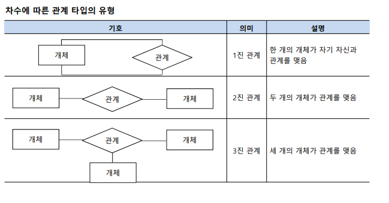
<br>
<br>
- 관계 집합에 참가하는 개체 타입의 수를 관계 타입의 `차수(degree)`

### 관계 타입의 유형
- 관계 대응수(cardinality) : 두 개체 타입의 관계에 실제로 참여하는 개별 개체 수

#### 일대일(1:1)관계
- 좌측 개체 타입에 포함된 개체가 우측 개체 타입에 포함된 개체와 일대일로 대응하는 관계

#### 일대다(1:N), 다대일(N:1) 관계
- 한쪽 개체 타입의 개체 하나가 다른 쪽 개체타입의 여러 개체와 관계를 맺음
- n은 0 이상의 자연수를 의미

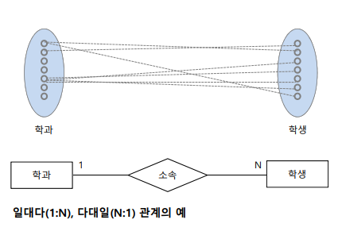

#### 다대다(N:M) 관계
- 각 개체 타입의 개체들이 서로 임의의 개수의 개체들과 서로 복합적인 관계를 맺고 있는 관계

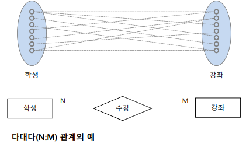
<br>
<br>

## 관계 대응수의 최솟값과 최댓값
- 관계 대응수 1:1, 1:N, M:N에서 `1, N, M`은 각 개체가 관계에 참여하는 `최댓값`을 의미
-  최솟값을 표시하지 않는다는 단점을 보완하기 위해 다이어그램에서는 대응수 외에 최솟값과 최댓값을 관계실선 위에 `(최솟값, 최댓값)`으로 표기


<br>

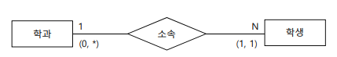
- 학과는 학생을 0이상 존재 가능
- 학생은 무조건 하나의 학과를 가지고 있어야 한다.


### isa 관계

- 상위 개체 타입의 특성에 따라 하위 개체 타입이 결정되는 형태

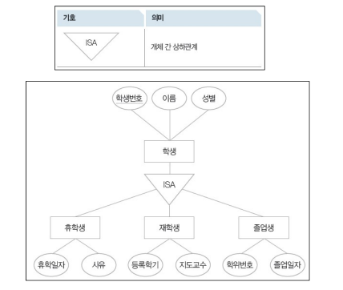


### 참여 제약 조건

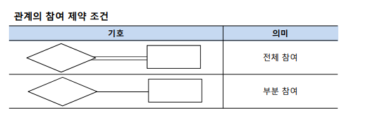

- 전체 참여는 개체 집합의 모든 개체가, 부분 참여는 일부만 참여함
- 최솟값이 1 이상으로 모두 참여한다는 뜻이고, 부분 참여는 최솟값이 0 이상

### 역할
- 개체 타입 간의 관계를 표현할 때 각 개체들은 고유한 역할(role) 담당

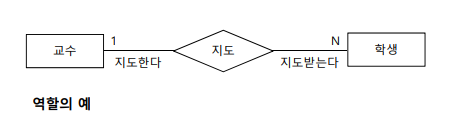

### 순환적 관계
- 하나의 개체 타입이 동일한 개체 타입(자기자신)과 순환적으로 관계를 가지는 형태


#### 문장으로 정리 해보기


- 직원 개체는 기본키로 직원번호, 이름, 직책 속성을 가지고 있다.
- 가족 개체는 이름, 관계 속성을 가지고 있고 직원의 기본키를 상속받아 사용한다. (직원번호로 가족을 구분)


## IE 표기법
- ER 다이어그램을 더 축약하여 쉽게 표현
- 개체 타입과 속성은 직사각형으로 표현


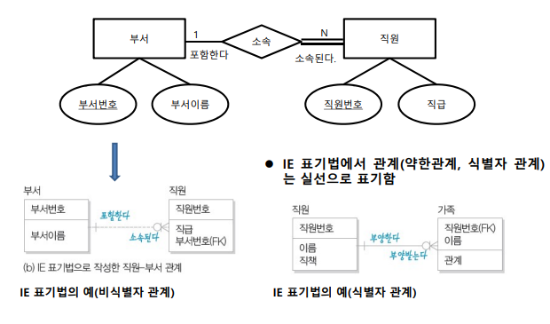
- fk 는 외래키로 가져온 것
- 직원 부서 관계에는 외래키가 기본 속성이다 (강한관계 : 비식별자 관계)
- 직원 가족 관계에는 직원번호 외래키가 구분자로 되어 있다. :  (약한개체 : 식별자 관계)

### er 실습 예제

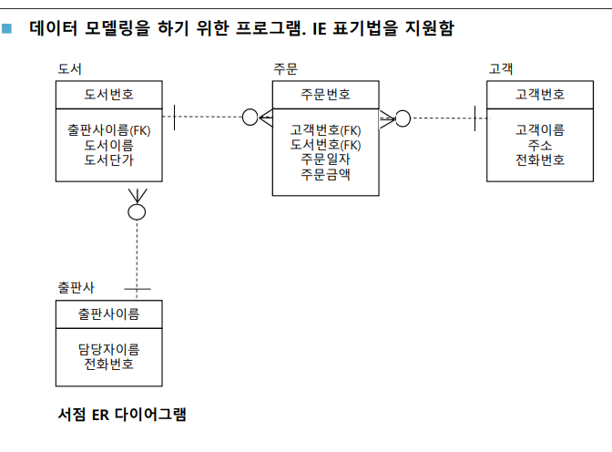

```sql
/*

/*

1) book 도서 개체

2) customer 고객 개체

3) orders 주문 개체

1. 서점은 출판사에서 도서를 공급받아 판매한다.
2. 판매내역은 매일 기록으로 남겨야 한다. ==> 고객서비스와 매출관리에 활용
3. 서점은 판매하는 도서의 도서번호, 도서이름, 출판사, 도서 단가를 갖는다.
4. 구매한 도서들은 납품한 출판사와 출판사 담당자 이름, 전화번호를 갖는다.
5. 고객이 책을 주문할 때마다 주문번호를 기록해야 한다.
6. 고객에게 판매한 도서는 판매한 날, 고객별 주문금액 추가로 관리해야 한다.
7. 고객들은 여러 번에 걸쳐 다양한 도서를 구매할 수 있다.


개념설계 / 논리설계 (개체와 관계를 구분하여 정리한다.)
- 도서 (도서번호,도서이름,출판사,도서단가) - E
- 고객 (고객번호,고객이름,주소,전화번호) - E
- 출판사 (출판사 이름,담당자 이름,전화번호) - E

- 출판사 1: 도서 N (서점은 출판사로부터 공급한 도서만 등록하여 관리)  - 비식별관계
- 고객 N : 도서 M -  교차테이블 : 주문 관계의 표현 필요 (도서와 고객의 pk 를 fk로 받아서 pk로 만들어야함)
- 고객과 주문, 도서와 주문은 식별관계로 생성 된다.
- 고객이 도서를 구입한 날 (주문일자), 구매한 가격(주문금액) 을 따로 저장한다. 고객과 도서의 관계에 속성이 존재


# workbench 활용 방법

file -> new model 하고, physical schema 우클 해서 edit으로 이름 변경 가능, er diagram 생성 가능
er diagram 창에서 table 생성 후 내가 생각하는 data 자료형들 표시하고

database 에서 foward engineer 로 erdiagram 만든 걸 테이블 생성 가능하고
reverse engineer 로는 테이블 가지고 erdiagram 을 만들 수 있다.

*/
*/
```


