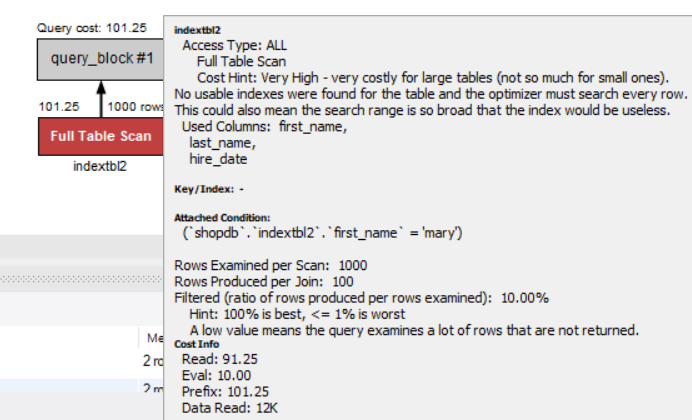
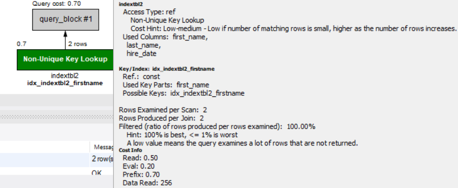
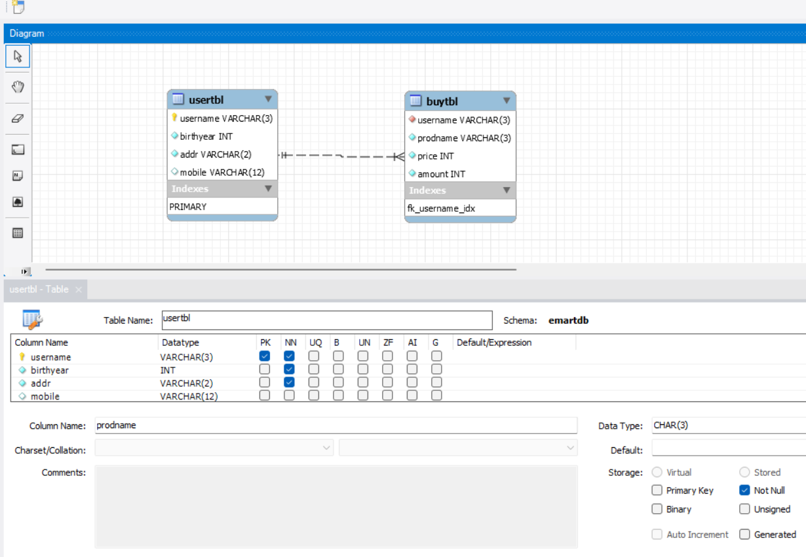
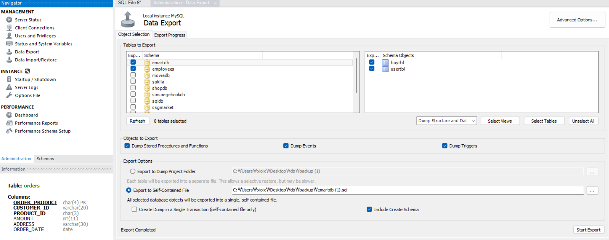
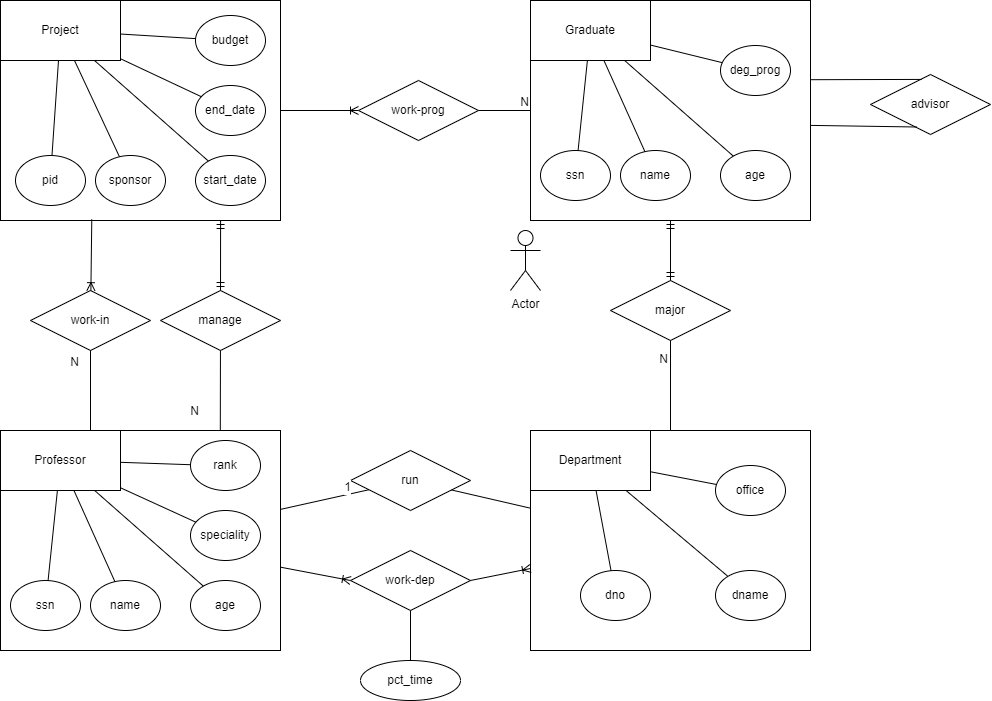
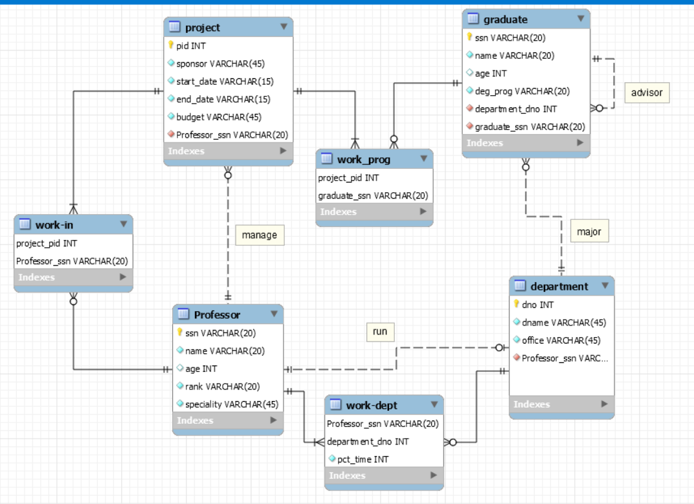
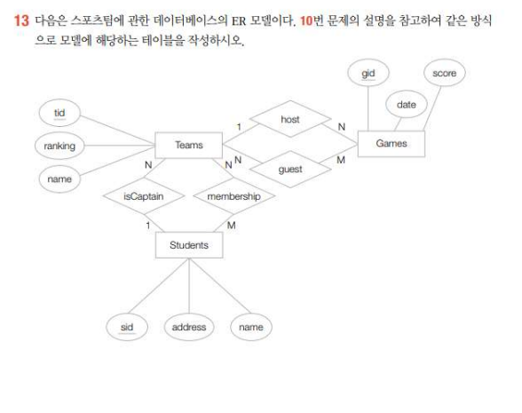
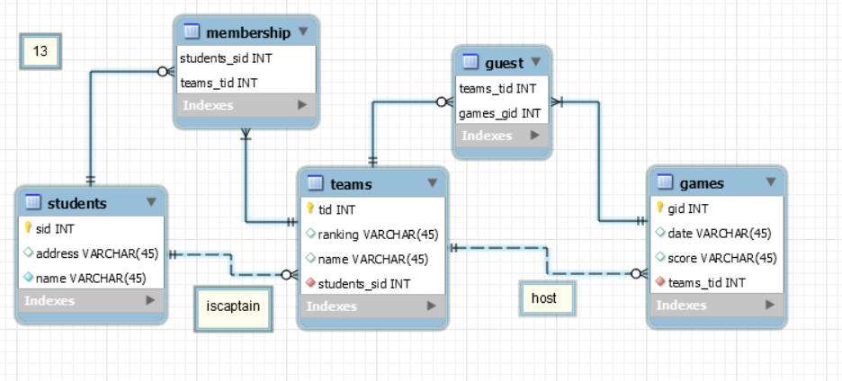

# 데이터베이스 튜닝
- db 성능 향상 --> 응답 시간의 단축
- 응답 시간의 주 원인은 인덱스
- 인덱스는 열 (column) 에 적용



- 쿼리문 천개를 전부 검색하는 것을 확인 가능
- 데이터가 많아지면 비효율적이니 index 적용 필요


- index 적용하자 위에서 1000개를 검색하던게 두 번 검색만으로 찾음, cost가 100 에서 0.7 로 감소한 것 확인 가능
- join 은 말 그대로 테이블 끼리 join 한 횟수

- 클러스터형 인덱스 는 데이터를 재정렬 해서, 리프 페이지에 데이터 저장
- 비클러스터형 인덱스 (보조인덱스) 는 데이터를 그대로 사용하며, 루트페이지와 리프페이지를 주소 인덱스로 활용하여 데이터에 접근

```sql
select count(*) from indextbl;

create table indextbl2(first_name varchar(14), last_name varchar(16),hire_date date);
insert into indextbl2 select first_name,last_name,hire_date from employees.employees limit 1000;
select count(*) from indextbl2;

-- indextbl2 에 first_name = 'mary';
select * from indextbl2 where first_name = 'mary';
create index idx_indextbl2_firstname on indextbl2(first_name);

-- pk (클러스터형 인덱스) - 테이블당 한 개
-- 테이블 생성 시 제약 조건 primary key 또는 unique 를 사용하면 자동으로 인덱스 생성
use sqldb;

create table tbl1(a int primary key, b int, c int);
show index from tbl1;
create table tbl2(a int primary key, b int unique, c int unique, d int);
-- unique 는 보조 인덱스로 저장
show index from tbl2;
create table tbl3(a int primary key, b int unique not null, c int unique, d int);
show index from tbl3;
-- unique 에 not null 설정하면 클러스터형 인덱스로 저장된다.
-- 클러스터형 인덱스는 튜플 데이터를 자신의 칼럼 기준으로 정렬한다.


-- 회원 usertbl에 회원 2명 정보를 입력하기
create table usertbl2(userID char(8) primary key, name varchar(10) not null,birthyear int not null, addr char(2) not null);
insert into usertbl2 select userid,name,birthyear,addr from usertbl;
select * from usertbl2;
insert into usertbl2 values ('KGB','김종봉',1987,'서울');
insert into usertbl2 values ('YKL','임경림',1980,'제주');

-- 테이블 변경 userid열의 pk 제거, name열을 pk 지정 하기
alter table usertbl2 drop primary key;
show index from usertbl2;  -- index 아무것도 없음
alter table usertbl2 add constraint pk_name primary key(name); -- 기본키 다시 설정하면 index 생김alter

-- pk , unique not null 지정한 열은 클러스터형 인덱스로 생성
-- unique , unique null 지정한 열은 보조 인덱스가 생성
-- pk와 unique not null 지정한 열 두 개가 있다면 pk의 열이 우선 클러스터형 인덱스가 생성된다.
-- pk로 지정한 열로 데이터가 오름차순 정렬 된다.


```

***
<br>
<br>

# 데이터 모델링 실습
## 데이터베이스 모델링
1. 개념적 모델링 (업무 분석 단계)
2. 논리적 모델링 (시스템 설계 전반부)
3. 물리적 모델링 (시스템 설계 후반부)


## 실습 내용
- 새로운 쇼핑몰을 오픈 했다는 가정
  - 매장을 찾는 고객의 명단을 기록하고 또 물건을 구매할 때 구매한 내역을 기록 예정

```sql
-- emartdb 생성
-- 교안에서 제시한 usertbl, buytbl 생성 (pdf db08 51p)  
-- mysqlworkbench 이용해서 만들기
-- sqldb usertbl과buytbl 자료를 emartdb 테이블에 각각 copy

insert  into usertbl select name,birthyear,addr,concat(mobile1,mobile2) from sqldb.usertbl;
insert into buytbl select name,prodname,price,amount from sqldb.buytbl a join sqldb.usertbl b
on a.userid =  b.userid;

```


- erdiagram 만들어서 테이블 만들기


- db 자료들 백업하기
- self-contained file 로 저장할거면 밑에 create dump in a single transcaction을 체크해줘야한다. (그림에는 안되어 있다.)


<br>

# 모델링 연습 AA 대학

### AA 대학 요구사항


 ### 모델링


                 

### 워크벤치에서 적용

 

- mandatory 체크 여부로 필수 참가 여부 조절 가능하다.

 


- manage : 교수는 하나의 프로젝트 담당자가 된다. 그래서 1: m 으로 --> 하나의 교수는 여러 프로젝트 담당자가 될수도, 하나도 아닐 수도 있다.
- work- in : 프로젝트의 공동참여 교수들이 존재한다. 교수는 여러 프로젝트에 참여할수도, 안할 수도 있다.
- work_prog : 대학원생은 여러프로젝트에 참여해야지만, 프로젝트중에는 대학원생 중에 없는 대학원생도 있다.
- advisor : 한명이 어려명을 멘토 할 수 도 있고, 안할 수도 있다.
- major : 대학원생이 학과 하나에 있을 수 있지만 , 학과 중에는 어떤 대학원생은 없을 수도 있다.
- run : 교수는 학과에 학과장으로 한명 존재하지만, 아닐 수 도 있다.
- work_dept : 교수들은 여러 과가 정해져 있을 수도 있고, 아예 없을 수도 있다.   : 교수가 부서는 없어도 되니 부서쪽에 o 가 있고, 부서는 교수가 있어야 하니 교수쪽은 o가 없다.
- 두 관계를 볼 때, 둘 중 없어도 된다 하는쪽에 o를 붙어야 한다.


# 13 번 문제 풀이






- 학생은 팀장에 속할 수 있지만 아닐수도 있기에 1:n (학생은 여러팀에 있을수도 0일수도 있다)에 n쪽에 madatory 를 제거해서 student student가 아에 팀에 해당 안되는 경우도 표현
- membership 관계는 학생과 팀이 n:m으로 되어 있으며, 학생은 membership 에 없어도 된다 생각해서 mandatory 제거
- 팀과 게임도 유사 guest도 위와 유사하다.
- erdiagram은 테이블 기준으로 반대쪽 그림을 해석하는게 중요해 보인다. ex) student 와 membership을 보면 student 반대는 n + 0 이므로 학생은 membership 테이블에 없는 개체도 있고 여러개 있어도 된다는 의미, 반대로 membership 은 student와 (1,1) 이므로 student 요소와 무조건 이어져 있다는 거다.
- erdiagram은 테이블 기준으로 직선에 반대쪽 끝만 생각을 잘하면 된다.
- students 튜플 하나는 team 튜플들에 여러번 사용될 수도, 사용 안 할수도 있다.
- students 튜플 하나는 membership 튜플들에 여러번 사용될 수도 사용이 안될 수 도 있다. 
- 하지만 teams 는 여러번 사용 될 수는 있지만 없는 경우 는 없다. (n:m 은 조금 특수하게 해석해야한다, student가 없을때 teams도 없는 경우는 없다는 의미다.)
- 이게 한쪽만 생각해야지 양사이드로 생각하니까 말이 안되는 같다

***
- 다시 정리해보자
- students 는 teams 튜플들에 반복 연결된애도 있고 연결 안된 애도 있다
- teams 는 students 튜플에 한번씩 연결되고  연결 안된 경우가 없다
- students 튜플은 teams 튜플들에 중복 연결이 가능하고, 연결 안되는 경우도 있다
- 하지만 teams 튜플은 students 튜플들에 중복 연결이 가능하지만,   연결 안 된 경우는 없다.


