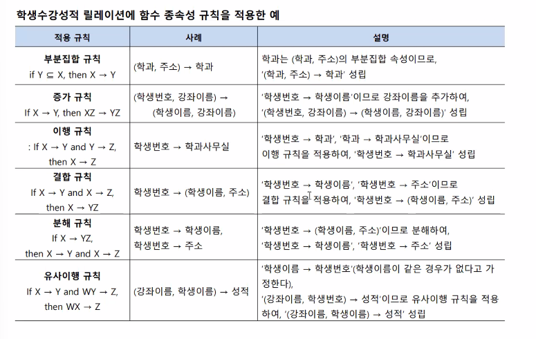
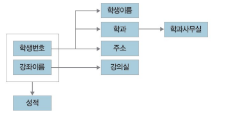
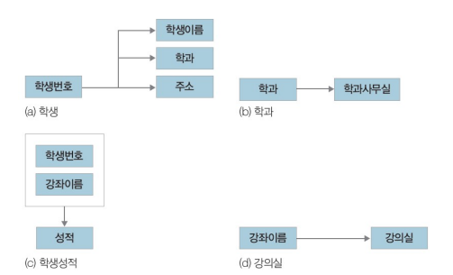
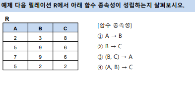
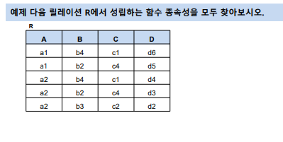
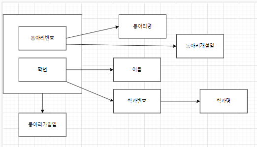
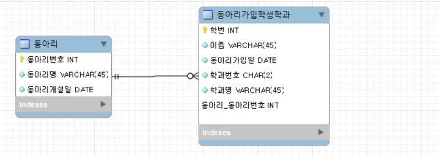
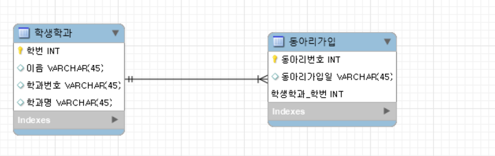
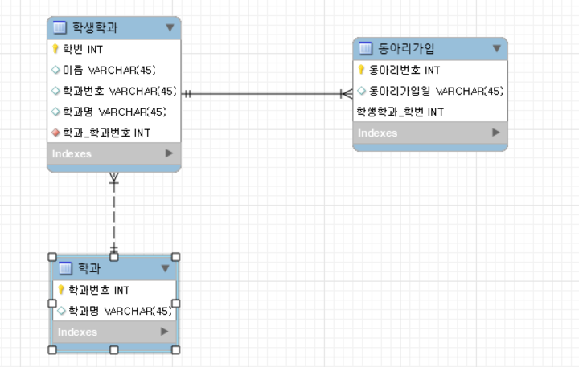
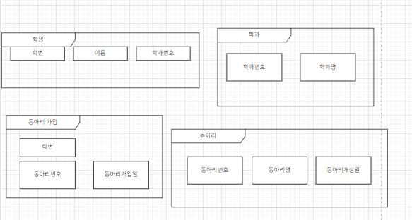

# 이상현상 과 정규화

## 이상현상
- 잘못된 설계로 테이블이 생성되면 조작 작업시 이상현상 발생
- 이상현상은 데이터의 일관성을 손상시켜 데이터의 무결성을 깨뜨린다.
- 속성간의 함수 종속성을 파악하여 테이블을 규칙에 의해서 분해가 필요 : `정규화`

### 이상 종류
- 삭제이상(deletion anomly) : 투플 삭제 시 같이 저장된 다른 정보까지 연쇄적으로 삭제되는 현상→ 연쇄삭제(triggered deletion) 문제 발생
- 삽입이상(insertion anomly) : 투플 삽입 시 특정 속성에 해당하는 값이 없어 NULL 값을 입력해야하는 현상 → NULL 값 문제 발생
- 수정이상(update anomly) : 투플 수정 시 중복된 데이터의 일부만 수정되어 데이터의 불일치 문제가 일어나는 현상 → 불일치(inconsistency) 문제 발생

**이상 재정의 해보기**
- 테이블에서 쿼리문으로 원하지 않는 접근, 즉 예외가 발생하는 것이다. 따라서 이 부분을 최소화 하기 위하여, 정규화를 통해 테이블을 변형한다.
- 데이터의 일관성을 손상시켜 데이터의 무결성을 깨뜨린다 --  예외가 발생하는 것을 의미 한다.

## 함수 종속성
- 정규화를 위해서는 테이블의 기본키와 속성간의 종속성을 파악해야 한다.
- 릴레이션 R과 R에 속하는 속성의 집합 X, Y가 있을 때, X 각각의 값이 Y의 값 한 개와 대응이 될 때 ‘X는 Y를 함수적으로 결정한다’라고 하고 X→Y로 표기함. 이때 X를 결정자(determinant)라고 하고, Y를 종속 속성(dependent attribute)이라고 함. 함수 종속성은 보통 릴레이션 설계 때 속성의 의미로부터 정해짐
  


## 이상현상과 결정자
- 한개의 릴레이션에 두개 이상의 정보(릴레이션)이 존재할 때 발생
- 이상현상은 `기본키가 아니면서 결정자`인 속성이 존재할 때 발생



- 수정 후



- 분해할 때 부분 릴레이션의 결정자는 원래 릴레이션에 남겨두어야 함. 그래야 분해된 부분릴레이션이 원래 릴레이션과 관계를 형성할 수 있음


- 예제

- 답 2, 4번
- 함수적 종속은 결국 함수이기 때문에 한키에 한 값만 속해야한다.

- 예제 2

- 결정자 : d, (a,b),(a,c), (a,d),(b,d,)(c,d),  (a,b,c),(a,b,d),(a,c,d),(b,c,d)

```sql
create table 학생수강 (
      학생번호 int, 
      학생이름 varchar(20) not null,
      학과  varchar(15) not null,
      주소  varchar(20) , 
      강좌이름 varchar(15) ,
      강의실 varchar(10)
   );
insert into 학생수강 values(501,'박지성','컴퓨터학과','영국 맨체스터', '데이터베이스','공학관110');
insert into 학생수강 values(401,'김연주','체육교육과','대한민국 서울', '데이터베이스','공학관110');
insert into 학생수강 values(402,'김연경','체육학과','대한민국 서울', '스포츠경영학','공학관112');
insert into 학생수강 values(502,'손흥민','체육학과','영국 토트넘', '스포츠교수법','공학관111');
insert into 학생수강 values(501,'박지성','컴퓨터학과','영국 맨체스터', '자료구조','공학관110');

SELECT * FROM emartdb.학생수강;
delete from 학생수강 where 강좌이름 ='스포츠경영학';
-- 강좌만 삭제하고싶어도 튜플이 삭제되어서 원하는 데이터도 사라짐 --> 삭제이상,, 연쇄 삭제 현상

-- 안정환 학생이 체육학과에 입학. 학생번호, 학생이름, 학과, 주소 입력,,,, 수강신청기간이 아니라 강좌이름과 강의실은 null 입력
insert into 학생수강 values(601,'안정환','체육학과','대한민국 서울',null,null);


-- 학생수강을 조회하는데 몇명의 학생이 수강하는지 확인
select count(*) from 학생수강 where 강좌이름 like '%';  -- 삽입이상 (null값 삽입으로 원하는 데이터 안나옴)


-- 박지성 학생 주소가 대한민국 서울로 수정을 요청, update 필요
update 학생수강 set 주소 = '대한민국 서울' where 학생이름 = '박지성' ; 
update 학생수강 set 주소 = '대한민국 서울' where 강좌이름 = '데이터베이스';  -- 수정이상 (모든 레코드 값이 변경이 되지 않는 이상)


-- 정리해서 테이블을 분해 해서 재 모델링 하기
create table 학생테이블 (
      학생번호 int primary key, 
      학생이름 varchar(20) not null,
      학과  varchar(15) not null,
      주소  varchar(20) 
   );
   
create table 강의테이블 (
	강좌번호 int primary key,
	강좌이름 varchar(15) not null ,
	강의실 varchar(10) not null
);
create table 수강테이블 (
	학생번호 int not null,
    강좌번호 int,
    foreign key(학생번호) references 학생테이블,
    foreign key(강좌반호) references 강의테이블,
    primary key(학생번호,강좌번호)
);


-- 실습  
DROP TABLE IF EXISTS Summer; /* 기존 테이블이 있으면 삭제 */
CREATE TABLE Summer
( sid INTEGER,
class VARCHAR(20),
price INTEGER
);
INSERT INTO Summer VALUES (100, 'FORTRAN', 20000);
INSERT INTO Summer VALUES (150, 'PASCAL', 15000);
INSERT INTO Summer VALUES (200, 'C', 10000);
INSERT INTO Summer VALUES (250, 'FORTRAN', 20000);
/* 생성된 Summer 테이블 확인 */
SELECT *
FROM Summer;


-- 삭제 이상
-- 질의 200번 학생의 계절학기 수강신청을 취소하시오.

/* C 강좌 수강료 조회 */ 
SELECT price "C 수강료"
FROM Summer
WHERE class='C';
/* 200번 학생의 수강신청 취소 */
DELETE FROM Summer
WHERE sid=200;
/* C 강좌 수강료 다시 조회  => C 수강료 조회 불가능!!*/
SELECT price "C 수강료"
FROM Summer
WHERE class='C';
/* 다음 실습을 위해 200번 학생 자료 다시 입력 */
INSERT INTO Summer VALUES (200, 'C', 10000);


-- 삽입 이상
-- 질의 계절학기에 새로운 자바 강좌를 개설하시오.

/* 자바 강좌 삽입  => NULL을 삽입해야 한다. NULL 값은 문제가 있을 수 있다. */
INSERT INTO Summer VALUES (NULL, 'JAVA', 25000);
/* Summer 테이블 조회 */
SELECT *
FROM Summer;
/* NULL 값이 있는 경우 주의할 질의 : 투플은 다섯 개지만 수강학생은 총 네 명임 */
SELECT COUNT(*) "수강인원"
FROM Summer;

SELECT COUNT(sid) "수강인원"
FROM Summer;

SELECT count(*) "수강인원"
FROM Summer
WHERE sid IS NOT NULL;


-- 수정 이상
-- 질의 FORTRAN 강좌의 수강료를 20,000원에서 15,000원으로 수정하시오.
/* FORTRAN 강좌 수강료 수정 */
UPDATE Summer
SET price=15000
WHERE class='FORTRAN';

SELECT *
FROM Summer;

SELECT DISTINCT price "FORTRAN 수강료"
FROM Summer
WHERE class='FORTRAN';
/* 다음 실습을 위해 FORTRAN 강좌의 수강료를 다시 20,000원으로 복구 */
UPDATE Summer
SET price=20000
WHERE class='FORTRAN';
/* 만약 UPDATE 문을 다음과 같이 작성하면 데이터 불일치 문제가 발생함 */
UPDATE Summer
SET price=15000
WHERE class='FORTRAN' AND sid=100;
/* Summer 테이블을 조회하면 FORTRAN 강좌의 수강료가 한 건만 수정되었음 */
SELECT *
FROM Summer;
/* FORTRAN 수강료를 조회하면 두 건이 나옴(데이터 불일치 문제 발생) */
SELECT price "FORTRAN 수강료"
FROM Summer
WHERE class='FORTRAN';
/* 다음 실습을 위해 FORTRAN 강좌의 수강료를 다시 20,000원으로 복구 */
UPDATE Summer
SET price=20000
WHERE class='FORTRAN';
/* 다음 실습을 위해 sid가 NULL인 투플 삭제 */
DELETE FROM Summer
WHERE sid IS NULL;


-- 이상을 피하기 위한 테이블 생성
/* 기존 테이블이 있으면 삭제하고 새로 생성하기 위한 준비 */
DROP TABLE SummerPrice;
DROP TABLE SummerEnroll;
/* SummerPrice 테이블 생성 */
CREATE TABLE SummerPrice
( class VARCHAR(20),
price int
);
INSERT INTO SummerPrice VALUES ('FORTRAN', 20000);
INSERT INTO SummerPrice VALUES ('PASCAL', 15000);
INSERT INTO SummerPrice VALUES ('C', 10000);
SELECT * FROM SummerPrice;
/* SummerEnroll 테이블 생성 */
CREATE TABLE SummerEnroll
( sid int,
class VARCHAR(20)
);
INSERT INTO SummerEnroll VALUES (100, 'FORTRAN');
INSERT INTO SummerEnroll VALUES (150, 'PASCAL');
INSERT INTO SummerEnroll VALUES (200, 'C');
INSERT INTO SummerEnroll VALUES (250, 'FORTRAN');
SELECT * FROM SummerEnroll;


-- 삭제이상 없음 확인
-- 질의 200번 학생의 계절학기 수강신청을 취소하시오.
/* C 강좌 수강료 조회 */
SELECT price "C 수강료"
FROM SummerPrice
WHERE class='C';

DELETE
FROM SummerEnroll
WHERE sid=200;

SELECT *
FROM SummerEnroll;
/* C 강좌의 수강료가 존재하는지 확인  => 삭제이상 없음!! */
SELECT price 'C 수강료'
FROM SummerPrice
WHERE class='C';


-- 삽입이상 없음
-- 질의 계절학기에 새로운 자바 강좌를 개설하시오.
/* 자바 강좌 삽입, NULL 값을 입력할 필요 없음 */
INSERT INTO SummerPrice VALUES ('JAVA', 25000);
SELECT *
FROM SummerPrice;
/* 수강신청 정보 확인 */
SELECT *
FROM SummerEnroll;


-- 수정이상 없음
-- 질의 FORTRAN 강좌의 수강료를 20,000원에서 15,000원으로 수정하시오.
UPDATE SummerPrice
SET price=15000
WHERE class='FORTRAN';

SELECT price "FORTRAN 수강료"
FROM SummerPrice
WHERE class='FORTRAN';


select * from summerenroll  natural join summerprice;

```


## 예제 3

```sql
CREATE TABLE 동아리가입학생학과 (
   동아리번호 char(2) not null,
   동아리명 varchar(20) not null,
   동아리개설일 date,
   학번 int not null,
   이름 varchar(20) not null,
   동아리가입일 date,
   학과번호 char(2) not null,
   학과명 varchar(20) not null,
   primary key (동아리번호,학번)
   );
insert into 동아리가입학생학과 values ('c1','세익스피어의 페르소나','2000-02-01',231001,'최문석','2023-03-01','D1','화학공학과');
insert into 동아리가입학생학과 values ('c2','게임좋아','2000-02-01',231002,'백종훈','2001-03-01','D4','경영학과');
insert into 동아리가입학생학과 values ('c3','풍물깡패','2010-05-04',232001,'정휘제','2011-03-01','D1','컴퓨공학과');
insert into 동아리가입학생학과 values ('c4','만화좋아','2020-03-01',231004,'김소진','2021-03-01','D2','컴퓨터공학과');
insert into 동아리가입학생학과 values ('c5','댄스배틀','2003-02-01',23109,'이다혜','2004-03-01','D4','경영학과');
insert into 동아리가입학생학과 values ('c4','만화좋아','2020-03-01',231108,'구희진','2021-03-01','D4','경영학과');
insert into 동아리가입학생학과 values ('c2','게임좋아','2000-02-01',231001,'김태진','2001-03-01','D1','화학공학과');
-- 동아리가입학생학과 테이블의 함수적 종속성 다이어그램을 그리고, 함수적 종속성을 확인해 주세요 
```





### 완전 함수적 종속성
- A 릴레이션이 (B, C, D)일 때  D는 (B, C)에 함수 종속적이지만 B나 C가 함수 종속적이 아닐 때를 말합니다.
- 위 예제에서는 동아리 가입일은 (동아리 번호, 학번) 기본키에 완전 함수적 종속성이다.

### 부분 함수적 종속성
- 어떤 속성 Y가 다른 복합 속성 X의 부분집합에 종속하는 관계
- 위 예제에서는 기본키 (동아리 번호, 학번) 에서 동아리명과 동아리개설일은 동아리 번호, 즉 부분집합에 종속되어 있는 것


### 이행적 종속성
- A->B이고 B->C일 때 A->C를 만족하는 관계
- 위 예제에서는 학번 -> 학과번호, 학과번호 -> 학과명 이여서 학번 -> 학과명 가 성립한다.


## 정규화
- 잘못 설계된 테이블을 수정하여 데이터의 일관성과 무결성을 회복하는 프로세스
- 중복성과 종속성을 최소화 , 데이터베이스의 효율성과 유지보수의 구조를 개선하고 데이터베이스의 성능 향상을 최적화하는데 의미가 있다

### 제 1정규화 (1NF)
- 모든 속성 값은 원자값(Atomic Value)을 만족, 중복되는 속성이나 속성그룹을 별도의 테이블로 분리

### 제 2정규화 (2NF)
- 1정규화를 만족하고, 부분 함수적 종속성을 제거, 기본키 속성에 완전 함수적 종속성을 가지도록 테이블 분할 혹은 기본키를 변경

### 제 3정규화 (3NF)
- 2정규화를 만족하고, 이행적 종속정을 제거, 테이블의 키가 아닌 속성들은 기본키에만 종속되도록 하는 것


### 보이스코드정규형 (bcnf), 제 4정규형, 제 5정규형
- bcnf : 결정자이면서 후보키가 아닌 것 제거

### 반정규화
- 중복 데이터를 하나 이상의 테이블에 추가하는 데이터베이스 최적화 기술, 이를 통해 관계형 데이터베이스에서 비용이 많이 드는 조인의 수를 줄일 수 있다.
- 정규화를 되돌린다거나 정규화되지 않음을 의미하는 것이 아니라, 정규화 후에 적용하는 최적화기법
- 장점: 더 적은 수의 테이블을 사용하면서 조인 개수를 줄이고, 검색 쿼리가 간단해지고 빠른 읽기 작업의 수행으 검색 성능이 좋다.
- 단점 : 중복저장으로 더 많은 스토리지가 요구되며, 데이터 불일치가 발생할 수 있으며, 쓰기 작업에 추가적인 비용이 발생할 수 있다.
<br>
<br>
<br>

### 1. 동아리가입학생학과 테이블에 대해 1nf 적용
- 동아리학생학과 테이블 에서 동아리테이블(동아리번호, 동아리명, 동아리개설일) 을 분리 하기
- 한 학생이 여러 동아리 가입상태 일 수 있으니 원자성을 위해 분리


### 2. 2정규화 적용
- 학생학과 테이블을 생성 및 동아리 가입 테이블 생성 (동아리가입일을 포함한 완전 종속 테이블이 될려면 학번,동아리번호가 필요함)


### 3. 3정규화 적용

- 이행성 제거를 위해 학과번호와 학과명 테이블을 분리





