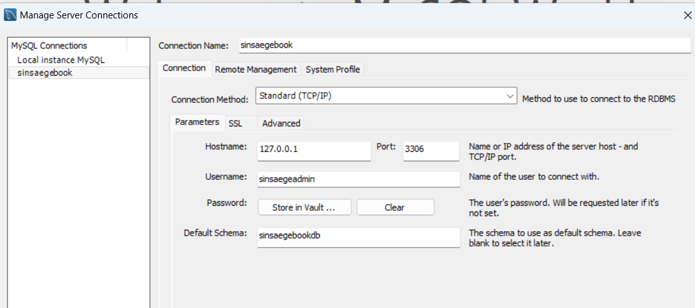
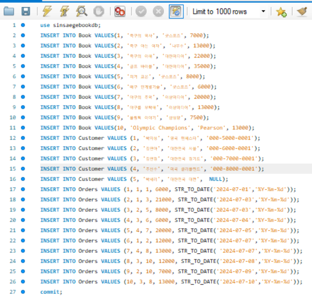
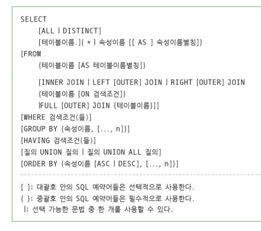
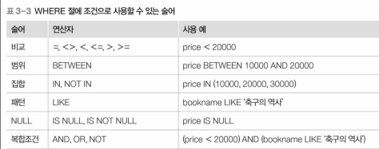

# 데이터 베이스 실습

#### mysql 작동 방법
1. mysql 8.0 cli
2. powershell 로 들어가서 mysql/mysql Server 8.0/bin 들어가서 작동
- [`그 이후 방법`](https://unluckyjung.github.io/db/2020/07/25/PowerShell_MySQL/)
- `mysql -u root -p` 그냥 이걸 치면 접속 가능하다

### 실습 1 
1. database 생성 : testdb
2. testdb use 명령어 지정하기
3. database 안에 데이터를 저장할 테이블 생성 : test 테이블 (id,name)
4. 만든 테이블 확인
5. 만든 테이블에 자료 입력 : insert

- 1.2. 과정
```agsl

mysql> show databases;
+--------------------+
| Database           |
+--------------------+
| information_schema |
| mysql              |
| performance_schema |
| sakila             |
| sys                |
| world              |
+--------------------+
6 rows in set (0.00 sec)

mysql> create database testdb;
Query OK, 1 row affected (0.02 sec)

mysql> show databases;
+--------------------+
| Database           |
+--------------------+
| information_schema |
| mysql              |
| performance_schema |
| sakila             |
| sys                |
| testdb             |
| world              |
+--------------------+
7 rows in set (0.00 sec)

mysql> use testdb;
Database changed
```

- 3, 4, 5 과정
```agsl
mysql> create table test(id smallint unsigned primary key auto_increment,name varchar(20) not null);
Query OK, 0 rows affected (0.07 sec)

mysql> show tables
    -> ;
+------------------+
| Tables_in_testdb |
+------------------+
| test             |
+------------------+
1 row in set (0.00 sec)

mysql> insert into test(id,name) values(1, 'Sample data');
Query OK, 1 row affected (0.02 sec)

mysql> select * from test;
+----+-------------+
| id | name        |
+----+-------------+
|  1 | Sample data |
+----+-------------+
1 row in set (0.00 sec)

```

### 실습 2
```agsl
mysql> create database sinsaegebookdb;
Query OK, 1 row affected (0.01 sec)

mysql> show databases;
+--------------------+
| Database           |
+--------------------+
| information_schema |
| mysql              |
| performance_schema |
| sakila             |
| sinsaegebookdb     |
| sys                |
| testdb             |
| world              |
+--------------------+
8 rows in set (0.00 sec)

mysql> create user sinsaegeadmin@localhost identified by '1234';
Query OK, 0 rows affected (0.02 sec)

mysql> grant all privileges on sinsaegebookdb.* to sinsaegeadmin@localhost;
Query OK, 0 rows affected (0.01 sec)

mysql> commit;
Query OK, 0 rows affected (0.00 sec)
```

- 신세계 db 에 sinsaegeadmin 계정 비밀번호 1234 로 만들어서
- sinsaegebookdb의 모든 권한을 주고 commit 한것



- 이 후에 workbench에서 만든 user 이름으로 연결 설정

## 실습 3
- pdf 3,7페이지 서점 데이터 만들기 (sinsaegebookdb)

1. book table 만들기  
```roomsql
mysql> create table Book(
    -> bookid INTEGER PRIMARY KEY,
    -> bookname VARCHAR(40),
    -> publisher VARCHAR(40),
    -> price INTEGER);
```
- VARCHAR 가 String 이라 생각하면 되겠다.
  <br>
  <br>

2.  customer table 만들기
```roomsql
mysql> create table customer(
    -> custid INTEGER PRIMARY KEY,
    -> name VARCHAR(40),
    -> address VARCHAR(40),
    -> phone VARCHAR(40));
```
<br>
<br>

3. order table 만들기 (외래키로 두테이블의 primary key 가져옴)
```roomsql
mysql> create table orders(
    -> orderid INTEGER PRIMARY KEY,
    -> custid INTEGER,
    -> bookid INTEGER,
    -> saleprice INTEGER,
    -> orderdate date,
    -> foreign key(custid) references customer(custid),
    -> foreign key(bookid) references book(bookid));
```
<br>
<br>

4. 자료 복사 붙이기
- 워크밴치는 그냥 넣고 번개 누르면 되지만,
- cli 에서는 붙이고 commit; 해줘야 함
```roomsql
use sinsaegebookdb;
INSERT INTO Book VALUES(1, '축구의 역사', '굿스포츠', 7000);
INSERT INTO Book VALUES(2, '축구 아는 여자', '나무수', 13000);
INSERT INTO Book VALUES(3, '축구의 이해', '대한미디어', 22000);
INSERT INTO Book VALUES(4, '골프 바이블', '대한미디어', 35000);
INSERT INTO Book VALUES(5, '피겨 교본', '굿스포츠', 8000);
INSERT INTO Book VALUES(6, '배구 단계별기술', '굿스포츠', 6000);
INSERT INTO Book VALUES(7, '야구의 추억', '이상미디어', 20000);
INSERT INTO Book VALUES(8, '야구를 부탁해', '이상미디어', 13000);
INSERT INTO Book VALUES(9, '올림픽 이야기', '삼성당', 7500);
INSERT INTO Book VALUES(10, 'Olympic Champions', 'Pearson', 13000);
INSERT INTO Customer VALUES (1, '박지성', '영국 맨체스타', '000-5000-0001');
INSERT INTO Customer VALUES (2, '김연아', '대한민국 서울', '000-6000-0001');
INSERT INTO Customer VALUES (3, '김연경', '대한민국 경기도', '000-7000-0001');
INSERT INTO Customer VALUES (4, '추신수', '미국 클리블랜드', '000-8000-0001');
INSERT INTO Customer VALUES (5, '박세리', '대한민국 대전',  NULL);
INSERT INTO Orders VALUES (1, 1, 1, 6000, STR_TO_DATE('2024-07-01','%Y-%m-%d'));
INSERT INTO Orders VALUES (2, 1, 3, 21000, STR_TO_DATE('2024-07-03','%Y-%m-%d'));
INSERT INTO Orders VALUES (3, 2, 5, 8000, STR_TO_DATE('2024-07-03','%Y-%m-%d'));
INSERT INTO Orders VALUES (4, 3, 6, 6000, STR_TO_DATE('2024-07-04','%Y-%m-%d'));
INSERT INTO Orders VALUES (5, 4, 7, 20000, STR_TO_DATE('2024-07-05','%Y-%m-%d'));
INSERT INTO Orders VALUES (6, 1, 2, 12000, STR_TO_DATE('2024-07-07','%Y-%m-%d'));
INSERT INTO Orders VALUES (7, 4, 8, 13000, STR_TO_DATE( '2024-07-07','%Y-%m-%d'));
INSERT INTO Orders VALUES (8, 3, 10, 12000, STR_TO_DATE('2024-07-08','%Y-%m-%d'));
INSERT INTO Orders VALUES (9, 2, 10, 7000, STR_TO_DATE('2024-07-09','%Y-%m-%d'));
INSERT INTO Orders VALUES (10, 3, 8, 13000, STR_TO_DATE('2024-07-10','%Y-%m-%d'));
commit;
```


<br>
<br>

5. 권한 부여하기 

`grant all privileges on sinsaegebookdb. * to 'sinsaegeadmin'@'localhost';`

6. 정보 조회 방법

```roomsql
mysql> select phone from customer;
+---------------+
| phone         |
+---------------+
| 000-5000-0001 |
| 000-6000-0001 |
| 000-7000-0001 |
| 000-8000-0001 |
| NULL          |
+---------------+
5 rows in set (0.00 sec)

mysql> select phone from customer where name='김연아';
+---------------+
| phone         |
+---------------+
| 000-6000-0001 |
+---------------+
1 row in set (0.00 sec)
```
- where 을 통해 조건을 주어서 원하는 값 가져올 수 있다.


<br>
<br>

7.  book 테이블에서 책이름과 출판사 이름을 뽑는데 가격이 만원이상인거
```roomsql
mysql> select bookname,publisher from book where price >= 10000;
+-------------------+------------+
| bookname          | publisher  |
+-------------------+------------+
| 축구 아는 여자    | 나무수     |
| 축구의 이해       | 대한미디어 |
| 골프 바이블       | 대한미디어 |
| 야구의 추억       | 이상미디어 |
| 야구를 부탁해     | 이상미디어 |
| Olympic Champions | Pearson    |
+-------------------+------------+
6 rows in set (0.00 sec)
```
<br>
<br>

- 출판사 기준 정렬
```roomsql
mysql> select bookname,publisher from book where price >= 10000 order by publisher;
+-------------------+------------+
| bookname          | publisher  |
+-------------------+------------+
| Olympic Champions | Pearson    |
| 축구 아는 여자    | 나무수     |
| 축구의 이해       | 대한미디어 |
| 골프 바이블       | 대한미디어 |
| 야구의 추억       | 이상미디어 |
| 야구를 부탁해     | 이상미디어 |
+-------------------+------------+
6 rows in set (0.01 sec)
```
<br>
<br>

- bookid 기준 오름 차순
```roomsql
mysql> select * from book where price >= 10000 order by bookid asc;
+--------+-------------------+------------+-------+
| bookid | bookname          | publisher  | price |
+--------+-------------------+------------+-------+
|      2 | 축구 아는 여자    | 나무수     | 13000 |
|      3 | 축구의 이해       | 대한미디어 | 22000 |
|      4 | 골프 바이블       | 대한미디어 | 35000 |
|      7 | 야구의 추억       | 이상미디어 | 20000 |
|      8 | 야구를 부탁해     | 이상미디어 | 13000 |
|     10 | Olympic Champions | Pearson    | 13000 |
+--------+-------------------+------------+-------+
6 rows in set (0.00 sec)
```
<br>
<br>

- distinct 로 중보제거 및 desc 로 내림차순
```roomsql
mysql> select distinct publisher from book where price >= 10000 order by bookid desc;
+------------+
| publisher  |
+------------+
| Pearson    |
| 이상미디어 |
| 대한미디어 |
| 나무수     |
+------------+
4 rows in set (0.00 sec)
```
<br>
<br>

### select 문 기본 문법




<br>
<br>

8.  문제 모든 도서의 이름과 가격을 검색

```roomsql
mysql> describe book;
+-----------+-------------+------+-----+---------+-------+
| Field     | Type        | Null | Key | Default | Extra |
+-----------+-------------+------+-----+---------+-------+
| bookid    | int(11)     | NO   | PRI | NULL    |       |
| bookname  | varchar(40) | YES  |     | NULL    |       |
| publisher | varchar(40) | YES  |     | NULL    |       |
| price     | int(11)     | YES  |     | NULL    |       |
+-----------+-------------+------+-----+---------+-------+
4 rows in set (0.00 sec)
```

<br>
<br>

- describe로 구조 확인 가능

```roomsql

mysql> select bookname, price from book;
+-------------------+-------+
| bookname          | price |
+-------------------+-------+
| 축구의 역사       |  7000 |
| 축구 아는 여자    | 13000 |
| 축구의 이해       | 22000 |
| 골프 바이블       | 35000 |
| 피겨 교본         |  8000 |
| 배구 단계별기술   |  6000 |
| 야구의 추억       | 20000 |
| 야구를 부탁해     | 13000 |
| 올림픽 이야기     |  7500 |
| Olympic Champions | 13000 |
+-------------------+-------+
10 rows in set (0.00 sec)
```

<br>
<br>


9. 모든 도서의 도서번호, 도서이름, 출판사, 가격 검색

```roomsql
mysql> select * from book ;
+--------+-------------------+------------+-------+
| bookid | bookname          | publisher  | price |
+--------+-------------------+------------+-------+
|      1 | 축구의 역사       | 굿스포츠   |  7000 |
|      2 | 축구 아는 여자    | 나무수     | 13000 |
|      3 | 축구의 이해       | 대한미디어 | 22000 |
|      4 | 골프 바이블       | 대한미디어 | 35000 |
|      5 | 피겨 교본         | 굿스포츠   |  8000 |
|      6 | 배구 단계별기술   | 굿스포츠   |  6000 |
|      7 | 야구의 추억       | 이상미디어 | 20000 |
|      8 | 야구를 부탁해     | 이상미디어 | 13000 |
|      9 | 올림픽 이야기     | 삼성당     |  7500 |
|     10 | Olympic Champions | Pearson    | 13000 |
+--------+-------------------+------------+-------+
10 rows in set (0.00 sec)
```
<br>
<br>

10. 도서 테이블에 있는 모든 출판사 검색


```roomsql
mysql> select publisher from book;
+------------+
| publisher  |
+------------+
| 굿스포츠   |
| 나무수     |
| 대한미디어 |
| 대한미디어 |
| 굿스포츠   |
| 굿스포츠   |
| 이상미디어 |
| 이상미디어 |
| 삼성당     |
| Pearson    |
+------------+
10 rows in set (0.00 sec)
```

<br>
<br>

### where 절 조건


<br>
<br>

11.  가격이 2만원 미만인 도서

```roomsql
mysql> select * from book where price<20000;
+--------+-------------------+------------+-------+
| bookid | bookname          | publisher  | price |
+--------+-------------------+------------+-------+
|      1 | 축구의 역사       | 굿스포츠   |  7000 |
|      2 | 축구 아는 여자    | 나무수     | 13000 |
|      5 | 피겨 교본         | 굿스포츠   |  8000 |
|      6 | 배구 단계별기술   | 굿스포츠   |  6000 |
|      8 | 야구를 부탁해     | 이상미디어 | 13000 |
|      9 | 올림픽 이야기     | 삼성당     |  7500 |
|     10 | Olympic Champions | Pearson    | 13000 |
+--------+-------------------+------------+-------+
7 rows in set (0.00 sec)
```

<br>
<br>

- where 조건문의 와일드카드


12. 가격 2만원 미만 도서

```roomsql
mysql> select * from book where price<20000;
+--------+-------------------+------------+-------+
| bookid | bookname          | publisher  | price |
+--------+-------------------+------------+-------+
|      1 | 축구의 역사       | 굿스포츠   |  7000 |
|      2 | 축구 아는 여자    | 나무수     | 13000 |
|      5 | 피겨 교본         | 굿스포츠   |  8000 |
|      6 | 배구 단계별기술   | 굿스포츠   |  6000 |
|      8 | 야구를 부탁해     | 이상미디어 | 13000 |
|      9 | 올림픽 이야기     | 삼성당     |  7500 |
|     10 | Olympic Champions | Pearson    | 13000 |
+--------+-------------------+------------+-------+
7 rows in set (0.00 sec)
```

13. 가격이 만원이상 2만원 이하
```roomsql
mysql> select * from book where price between 10000 and 20000;
+--------+-------------------+------------+-------+
| bookid | bookname          | publisher  | price |
+--------+-------------------+------------+-------+
|      2 | 축구 아는 여자    | 나무수     | 13000 |
|      7 | 야구의 추억       | 이상미디어 | 20000 |
|      8 | 야구를 부탁해     | 이상미디어 | 13000 |
|     10 | Olympic Champions | Pearson    | 13000 |
+--------+-------------------+------------+-------+
4 rows in set (0.00 sec)
```

14. 출판사가 굿스포츠 혹은 대한미디어

```roomsql
mysql> select * from book where publisher='굿스포츠' or publisher='대한미디어';
+--------+-----------------+------------+-------+
| bookid | bookname        | publisher  | price |
+--------+-----------------+------------+-------+
|      1 | 축구의 역사     | 굿스포츠   |  7000 |
|      3 | 축구의 이해     | 대한미디어 | 22000 |
|      4 | 골프 바이블     | 대한미디어 | 35000 |
|      5 | 피겨 교본       | 굿스포츠   |  8000 |
|      6 | 배구 단계별기술 | 굿스포츠   |  6000 |
+--------+-----------------+------------+-------+
5 rows in set (0.00 sec)
```

15. 출판사가 굿스포츠 혹은 대한미디어가 아닌거
```roomsql
mysql> select * from book where publisher not in('굿스포츠','대한미디어');
+--------+-------------------+------------+-------+
| bookid | bookname          | publisher  | price |
+--------+-------------------+------------+-------+
|      2 | 축구 아는 여자    | 나무수     | 13000 |
|      7 | 야구의 추억       | 이상미디어 | 20000 |
|      8 | 야구를 부탁해     | 이상미디어 | 13000 |
|      9 | 올림픽 이야기     | 삼성당     |  7500 |
|     10 | Olympic Champions | Pearson    | 13000 |
+--------+-------------------+------------+-------+
5 rows in set (0.00 sec)
```

16. 축구의 역사를 출간한 출판사
```roomsql
mysql> select bookname,publisher from book where bookname='축구의 역사';
+-------------+-----------+
| bookname    | publisher |
+-------------+-----------+
| 축구의 역사 | 굿스포츠  |
+-------------+-----------+
1 row in set (0.00 sec)
```

17. 도서 이름에 축구가 포함된 출판사
```roomsql
mysql> select bookname,publisher from book where bookname like '%축구%';
+----------------+------------+
| bookname       | publisher  |
+----------------+------------+
| 축구의 역사    | 굿스포츠   |
| 축구 아는 여자 | 나무수     |
| 축구의 이해    | 대한미디어 |
+----------------+------------+
3 rows in set (0.00 sec)
```

18.  도서이름의 왼쪽 두번째 위치에 구 라는 문자열 갖는 도서
```roomsql
mysql> select * from book where bookname like '_구%';
+--------+-----------------+------------+-------+
| bookid | bookname        | publisher  | price |
+--------+-----------------+------------+-------+
|      1 | 축구의 역사     | 굿스포츠   |  7000 |
|      2 | 축구 아는 여자  | 나무수     | 13000 |
|      3 | 축구의 이해     | 대한미디어 | 22000 |
|      6 | 배구 단계별기술 | 굿스포츠   |  6000 |
|      7 | 야구의 추억     | 이상미디어 | 20000 |
|      8 | 야구를 부탁해   | 이상미디어 | 13000 |
+--------+-----------------+------------+-------+
6 rows in set (0.00 sec)
```

19. 축구에 관한 도서중 가격이 2만원 이상인 도서

```roomsql
mysql> select * from book where bookname like '%축구%' and price>=20000;
+--------+-------------+------------+-------+
| bookid | bookname    | publisher  | price |
+--------+-------------+------------+-------+
|      3 | 축구의 이해 | 대한미디어 | 22000 |
+--------+-------------+------------+-------+
1 row in set (0.00 sec)
```

20. 도서를 이름 순으로 검색
```roomsql
mysql> select * from book order by bookname;
+--------+-------------------+------------+-------+
| bookid | bookname          | publisher  | price |
+--------+-------------------+------------+-------+
|     10 | Olympic Champions | Pearson    | 13000 |
|      4 | 골프 바이블       | 대한미디어 | 35000 |
|      6 | 배구 단계별기술   | 굿스포츠   |  6000 |
|      8 | 야구를 부탁해     | 이상미디어 | 13000 |
|      7 | 야구의 추억       | 이상미디어 | 20000 |
|      9 | 올림픽 이야기     | 삼성당     |  7500 |
|      2 | 축구 아는 여자    | 나무수     | 13000 |
|      1 | 축구의 역사       | 굿스포츠   |  7000 |
|      3 | 축구의 이해       | 대한미디어 | 22000 |
|      5 | 피겨 교본         | 굿스포츠   |  8000 |
+--------+-------------------+------------+-------+
10 rows in set (0.00 sec)
```

21. 도서를 가격순으로 검색하고, 가격이 같으면 이름순 검색
```roomsql
mysql> select * from book order by price,bookname;
+--------+-------------------+------------+-------+
| bookid | bookname          | publisher  | price |
+--------+-------------------+------------+-------+
|      6 | 배구 단계별기술   | 굿스포츠   |  6000 |
|      1 | 축구의 역사       | 굿스포츠   |  7000 |
|      9 | 올림픽 이야기     | 삼성당     |  7500 |
|      5 | 피겨 교본         | 굿스포츠   |  8000 |
|     10 | Olympic Champions | Pearson    | 13000 |
|      8 | 야구를 부탁해     | 이상미디어 | 13000 |
|      2 | 축구 아는 여자    | 나무수     | 13000 |
|      7 | 야구의 추억       | 이상미디어 | 20000 |
|      3 | 축구의 이해       | 대한미디어 | 22000 |
|      4 | 골프 바이블       | 대한미디어 | 35000 |
+--------+-------------------+------------+-------+
```

22. 도서 가격 내림차순 검색, 같으면 출판사 오름차순
```roomsql
mysql> select * from book order by price desc, publisher asc;
+--------+-------------------+------------+-------+
| bookid | bookname          | publisher  | price |
+--------+-------------------+------------+-------+
|      4 | 골프 바이블       | 대한미디어 | 35000 |
|      3 | 축구의 이해       | 대한미디어 | 22000 |
|      7 | 야구의 추억       | 이상미디어 | 20000 |
|     10 | Olympic Champions | Pearson    | 13000 |
|      2 | 축구 아는 여자    | 나무수     | 13000 |
|      8 | 야구를 부탁해     | 이상미디어 | 13000 |
|      5 | 피겨 교본         | 굿스포츠   |  8000 |
|      9 | 올림픽 이야기     | 삼성당     |  7500 |
|      1 | 축구의 역사       | 굿스포츠   |  7000 |
|      6 | 배구 단계별기술   | 굿스포츠   |  6000 |
+--------+-------------------+------------+-------+
```


