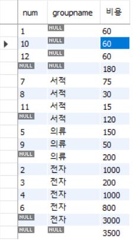
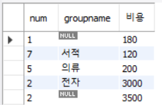

# Employees 실습

### powershell 
- cmd 입력
- dir \ 입력
- cd datasource\employees
- mysql -u root -p
- source employees.sql

- 이러면 미리 입력한 sql 명령어로 employees 저장

### workbench

1. schemas 우클릭으로  create schema 를 하여 db 생성가능
2. tables 우클릭으로 create table
   - column name, datatype 등등 편한대로 지정하고 넣어주면된다.

3. 원하는 테이블 우클릭해서 select문 실행 하고, 테이블에 좌클릭 누르면서 직접 값 하나 하나 넣기가능


4. sql script 저장


5. 주석 처리 방법


6. 띄어쓰기가 있는 sql문


7. 다른 실습
```sql
USE employees;
-- select emp_no from employees;  주석처리
-- create table `my test`;  my test 같이 띄어쓰면 원래 안되는데 `` 으로 둘러싸면 된다.
-- select * from employees.titles;  -- 만약 다른 db 사용중이라면 db이름.table 로 접근하는것
-- select * from shopdb.membertbl;
-- select emp_no,to_date from titles;

-- 현재 데이터베이스의 모든 테이블의 정보를 출력
-- show table status;

-- 테이블의 이름만 간단히 보려면
-- show tables;

-- employees 테이블의 열이 무엇이 있는지 출력하세요
desc employees;

-- employees 테이블로 부터 last_name 과 성별을 출력하세요
select first_name as 이름 ,gender 성별, hire_date '회사 입사일' from employees; -- as 생략가능 하다, 띄어쓰기는 '' 로 감싸면된다.
```

8. Script 만들기


```sql
INSERT INTO buytbl VALUES(NULL, 'KBS', '운동화', NULL   , 30,   2);
INSERT INTO buytbl VALUES(NULL, 'KBS', '노트북', '전자', 1000, 1);
INSERT INTO buytbl VALUES(NULL, 'JYP', '모니터', '전자', 200,  1);
INSERT INTO buytbl VALUES(NULL, 'BBK', '모니터', '전자', 200,  5);
```

- `auto_increment` 는 `insert` 할 때 null 을 넣는다.


```sql
-- 1. sqldb 선택하고, 사용자 중 김경호 씨 정보 출력
use sqldb;
SELECT * FROM usertbl;
SELECT * FROM buytbl;

select * from usertbl where name = '김경호';

-- 2. 1970 년 이후에 출생하고 신장 182 이상인 사람의 아이디와 이름 조회
select userid,name from usertbl where birthyear> 1970 and height >= 182;

-- 3 . 키가 180~183 인 사람의 아이디와 이름과 키를 조회 
select userid,name,height from usertbl where height>=180 and height<=183;
select userid,name,height from usertbl where height between 180 and 183;

-- 4. 지역이 경남과 경북인 사람의 정보 조회
select * from usertbl where addr='경남' or addr ='경북'; 
select * from usertbl where addr in('경남' ,'경북'); 

-- 5.  이름이 김으로 시작하는 사람의 이름과 키 조회
select name,height from usertbl where name like '김%';

-- 6. 이름이 종신인 사람의 이름 키 지역 조회
select name,height,addr from usertbl where name like '%종신';
select name,height,addr from usertbl where name like '_종신';

-- subQuery (서브쿼리 : 하위쿼리) 쿼리문 안에 쿼리문이 들어 있는 것

-- 김경호보다 키가 크거나 같은 사람의 이름과 키를 출력

select name, height from usertbl where name ='김경호';
select name,height from usertbl where height >177;

select name , height from usertbl 
where height > (select height from usertbl where name='김경호');   -- 서브쿼리 결과가 하나만 나오는 경우

-- 지역이 경남 사람의 키보다 키가 크거나 같은 사람의 이름과 키를 출력
select name,height from usertbl 
where height >= any (select height from usertbl where addr='경남');  -- 서브쿼리 결과가 여러개인 경우 , any 값 아무거나 조건 맞으면 성립 (170 이상)
select name,height from usertbl 
where height >= all (select height from usertbl where addr='경남');  -- 서브쿼리 결과가 여러개인 경우 , all 을 쓰면 여기 모든 값의 조건을 맞아야 성립  (173 이상)

select name,height from usertbl 
where height = any (select height from usertbl where addr='경남');  -- = 하면 조건 맞는사람 2명 출력

select name,height from usertbl 
where height in (select height from usertbl where addr='경남');  -- 위에 = any 와 같다

select name,height from usertbl 
where height >= some (select height from usertbl where addr='경남');  -- some 이랑 any 랑 같다

-- 원하는 순서대로 정렬하여 출력 : order by 절 : 결과물에 대해 영향이 없다. 결과가 출력되는 순서를 조절하는 구문
-- asc , desc


-- 먼저 가입한 순서대로 회원의 이름과 가입일을 출력
select name,mdate from usertbl order by mdate;

-- 여러 정렬 조건 제시, 키가 큰 순서대로 정렬하되, 만약 키가 같다면 이름 순으로 정렬하여 출력
select * from usertbl order by height desc , name;

-- 중복된 것은 거르고 하나만 ... distinct 
-- 회원테이블에서 회원들의 거주지역이 몇군데인지 출력
select count(distinct(addr)) from usertbl;

-- employees db로 전환  
use employees;
desc employees;
-- 입사일이 오래된 사원 5명의 사원번호, 입사일을 조회
select emp_no,hire_date from employees order by hire_date limit 5;    -- 에서부터 5개 (index 시작은 0)
select emp_no,hire_date from employees order by hire_date limit 0,5;  -- 시작 2에서 부터 5개


```

## group by, having

```sql
-- 테이블을 복사하는 select
-- create table 테이블이름 (select 원하는 속성 지정 from 기존테이블);
select * from buytbl2;
create table buytbl2 (select * from buytbl);
create table buytbl3 (select num,userid,prodname from buytbl);
desc buytbl2;  -- 프라이머리 키와 같은 제약조건은 복사 안됨

-- group by 절 과 having , 집계 함수

-- buytbl 테이블에서 사용자아이디와 재고수량을 아이디 오름차순 정렬 하여 출력
select userid,sum(amount) 총개수 from buytbl group by userid order by userID;

-- 전체 구매자가 구매한 물품의 평균을 구하여 출력 (평균 구매 개수)
select * from buytbl;
select avg(amount) as '평균 구매 개수' from buytbl;
-- 각 사용자 별로 한 번 구매시 평균 몇개를 구매 했는지 평균을 출력alter
select userid, avg(amount) from buytbl group by userid;

-- usertbl 에서 가장 큰 키와 가장 작은 키의 회원의 이름과 키를 출력
select * from usertbl;
select name, max(height), min(height) from usertbl group by name;  -- 안나옴 서브쿼리로 해결 할 필요 있음

select name, height from usertbl where height = 
(select max(height) from usertbl) or height = (select min(height) from usertbl);

-- 휴대폰이 있는 사용자의 수를 출력하세요
select * from usertbl;
select count(*) from usertbl where mobile2 is not null;
select count(mobile2) from usertbl;  -- 위 아래 같게나옴, null 은 count 하지 않는다

-- group by 조건은 having으로 줌
-- 사용자별 총 구매액 출력 buytbl
select * from buytbl;
select userid as '사용자',sum(price*amount) as 총구매액 from buytbl group by userid;

-- 총 구매액이 1000이상인 사용자에게만 사은품 증정하려고 한다. 이 조건에 해당하는 사용자 id 를 출력
-- where 절에서는 집계함수 사용 할수 없다
select userid,sum(price*amount) from buytbl group by userid having sum(price*amount) >= 1000; -- 그룹 한 상태에서 조건을 찾는것이기 때문에 having 써야함


-- 총합 또는 중간합계를 구하려면 group by절과 함께 rollup문을 함꼐 사용한다. 
-- groupname(분류) 별로 합계 와 그 총합을 구하고 싶다.
select groupname from buytbl;
select num, groupname, sum(price*amount) as 비용 from buytbl group by groupname,num with rollup;

```

- 처음에 1 10 12 는 groupname 없는애들 값이고, 그리고 그거에 합 180 나오는거
- 두번째부터 각 분류별로 값 나열하고 합 나오고,
- 맨 마지막에는 모두의 합이 나오는것
- 그룹네임과 num 기준으로 했기 때문에 두 기준에 맞게 rollup 한거

```sql
select num, groupname, sum(price*amount) as 비용 from buytbl group by groupname with rollup;

```

- 그룹네임으로 묶어서 비용 총합 나오는거 볼수 잇음

```sql

-- 트랜잭션 : 테이블의 데이터를 변경(입력/수정/삭제) 할 떄 실제 테이블에 완전히 적용하지 않고, 임시로 적용시키는 것. 실수가 있을 경우 취소할 수 있다.
select * from usertbl;
desc usertbl;
insert into usertbl values('sym1','yoomi',2000,'경기','010','12345678',170,'2024-01-17');
rollback;

-- test 테이블을 생성 하는데
create table testTbl1 (id int, username char(3), age int);
insert into testTbl1 values (1,'sss',20);
insert into testTbl1(id,username) values (1,'sss');
insert into testTbl1(username,id,age) values ('jko',3,22);  -- 순서를 앞에서 내가 넣고 싶은대로 명칭 해둘수 있음
select * from testTbl1;

create table testTbl2 (id int auto_increment primary key, username char(3), age int);
insert into testTbl2 values (null,'지효',25);
select * from testTbl2;
rollback;
commit;


-- autoincrement 가 어느 숫자까지 증가되었는지 확인 방법
-- autoincrement 는 중간에 값 삭제 가능하고 중간에 빈 숫자를 넣어 insert 가능
-- autoincrement 는 중간에 이은 숫자가 아닌 큰 숫자를 넣으면 거기서부터 증가 시작함
select last_insert_id(); 
alter table testTbl2 auto_increment = 100; -- auto_increment 입력값을 변경
set @@auto_increment_increment = 3; -- auto 증가가 3씩 됨

-- 대량의 샘플데이터 생성 방법 : insert into ... select 구문
create table testTbl3 (id int, Fname varchar(50), Lname varchar(50));
insert into testTbl3 select emp_no,first_name,last_name from employees.employees; -- 다른 테이블에서 복사해옴
select count(id) from testTbl3;
commit;


-- testTbl4 employees.employees 테이블 속성중 emp_no, first_name, last_name
create table testtTbl4 (select emp_no,first_name,last_name from employees.employees); -- 이렇게도 복사생성 가능
select count(*) from testtTbl4;


-- 데이터의 수정 : update : 기존에 입력되어 있는 값은 변경하기 위해 사용하는 명령어
update 테이블 이름 set 열1 = 값1, 열2 = 값2 where 조건;
select * from testtTbl4;
select * from testtTbl4 where first_name ='Kyoichi';
rollback;
update testtTbl4 set last_name ='none' where first_name = 'Kyoichi';

-- 데이터의 삭제 : delete from 테이블이름 where 조건 ; (행, row, tuple) 단위로 삭제
delete from testtTbl4 where first_name = 'Berni' limit 5;
select * from testtTbl4 where first_name = 'Berni';
rollback;


-- 대용량 테이블 3개 생성 bigTbl1, bigTbl2, bigTbl3 employees.employees 의 전체 속성을 대상으로 생성
create table bigTbl1 (select * from employees.employees);
create table bigTbl2 (select * from employees.employees);
create table bigTbl3 (select * from employees.employees);

delete from bigTbl1; -- bigTbl1 의 전체 튜플 삭제
select * from bigTbl1;
select * from bigTbl2;
select * from bigTbl3;
drop table bigTbl2; -- 테이블자체가 사라짐
truncate table bigTbl3;  -- 속도가 삭제중에서 가장빠름 (테이블구조는 남아 있음) 트랜잭션로그를 기록하지 않아서 빠름


-- insert 문이 행 데이터를 입력한다. alter
-- userTbl에서 아이디,이름,주소만 가지고 와서 memberTBL 생성 3건만 가져오기
desc usertbl;
create table memberTBL (select userid,name,addr from usertbl);
create table memberTBL2 (select userid,name,addr from usertbl limit 3);
select * from memberTBL2;
select * from memberTBL;
alter table memberTBL add constraint pk_memberTBL primary key(userid);
desc memberTBL;

insert ignore into membertbl values('BBQ', '비비큐', '한국');
insert ignore into membertbl values('SJH', '서장훈', '서울');
insert ignore into membertbl values('BBK', '비비케이', '한국'); -- ignore 하면 에러가 아닌 warning 출력함, 대용량으로 넣을때 멈추지 않고 다음 sql문을 진행하게해줌
insert ignore into membertbl values('AJH', '안정환', '서울');
insert ignore into membertbl values('AJH', '안정환', '서울') on duplicate key update name = '키가', addr = '겹쳐요';
    select * from memberTBL;


-- with 절, cte (common table expression) 를 표현하기 위한 구문 

-- 1. 재귀적 cte
/* with cte_테이블명( 열이름 ...., )
 as 
 ( 쿼리문 ) select 열이름 from cte_테이블이름;
*/

-- buybtl에서 사용자 아이디별 총 구매액을 출력
select userid as 사용자,sum(price*amount) as 총구매액 from buytbl group by userid;

with abc(userid,total)
as(select userid,sum(price*amount) from buytbl group by userid) 
select * from abc order by total desc;


-- 회원테이블(userTBL) 에서 각 지역별로 가장 큰 키를 가진 회원 1명을 뽑은 후에, 그 사람들의 평균을 구하세요
select * from usertbl;
-- 각 지역별 큰키를 가진 회원 조회 하기 
select addr, max(height) from usertbl group by addr;

SELECT AVG(max_height) AS avg_max_height
FROM (
    SELECT addr, MAX(height) AS max_height
    FROM usertbl
    GROUP BY addr
) AS heigt_user;
-- with절 만든거랑 같은 select문


-- with 절에 넣기
with height_user(addr, maxHeight)
as (select addr,max(height) from usertbl group by addr) 
select avg(maxHeight) as '지역별 최고 키의 평균' from height_user;


```


> https://dev.mysql.com/doc/employee/en/sakila-structure.html


