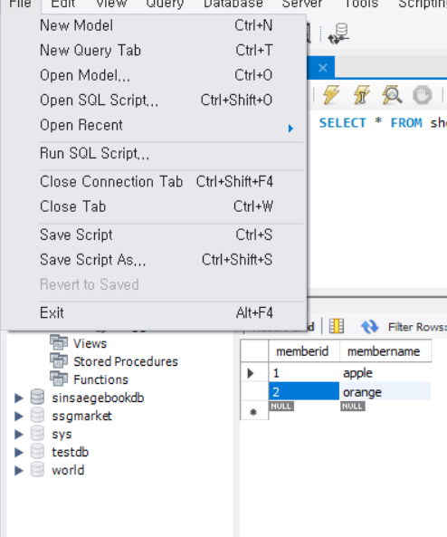
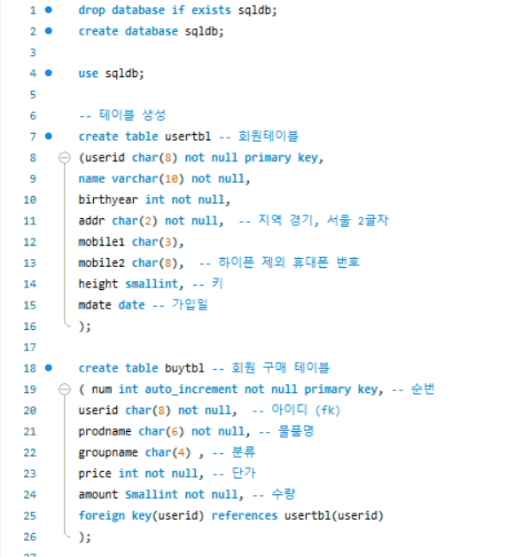

# Employees 실습

### powershell 
- cmd 입력
- dir \ 입력
- cd datasource\employees
- mysql -u root -p
- source employees.sql

- 이러면 미리 입력한 sql 명령어로 employees 저장

### workbench

1. schemas 우클릭으로  create schema 를 하여 db 생성가능
2. tables 우클릭으로 create table
   - column name, datatype 등등 편한대로 지정하고 넣어주면된다.

3. 원하는 테이블 우클릭해서 select문 실행 하고, 테이블에 좌클릭 누르면서 직접 값 하나 하나 넣기가능


4. sql script 저장



5. 주석 처리 방법


6. 띄어쓰기가 있는 sql문


7. 다른 실습
```agsl
USE employees;
-- select emp_no from employees;  주석처리
-- create table `my test`;  my test 같이 띄어쓰면 원래 안되는데 `` 으로 둘러싸면 된다.
-- select * from employees.titles;  -- 만약 다른 db 사용중이라면 db이름.table 로 접근하는것
-- select * from shopdb.membertbl;
-- select emp_no,to_date from titles;

-- 현재 데이터베이스의 모든 테이블의 정보를 출력
-- show table status;

-- 테이블의 이름만 간단히 보려면
-- show tables;

-- employees 테이블의 열이 무엇이 있는지 출력하세요
desc employees;

-- employees 테이블로 부터 last_name 과 성별을 출력하세요
select first_name as 이름 ,gender 성별, hire_date '회사 입사일' from employees; -- as 생략가능 하다, 띄어쓰기는 '' 로 감싸면된다.
```

8. Script 만들기



```agsl
INSERT INTO buytbl VALUES(NULL, 'KBS', '운동화', NULL   , 30,   2);
INSERT INTO buytbl VALUES(NULL, 'KBS', '노트북', '전자', 1000, 1);
INSERT INTO buytbl VALUES(NULL, 'JYP', '모니터', '전자', 200,  1);
INSERT INTO buytbl VALUES(NULL, 'BBK', '모니터', '전자', 200,  5);
```

- `auto_increment` 는 `insert` 할 때 null 을 넣는다.


```agsl
-- 1. sqldb 선택하고, 사용자 중 김경호 씨 정보 출력
use sqldb;
SELECT * FROM usertbl;
SELECT * FROM buytbl;

select * from usertbl where name = '김경호';

-- 2. 1970 년 이후에 출생하고 신장 182 이상인 사람의 아이디와 이름 조회
select userid,name from usertbl where birthyear> 1970 and height >= 182;

-- 3 . 키가 180~183 인 사람의 아이디와 이름과 키를 조회 
select userid,name,height from usertbl where height>=180 and height<=183;
select userid,name,height from usertbl where height between 180 and 183;

-- 4. 지역이 경남과 경북인 사람의 정보 조회
select * from usertbl where addr='경남' or addr ='경북'; 
select * from usertbl where addr in('경남' ,'경북'); 

-- 5.  이름이 김으로 시작하는 사람의 이름과 키 조회
select name,height from usertbl where name like '김%';

-- 6. 이름이 종신인 사람의 이름 키 지역 조회
select name,height,addr from usertbl where name like '%종신';
select name,height,addr from usertbl where name like '_종신';

-- subQuery (서브쿼리 : 하위쿼리) 쿼리문 안에 쿼리문이 들어 있는 것

-- 김경호보다 키가 크거나 같은 사람의 이름과 키를 출력

select name, height from usertbl where name ='김경호';
select name,height from usertbl where height >177;

select name , height from usertbl 
where height > (select height from usertbl where name='김경호');   -- 서브쿼리 결과가 하나만 나오는 경우

-- 지역이 경남 사람의 키보다 키가 크거나 같은 사람의 이름과 키를 출력
select name,height from usertbl 
where height >= any (select height from usertbl where addr='경남');  -- 서브쿼리 결과가 여러개인 경우 , any 값 아무거나 조건 맞으면 성립 (170 이상)
select name,height from usertbl 
where height >= all (select height from usertbl where addr='경남');  -- 서브쿼리 결과가 여러개인 경우 , all 을 쓰면 여기 모든 값의 조건을 맞아야 성립  (173 이상)

select name,height from usertbl 
where height = any (select height from usertbl where addr='경남');  -- = 하면 조건 맞는사람 2명 출력

select name,height from usertbl 
where height in (select height from usertbl where addr='경남');  -- 위에 = any 와 같다

select name,height from usertbl 
where height >= some (select height from usertbl where addr='경남');  -- some 이랑 any 랑 같다

-- 원하는 순서대로 정렬하여 출력 : order by 절 : 결과물에 대해 영향이 없다. 결과가 출력되는 순서를 조절하는 구문
-- asc , desc


-- 먼저 가입한 순서대로 회원의 이름과 가입일을 출력
select name,mdate from usertbl order by mdate;

-- 여러 정렬 조건 제시, 키가 큰 순서대로 정렬하되, 만약 키가 같다면 이름 순으로 정렬하여 출력
select * from usertbl order by height desc , name;

-- 중복된 것은 거르고 하나만 ... distinct 
-- 회원테이블에서 회원들의 거주지역이 몇군데인지 출력
select count(distinct(addr)) from usertbl;

-- employees db로 전환  
use employees;
desc employees;
-- 입사일이 오래된 사원 5명의 사원번호, 입사일을 조회
select emp_no,hire_date from employees order by hire_date limit 5;    -- 에서부터 5개 (index 시작은 0)
select emp_no,hire_date from employees order by hire_date limit 0,5;  -- 시작 2에서 부터 5개


```


> https://dev.mysql.com/doc/employee/en/sakila-structure.html


