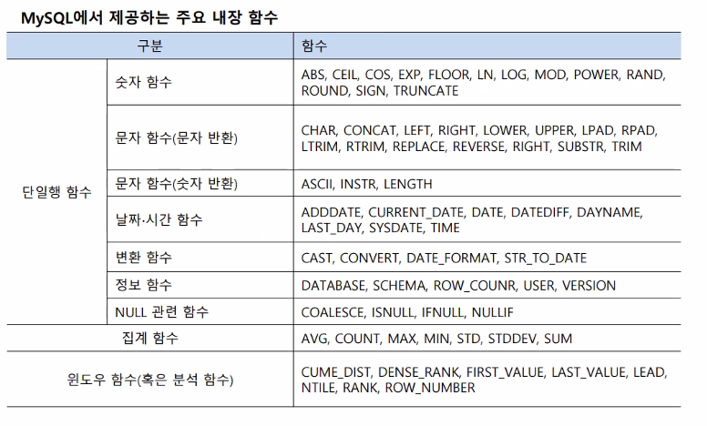
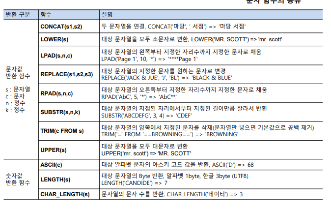
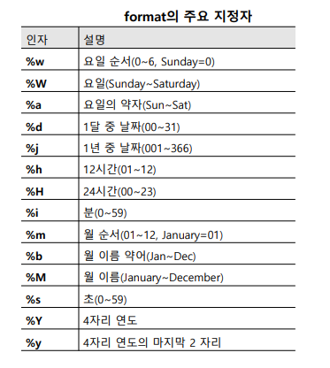

# 내장 함수, 뷰, 인덱스

## 내장 함수
- dbms 별로 제공 해주는 함수
- 필요에 따라 사용자 정의 함수도 만들 수 있음




- 숫자 함수


- 문자 함수


- 날짜 함수





```sql
-- 내장 함수

-- 2 4.875를 소수 첫째 자리까지 반올림한 값을 구하시오.

select round(4.857,1) from dual;  -- 가상 빈 테이블 dual


select abs(-4.5),abs(4.5) from dual;

-- -78과 +78의 절댓값을 구하시오.

select abs(-78),abs(78) ;
select round(4.857,1);

-- use sinsaegebookdb

-- 3 고객별 평균 주문 금액을 백 원 단위로 반올림한 값을 구하시오
select custid 고객번호, round(avg(saleprice),-2)
from orders group by custid;

-- 4 도서제목에 야구가 포함된 도서를 농구로 변경한 후 도서 목록을 보이시오.
select replace(bookname,'야구','농구') from book where bookname like '%야구%';

-- 5 굿스포츠에서 출판한 도서의 제목과 제목의 글자 수를 확인하시오. (한글은 2바이트 혹은 UNICODE 경우는 3바이트를 차지함)
select bookname,round(length(bookname)/3,0),char_length(bookname) from book where publisher = '굿스포츠';

-- 6 서점의 고객 중에서 같은 성(姓)을 가진 사람이 몇 명이나 되는지 성별 인원수를 구하시오
select substr(name,1,1),count(*)  from customer group by substr(name,1,1);

--  날짜 시간 함수
select date(sysdate());
select adddate('2024-01-19',interval -5 day) before5,
adddate('2024-01-19', interval +5 day) after5;

-- 7 서점은 주문일로부터 10일 후 매출을 확정한다. 각 주문의 확정일자를 구하시오.
select orderid, orderdate,adddate(orderdate, interval +10 day) as 주문확정일자 from orders;

-- 8 서점이 2024년 7월 7일에 주문 받은 도서의 주문번호, 주문일, 고객번호, 도서번호를 모두보이시오. 단, 주문일은 '%Y-%m-%d' 형태로 표시한다.
select * from orders where orderdate = '2024-07-07';
select orderid , date_format(orderdate, '%Y-%m-%d') 주문일, custid,bookid from orders
where orderdate = str_to_date('2024-07-07','%Y-%m-%d');   -- 주의 y는 대문자로 해야한다.

-- 9 DBMS 서버에 설정된 현재 날짜와 시간, 요일을 확인 하시오
select sysdate(), date_format(sysdate(),'%Y/%m/%d %a %h:%i');

-- 10 이름, 전화번호가 포함된 고객목록을 보이시오. 단, 전화번호가 없는 고객은‘연락처없음’으로 표시한다.
select name, ifnull(phone,'연락처없음') 연락처 from customer ;

-- 행번호 출력
set @seq:=0;   -- mysql 에서는 := 이 = 이랑 같음, set 변수 설정 같은 거다.
select (@seq:=@seq+1) '순번', custid, name, phone from customer ; -- where @seq<2;


```


# 뷰
-  하나 이상의 테이블을 합하여 만든 가상의 테이블

### 뷰의 장점
- 편리성 및 재사용성 : 자주 사용되는 복잡한 질의를 뷰로 미리 정의해 놓을 수 있음→ 복잡한 질의를 간단히 작성
- 보안성 : 사용자별로 필요한 데이터만 선별하여 보여줄 수 있고, 중요한 질의의 경우 질의 내용을 암호화할 수 있음 개인정보(주민번호)나 급여, 건강 같은 민감한 정보를 제외한 테이블을 만들어 사용
- 독립성 : 미리 정의된 뷰를 일반 테이블처럼 사용할 수 있기 때문에 편리하고, 사용자가 필요한 정보만 요구에 맞게 가공하여 뷰로 만들어 쓸 수 있음 원본 테이블의 구조가 변해도 응용에 영향을 주지 않도록 하는 논리적 독립성 제공

### 뷰의 특징
- 원본 데이터 값에 따라 같이 변함
- 독립적인 인덱스 생성이 어려움
- 삽입, 삭제, 갱신 연산에 많은 제약이 따름

  

```sql
CREATE VIEW 뷰이름 [(열이름 [ ,...n ])]
AS SELECT 문


-- 뷰
-- Book 테이블에서 ‘축구’라는 문구가 포함된 자료만 보여주는 뷰
create view vw_book1 as 
select * from book where bookname like '%축구%';

select * from vw_book1;

-- 20 주소에 '대한민국'을 포함하는 고객들로 구성된 뷰를 만들고 조회하시오. 뷰의 이름은vw_Customer로 설정하시오
create or replace view vw_Customer as
select * from customer where address like '%대한민국%';

select * from vw_Customer;

-- 21 Orders 테이블에 고객이름과 도서이름을 바로 확인할 수 있는 뷰를 생성한 후, ‘김연아’ 고객이 구입한 도서의 주문번호, 도서이름, 주문액을 보이시오.
create or replace view vw_order2 as  -- replace 추가하면 뷰 같은이름으로 생성 및 수정할때 오류 발생안함
select name,orderid,bookname,price from customer natural join orders natural join book;

select customer.name,orders.orderid,book.bookname,book.price from customer join orders on customer.custid=orders.custid 
join book on orders.bookid = book.bookid;

select * from vw_order2 where name = '김연아';


-- 22 [20]에서 생성한 뷰 vw_Customer는 주소가 대한민국인 고객을 보여준다. 이 뷰를 영국을주소로 가진 고객으로 변경하시오. phone 속성은 필요 없으므로 포함시키지 마시오.

create or replace view vw_Customer (번호,이름,주소) as   -- (여기 값을 넣은게 출력때 별명으로 들어감)
select custid,name,address from customer where address like '%영국%';

select * from vw_Customer;

-- 23 앞서 생성한 뷰 vw_Customer를 삭제하시오.
drop view vw_Customer;


-- 모든 스키마 정보들은 시스템 카탈로그에 저장됩니다
select * from information_schema.tables where table_schema like 'sinsaegebookdb';

-- 판매가격이 20,000원 이상인 도서의 도서번호, 도서이름, 고객이름, 출판사, 판매가격을 보여주는 highorders 뷰를 생성하시오.
create or replace view highorders (도서번호,도서이름,고객이름,출판사,판매가격) 
as select bookid,bookname,name,publisher,price from book natural join orders natural join customer
where price >= 20000;

select * from highorders;

-- 생성한 뷰를 이용하여 판매된 도서의 이름과 고객의 이름을 출력하는 SQL 문을 작성하시오
select 도서이름,고객이름 from highorders;

--  highorders 뷰를 변경하고자 한다. 판매가격 속성을 삭제하는 명령을 수행하시오. 삭제 후 (2)번 SQL 문을 다시 수행하시오
create or replace view highorders (도서번호,도서이름,고객이름,출판사) 
as select orders.bookid,bookname,name,publisher from book  join orders on book.bookid = orders.bookid
 join customer on customer.custid = orders.custid
where price >= 20000;

select 도서이름,고객이름 from highorders;

```


# 인덱스 (따로 공부하자)

- 도서의 색인이나 사전과 같이 데이터를 쉽고 빠르게 찾을 수있도록 만든 데이터 구조


