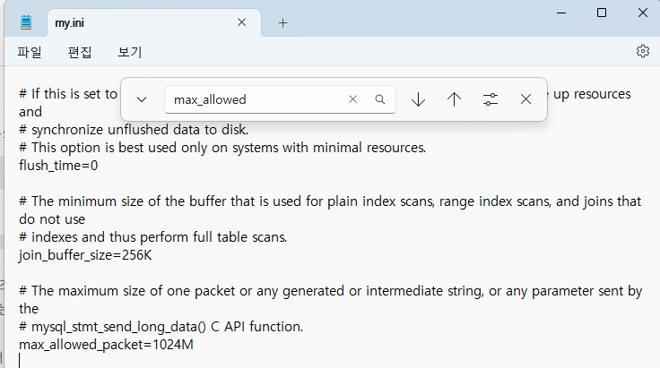
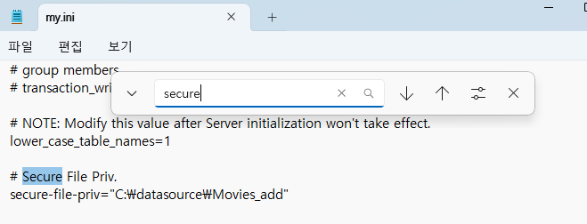
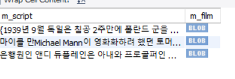

# SQL 심화

## mysql 데이터 형식
1) 숫자 
    - SMALLINT (2)
    - INT (4)
    - BIGINT (8)
    - FLOAT(4)  -- 소수점 아래 7자리
    - DOUBLE(8) -- 소수점 15자리
    - DECIMAL(m,d) -- m: 전체자릿수 , d: 소수점 이하 자리수
   
2) 문자
    - CHAR(n) , CHAR(1) , CHARACTER : 고정길이
    - VARCHAR(1~65535) : 가변길이
    - TEXT 형식
      - TINYTEXT 1~255 : TEXT 데이터 값
      - TEXT 1~65535
      - LONGTEXT 4G 까지 저장 가능
    - ENUM() 열거형 데이터 값
    - BLOB 형식 - 사진, 동영상파일, 대용량의 글자를 저장하기 위한 데이터타입
      - longblob : 4기가 (4294967295바이트)까지 저장
      - medium : 16메가바이트 (16777215 바이트)
    - SET 
3) 날짜/시간
    - DATE (3) YYYY-MM-DD 형식
    - DATETIME (8) YYYY-MM-DD HH:MM:SS
4) 지도/JSON 데이터 형식
    - GEOMETRY : 공간데이터 형식으로 선,점, 다각형같은 공간개체를 저장,조작
    - JSON : (JavaScript Object Notation) {id:'jack' , age : 20 ....}

5) SQL 변수 사용
   - SET @변수이름 = 값; -- 변수의 선언 및 값 대입
        SELECT @변수이름


```sql
set @seq =1;
select @seq;

set @myvar1 =5;
set @myvar2 =3;
set @myvar3 =4.2;
set @myvar4 ='가수이름==>';

select @myvar1;
select @myvar2;
select @myvar3;
select @myvar4;

select @myvar1 + @myvar2;
select @myvar4, name from usertbl where height>180;

set @myvar1 = 3;
prepare myQuery  -- 함수 만들기
	from 'select name, height from usertbl order by height limit ?';   -- ? 매개변수 자리
    execute myQuery using @myVar1;  -- 매개변수 값 using, 함수 실행 execute
 execute myQuery using @myVar3;
 
 
 
 
 create table employee(name varchar(255), salary int, location varchar(255));
 desc employee;
 insert into employee values ('Amit',6554,'seoul');
 insert into employee values ('Sumit',5980,'busan');
 insert into employee values ('Su',7887,'masan');
 select * from employee;
 
 prepare prepared_stmt from 'insert into employee values(?,?,?)';
 
 set @name = 'ruby';
 set @sal =9000;
 set @loc = 'jeju';
 
 execute prepared_stmt using @name,@sal,@loc;
 select * from employee;
 
 
 -- prepare pre_empSelect from ' select ? as sal,? as loc,? as name from employee where name = ?' ;
 prepare pre_empSelect from ' select *  from employee where name = ?' ;
 -- set @col1 = 'salary';
 -- set @col2 ='location';
 -- set @col3 = 'name';
set @name1 = 'ruby';
--  execute pre_empSelect using @col1,@col2,@col3,@name1;
 execute pre_empSelect using @name1;
 
 
 
 create table student(name varchar(30), age int, score int);
 insert into student values ('jimi',22,8);
 set @table = 'student';
 set @statement = concat('select * from ',@table);
 prepare pre_student from @statement;
 execute pre_student;
 
 
 
 -- built-in function
 
 -- 1. 제어 흐름 함수 : 프로그램의 흐름 제어
 -- 1-1  if(수식,참,거짓)
 select if (100>200, '참','거짓');
 
 
 -- 1-2 ifnull(수식1, 수식2) : 수식1이 null 아니면 수식1이 반환, 수식1이 null 이면 수식 2 반환
 select ifnull(null,'null이구나'), ifnull(100,'null이 아니네');
 
 -- 1-3 nullif(수식1, 수식2) : 수식1과 수식2가 같으면 null 반환, 다르면 수식 1 반환
 select nullif(100,100) , nullif(200,100);
 
 -- 2 case ~when ~else ~end : case  연산자 다중분기에서 사용되는 함수와 함께 사용한다.
 select case 11
	when 1 then '일'
	when 5 then '오'
	when 10 then '십'
    else '모르겠다'
end as 'case 연습';
 
 
 
 -- 3 문자열 ASCII(아스키코드), CHAR(숫자) 
 select ascii('a'),char(65);  -- 우클릭으로 open in viewer로 a 값 확인 가능
 
 
 -- bit_length(문자열), char_length(문자열), length(문자열)
 select bit_length('abc'), char_length('abc'), length('abc');
 select bit_length('가나다'), char_length('가나다'), length('가나다');
 
 -- concat(문자열1, 문자열2, ...) , concat_ws(구분자,문자열1,문자열2)
 select concat_ws('#','2024','02','21');
 
 
 -- elt(위치,문자열1,문자열2...)
 select elt(2,'하나','둘','셋');
 
 -- field('찾을 문자열',문자열1,문자열2...)
 select field('둘','하나','셋','둘');
 
 
 -- find_in_set(찾을 문자열, 문자열 리스트)
 select find_in_set('둘','둘');
 
 -- instr('하나둘셋','둘');   찾는 문자 뒤에게 몇번째에 있는지 리스트에서
 select instr('하나둘셋','둘');
 
 -- locate('둘','하나둘셋'); 위와 매개변수 위치만 다름
 select  locate('둘','하나둘셋'); 


-- format(숫자, 소수점 자릿수)
select format(12345.1234567,4);

-- bin(숫자), hex(숫자), oct(숫자) 2진수, 16진수, 8진수
select bin(30), hex(30), oct(30);


-- insert()
select insert('abcdefghi',3,4,'!!!!'); -- 3번자리부터 4개 문자 지우고 맨뒤에거 넣어줌
select insert('abcdefghi',3,2,'!!!!'); 

-- left() right() : 왼쪽 , 오른쪽 문자열의 길이만큼 반환
select left('abcdefghi',3),right('abcdefghi',3);

-- upper(), lower()  -- 대소문자 변환함수

-- lpad,rpad
select lpad('자바 백엔드 개발자',11,'#');
select rpad('자바 백엔드 개발자',11,'#');

-- ltrim, rtrim, trim() : 공백제거   both: 양쪽 		leading: 앞 trailing : 뒤
select ltrim('    sql 프로그래밍'), rtrim('sql 프로그래밍    ');
select length(ltrim('    sql 프로그래밍')), rtrim('sql 프로그래밍    ');
select trim('    안녕     '), trim(both '^'  from  '^^재미있네요.^^');
select trim('    안녕     '), trim(leading '^'  from  '^^재미있네요.^^');
select trim('    안녕     '), trim(trailing '^'  from  '^^재미있네요.^^');


-- repeat(문자열, 횟수)
select repeat('sql',3);


-- replace(문자열, 원래 문자열, 바꿀문자열);
select replace('mysql 문법 배우기', '문법','저장 프로그램');


```


## movie 실습

```sql
create database moviedb;
use moviedb;

create table movietbl(
	m_id int,
    m_title varchar(30),
    m_director varchar(20),
    m_star varchar(20),
    m_script longtext,
    m_film longblob
) default charset=utf8mb4;   -- 한글 지원 오류를 피하기 위해 utf 8 (3byte 지원)로 설정 utf8mb4 코드를 추가해서 4bytes 기반의 문자열을 지원
								-- 4 bytes 문자열( ex) Emoji 😀)이 등장하면서 이러면 기존의 utf8로는 저장을 할 수 없게 되었다.
insert into movietbl values (1,'쉰들러 리스트','스티븐 스필버그','리암 니슨',
		load_file('C:/datasource/Movies_add/schindler.TXT'),load_file('C:/datasource/Movies_add/schindler.mp4')
        );  -- 주의 경로는 슬래쉬다, 역슬래쉬가 아니다
insert into movietbl values 
(2,'쇼생크 탈출','프랭크 다라본트','팀 로빈슨',
		load_file('C:/datasource/Movies_add/shawshank.TXT'),load_file('C:/datasource/Movies_add/shawshank.mp4')
        );
insert into movietbl values (3,'라스트 모히칸','마이클 만','다니엘 데이 루이스',
		load_file('C:/datasource/Movies_add/mohican.TXT'),load_file('C:/datasource/Movies_add/mohican.mp4')
        );
        
select * from movietbl;
commit;


-- TEXT 파일로 내려받기
select m_script from movietbl where m_id = 1
	into outfile 'C:/datasource/movies_add/out/schindelr_out.txt'
    lines terminated by '\\n';     -- 줄바꿈 문자도 그대로 저장하기 위한 옵션
    
-- 영화 쉰들러 리스트의 영화대본(m_script)를 schinder_out.txt 파일로 다운받겠다. 


-- 바이너리 파일로 영화클립 파일 다운로드
select m_film from movietbl where m_id=3
	into dumpfile 'C:/datasource/movies_add/out/mohican_out.mp4';
    
    
-- 피벗 (pivot) 열에 포함된 여러 값을 출력하고,   여러 열로 변환하여 테이블 반환 식을 회전하고 필요하면 집계까지 수행하는 작업
create table pivotTest (
	name char(3),
    season char(2),
    amount int);
    
insert into pivotTest values ('ss1','여름',10);
insert into pivotTest values ('ss2','가을',10);
insert into pivotTest values ('ss3','겨울',10);
insert into pivotTest values ('ss4','봄',10);
select * from pivotTest;
select name,
	sum(if(season='봄',amount,0)) as '봄',
	sum(if(season='여름',amount,0)) as '여름',
	sum(if(season='가을',amount,0)) as '가을',
	sum(if(season='겨울',amount,0)) as '겨울',
    sum(amount) as '합계' from pivotTest group by name;

-- JSON 데이터
-- 웹과 모바일 으용 프로그램 등과 데이터를 교환하기 위한 개방형 표준 포맷이다. (속성 : 값) 독립적인 데이터 포맷이다.
use sqldb;
select * from usertbl;
desc usertbl;
select json_object('name',name,'height',height) as 'JSON 값' from usertbl where height >= 180;

set @json = '{
	"usertbl": [{"name":"임재범","height":"182"},{"name":"이승기","height":"182"},{"name":"성시경","height":"186"}]
    }';
    
select json_valid(@json) as json_valid;
select json_search(@json,'one','성시경') as json_search;  -- one 하면 최초 발견값만 리턴, all 하면 모든 값 리턴
select json_extract(@json,'$.usertbl[2].name') as json_extract;

select json_insert(@json,'$.usertbl[0].mdate','2024-01-21') as json_insert;
select json_replace(@json,'$.usertbl[0].name','신세계') as json_replace;
select json_remove(@json,'$.usertbl[0]') as json_remove;


-- m_script, m_film 에 null 해결 방법
-- 1. 최대 패킷 크기 확인 (= 최대 파일 크기)
show variables like 'max_allowed_packet';  -- 해보면 4M 지원중

-- 2. 시스템 변수에 secure_file_priv 
show variables like 'secure_file_priv';  -- 숨김 폴더임

/*
powershell을 관리자 권한으로 실행하기

PS C:\WINDOWS\system32> cmd
Microsoft Windows [Version 10.0.22621.3007]
(c) Microsoft Corporation. All rights reserved.

C:\Windows\System32>cd %programdata%

C:\ProgramData>cd mysql

C:\ProgramData\MySQL>cd mysql server 8.0

C:\ProgramData\MySQL\MySQL Server 8.0>dir
 C 드라이브의 볼륨에는 이름이 없습니다.
 볼륨 일련 번호: A297-E70D

 C:\ProgramData\MySQL\MySQL Server 8.0 디렉터리

2024-01-15  오전 09:41    <DIR>          .
2024-01-15  오전 09:35    <DIR>          ..
2024-01-22  오전 11:55    <DIR>          Data
2024-01-15  오전 09:41               712 installer_config.xml
2024-01-15  오전 09:41            17,418 my.ini
2024-01-15  오전 09:41    <DIR>          Uploads
               2개 파일              18,130 바이트
               4개 디렉터리  161,081,868,288 바이트 남음

C:\ProgramData\MySQL\MySQL Server 8.0>notepad my.ini

C:\ProgramData\MySQL\MySQL Server 8.0>exit

그 후에 mysql administration startup 으로 서버 종료후 다시 실행
*/


```
<br>
<br>

### powershell 들어가서 my.ini 파일을 notepad로 열고 바꿔야 하는 설정
1. 사이즈 허용


2. 파일 경로 변경


3. 위 설정 변경하면 이렇게 표시가 잘 된다.



- 윈도우 경로에 C:\ProgramData 로 들어가면 my.ini 파일 볼 수 있다.


