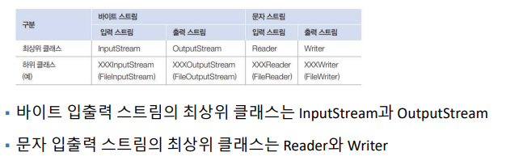
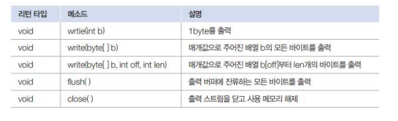
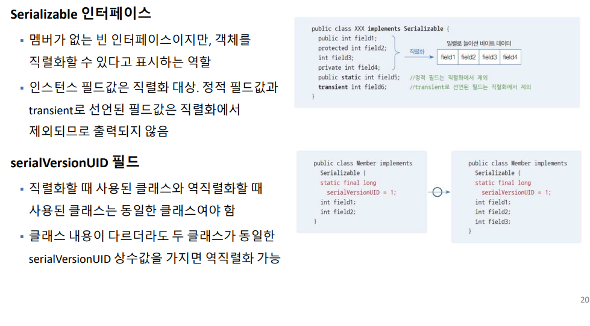

# IO



- 모든 데이터 입출력에는 입력스트림, 출력스트림이 정해져야 한다.
- java.io 가 제공
## outputstream




<br>


- int 4바이트에서 마지막 1바이트 만 write


- 바이트 배열로 데이터 출력, 길이 조절도 가능

## inputstream


- read 함수는 리턴 값이 있다


## Writer 


## Reader


### 실습 1

```
메모장 응용프로그램 만들기
파일 입출력 + 컬렉션
[기능]
- 메모 쓰기
- 메모 읽기
- 메모 삭제
[데이터]
- 메모: 고유번호, 작성자, 메모내용, 날짜, 중요도   
- 파일: memo.dat
 
[프로그램 흐름]
- 프로그램 시작: 파일 모든 내용 읽기(파일 입출력) --> 메모리 저장(컬렉션)
- 프로그램 사용: 메모리 조작(컬렉션)
- 프로그램 종료: 메모리 저장(컬렉션) > 모든 파일 내용 쓰기(파일 입출력)
기능요구사항 
-menu: 콘솔 첫 화면에 출력할 화면이며, 각 항목중에 선택값을 입력받습니다.
 
-pause: 각 기능에서 공통으로 들어갈 화면전환을 엔터로 할 수 있게 만들었습니다. 각 기능(메소드)마다 들어갑니다.
 
-add: 메모장의 쓰기 기능을 구현. 메모에 들어갈 값을 각각 따로 입력받아서 저장하고 메모내용에 해당하는 부분은 입력시 사용자가 엔터를 쓴다는 것을 감안하여 \r\n(엔터처리)하여, 
       만약 메모를 다 작성하고 'exit'를 입력하면 
       이전화면으로 나올 수 있게 구현합니다.
       각각 입력받은 값을 Memo클래스 대입하고, ArrayList 배열에 추가합니다.
 
-getseq: 메모장 기능에 해당되는 고유번호. 만약 현재 memo.dat에 메모된 값이 총 3개라면 최대값에서 +1을 해주어 그다음 메모장 고유번호의 중복이 불가하게 설정합니다. 
-getMemo: 확인할 메모의 고유번호를 입력받으면 그 고유번호를 확인하고 세부내용을 보여줍니다.
 
-part: 메모 읽기/삭제에 작업을 하기전, 해당 메모의 일부분 내용만 출력 해주는 메소드.미리 입력받은 content (메모내용)를 불러와서 엔터 부분을 공백처리 해주며, 내용의 길이만큼 '...'이 나오게 처리 합니다. 
 
-list: 메모장에 저장된 내용들을 읽습니다., 저장된 내용들의 일부분만 먼저 확인하고 세부내용은 고유번호를 선택하면 Memo 클래스에서 객체를 생성하여 대입된 값을 출력하게 해줍니다. 
      입력해야할 고유번호가 아닌 엔터키나 0을 입력하면 출력되지 않고 다음단계로 넘어갑니다.
- delete: 삭제하기전 메모장의 내용을 일부분만 확인 할 수 있게 먼저 출력해주며,  그 다음 삭제할 고유번호를 입력받은 뒤, ArrayList배열의 저장된 값중 고유번호와 일치하는 객체가 삭제됩니다.
- load: 사용자에게 콘솔 출력전 맨 처음 선언되며, 지정해준 DATA 경로값을 읽어오며 memo.dat의 형식인 CSV로 기록한 값을 콤마로 구분하였기 때문에 split(",")으로 
          각 콤마마다 값을 Memo 클래스에서 불러온 고유번호, 이름, 날짜, 중요도를 임의로 지정해준 배열에 저장시킨다. 
          또한 메모 내용은 memo가 끝나는 지점인 "============"이 아닐때 까지 변수에 메모내용을 엔터(\r\n)를 구분해서 저장시킨다. 
          마지막으로 그렇게 대입한 값을 ArrayList 배열에 추가한다. 
 
- save: 마지막 단계 쓰기작업을 하는 BufferedWriter와 FileWriter 호출하여 Memo 클래스에 있는 값을 ArrayList로 저장시킨다.
```


## 보조 스트림
- 보조스트림 변수 = new 보조스트림(입출력스트림);
- 다른 스트림과 연결되어 여러 편리한 기능을 제공해주는 스트림


## 직렬화와 역직렬화
- 직렬화 : 메모리에 생성된 객체를 파일 또는 네트워크로 출력하기 위해 필드값을 일렬로늘어선 바이트로 변경하는 것
- 역직렬화 :  직렬화된 바이트를 객체의 필드값으로 복원하는 것


- 직렬화 할 클래스에는 Serializable 인터페이스를 구현해놔야 한다.




