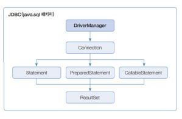
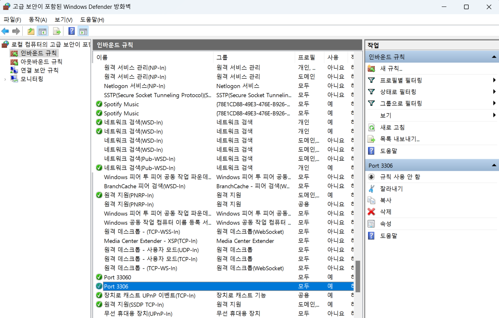
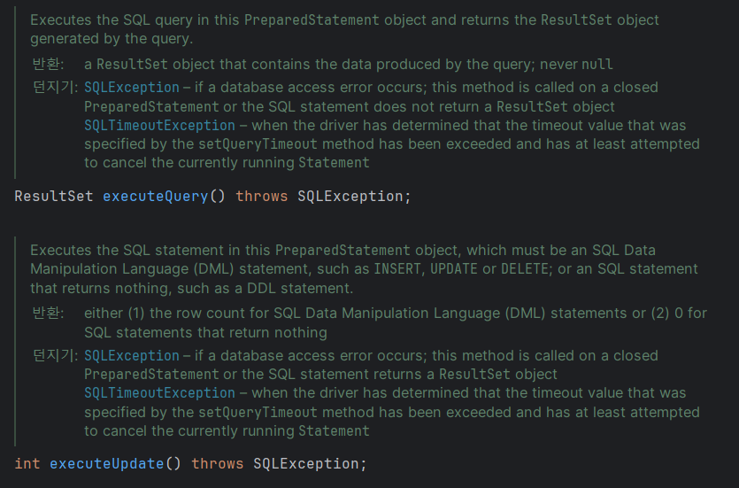
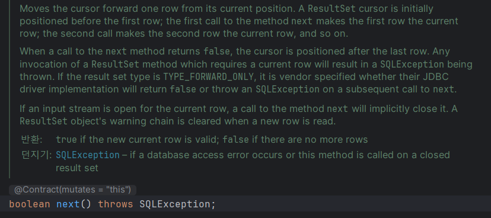
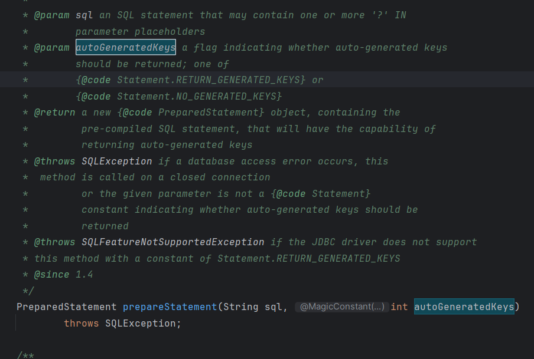

# JDBC
## java.sql
- 자바에서 sql 연동을 위하여 제공하는 라이브러리
- https://docs.oracle.com/en/java/javase/17/docs/api/java.sql/java/sql/package-summary.html

### JDBC 란
- Java Database Connectivity
- 자바 언어를 사용하여 데이터베이스에 접속하고 쿼리를 실행하기 위한 자바 API(응용 프로그래밍 인터페이스)입니다

## JDBC Driver
- DriverManager 클래스: JDBC Driver를 관리하며 DB와 연결해서 Connection 구현 객체를 생성
  - Connection 객체 생성 (ip,id,pw,스키마정보) 
- Connection 인터페이스: Statement, PreparedStatement, CallableStatement 구현 객체를 생성하며, 트랜잭션 처리 및 DB 연결을 끊을 때 사용
  - Connection 객체로 쿼리문 작성 --> Statement, PreparedStatement, CallableStatement 에 담아서 DBMS로 보냄
  - DBMS는 처리 결과롤 돌려줌 (SELECT 결과는 `ResultSet` 객체에 저장) 
  - Connection, Statement, PreparedStatement 자원 해제
- Statement 인터페이스: SQL의 DDL과 DML 실행 시 사용
- PreparedStatement: SQL의 DDL, DML 문 실행 시 사용. 매개변수화된 SQL 문을 써 편리성과 보안성 유리
- CallableStatement: DB에 저장된 프로시저와 함수를 호출
- ResultSet: DB에서 가져온 데이터를 읽음

### 인바운드 규칙 : 포트 열기

## 자바 실습

- query 는 select문에 쓴다

- 커서 처럼 하나씩 튜플을 가져온다.

- This parameter is ignored if the SQL statement is not an {@code INSERT} statement : insert 문에서 만 이용

- Creates a default {@code PreparedStatement} object that has the capability to retrieve auto-generated keys.
  - 자동 생성된 키를 검색하는 기본 개체임
  - 보통 auto_increment 한 칼럼을 찾아주는 것이며, 주로 기본키를 찾게된다.

