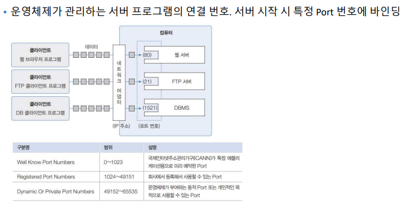

# 네트워크
- 여러 컴퓨터들을 통신 회선으로 연결한 것

### HTTP
- 하이퍼텍스트 (텍스트의 형태로 구성된 문서이며, 다른 문서나 데이터와 연결(link)되어 있어 사용자가 한 문서에서 다른 문서로 쉽게 이동할 수 있는 구조를 가지고 있습니다. 이러한 링크를 통해 사용자는 원하는 정보를 찾거나 관련 정보를 탐색할 수 있습니다)
  - html 이 하이퍼 텍스트로 만들어져 있다.

## Port

- 네트워크에서 프로세스가 통신을 위해 사용하는 논리적인 엔드포인트
- 포트는 IP 주소와 함께 사용되어 네트워크 통신을 관리
- 포트는 컴퓨터 내에서 특정 프로세스를 식별

