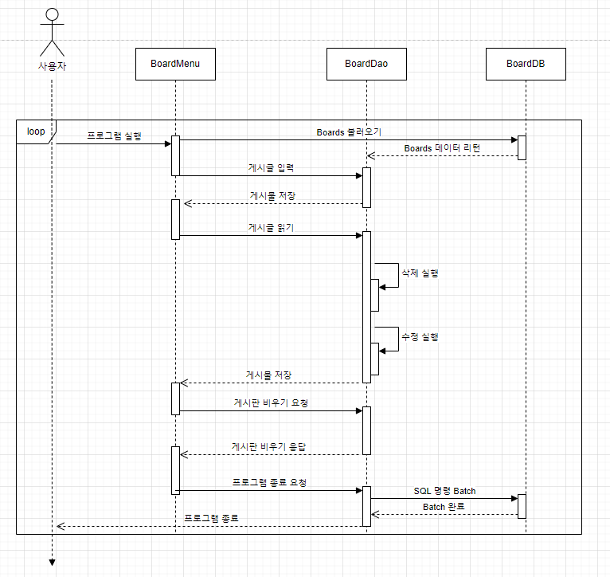
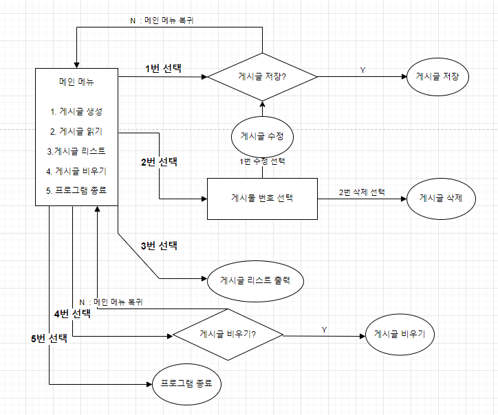
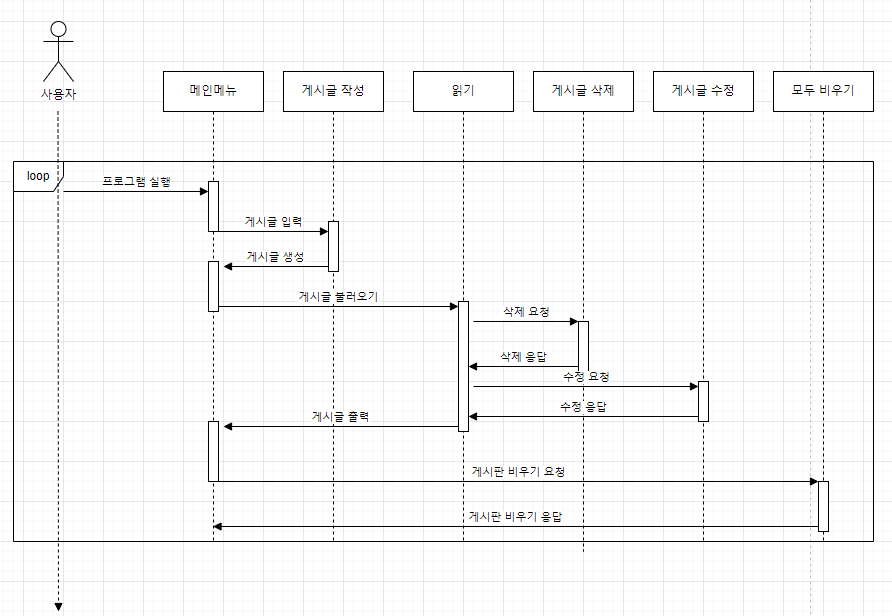
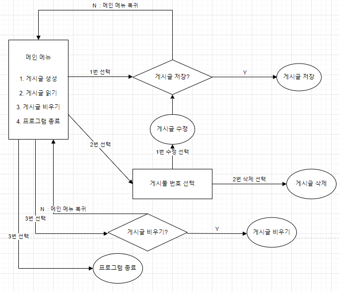

# Board Project (DB 연동)

## 1. 목표와 배경
- 게시판에 게시글을 작성하여 저장 후, 필요한 경우 저장한 게시글을 읽거나 수정 및 삭제 기능을 통해 관리를 할 수 있다.
- 게시글 데이터를 DB 연동을 통하여 관리한다.

### Bottom-up
- 게시판 시스템을 만들기 위한 자바 객체 생성 구조 분석 및 Exception 패키지 분석
- JDBC 을 이용하여 MYSQL 연동 

## 2. 제약 조건

- DB 연동 후 시퀀스 다이어그램



<br>
<br>
<br>
<br>
<br>
<br>
<br>
<br>


# Board Project (DB 추가 전)

## 1. 목표와 배경
- 게시판에 게시글을 작성하여 저장 후, 필요한 경우 저장한 게시글을 읽거나 수정 및 삭제 기능을 통해 관리를 할 수 있다.

### Bottom-up
- 게시판 시스템을 만들기 위한 자바 객체 생성 구조 분석 및 Exception 패키지 분석

## 2. 제약 조건




## 3. 플로우 차트




<br>
<br>
<br>
<br>


### 40분이라는 시간 안에 완성 못한 이유

1. 클래스 간의 객체 생성 개념 미흡
   - BoardMenu 에서 BoardDao 객체를 생성 했으면서 BoardDao 에서 BoardMenu 객체 생성을 하게 만들어서 무한 객체 생성 구조를 만들었다.
   - 이전 board 실습 때 메서드 안에 메뉴 출력 메서드를 부르는 구조를 생각 하며 이번에도 비슷하게 만들려고 했으나, 메뉴 메서드는 다른 클래스에 있다는 생각을 하지 못해서 발생한 오류
   ```agsl
    switch (choice) {
    case 1-> {boardDao.Create(); mainMenu();}
    case 2-> {boardDao.Read();  mainMenu();}
    case 3-> {boardDao.Clear();  mainMenu();}
    case 4-> {boardDao.Exit();  mainMenu();}
    default -> mainMenu();
    //이렇게 함수 2개 해서 반복되게 가능
    } ```
    
   
  - case 내부에서 자기 자신을 부르는 메서드 호출로 해결 할 생각을 하지 못했다.

2. read 함수에서 delete 함수 호출 시 비정상 종료하는 현상
   - try catch로 오류 발생 예상 지점을 찾았지만 모두 비정상 종료가 발생
   - 알고보니 foreach 문에서 작동하는 배열이 remove로 처음 진입했을 때 반복사이즈와 다르니 발생하는 오류
   - foreach의 반복이 될 배열 요소사이즈가 변화하는 내용을 담는다면 break; 로 바로 멈추게 하던가 아니면 주의를 해야겠다.
<br>
<br>
3. 예외처리 기능 추가 
   ```agsl
   public static boolean isInteger(String str){
        String regex = "^[0-9]*$";
        Pattern p = Pattern.compile(regex);
        Matcher m = p.matcher(str);
        return m.matches();
    } 
- 숫자 입력 받아야 하지만 아닐 때 체크 함수
```agsl
IS_NOT_RIGHT_CHOICE("올바른 선택지가 아닙니다.(숫자 입력이 아닙니다.)","E01");
```
- 예외출력 문구


4. hashmap 을 적용해보자 (key,list(content writer 등등))
