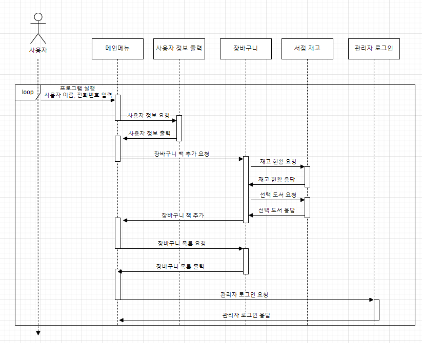
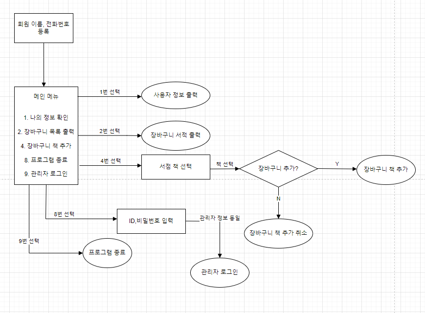

# Book Project

## 1. 목표와 배경
- 서점 장바구니 기능을 객체와 자료구조를 사용하고, 각 기능의 예외처리를 추가하여 자바의 전반적 구조에 이해를 향상

### Bottom-up
- 서점 장바구니 기능을 만들기 위한 MVC 모델 활용, 자바 자료구조 분석 및 Exception 패키지 분석

## 2. 제약 조건

## 3. 플로우 차트

 
 
 

## BookProject 진행과정

1. 개발 시작
   - [`myProject`](BookProjects%2FmyProject)
 
 
 
   
2. 팀단위 리팩토링

   - [`Project_mall_team`](Project_mall_team)
 
 
 
   
3. 예외처리 추가

   - [`BookProject_Exception`](BookProject_Exception)

 
 
 

4. 인터페이스 추가 및 자료구조 변경

   - [`BookProject_4th`](BookProject_4th)