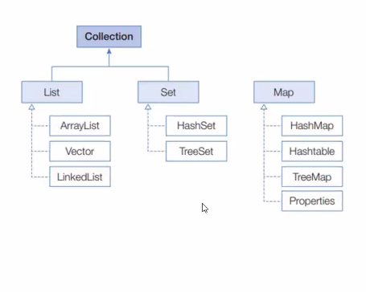
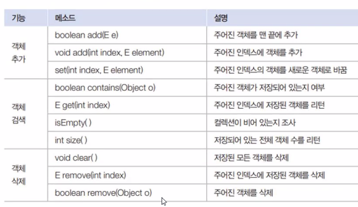

# Collection Framework

- 프레임워크 : 미리 준비되어진 구조나 기능
- 컬렉션 : 객체를 수집하고 저장해서 관리 (CRUD)

- map 은 collection implement는 아니지만 자료구조로 묶어서 설명
- collection 은 Iterable<E> 을 상소중

## List

- index 가 있다 --- 순서가 있다.
- 중복 객체 허용
- 순서에 따라 객체를 관리한다.

- 기본 메소드

### VO, Dao 활용
- Dao 를 활용하여 main 에서 VO 를 숨김
- 객체의 데이터와 기능을 분리시켜서 재사용성 증가, 서로의 영향력을 감소

- [`BoardExample`](ListExample%2FBoardExample)
    - 활요 예제

## Set

- 중복 객체 비허용 
- 순서 x

## Map

- 키와 값이 1대1 페어링 되어 있는 구조

