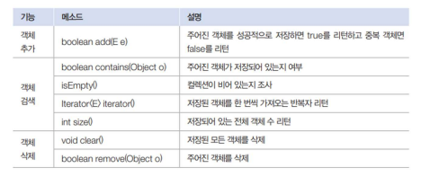
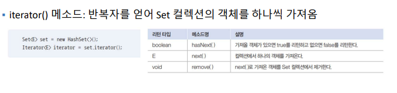
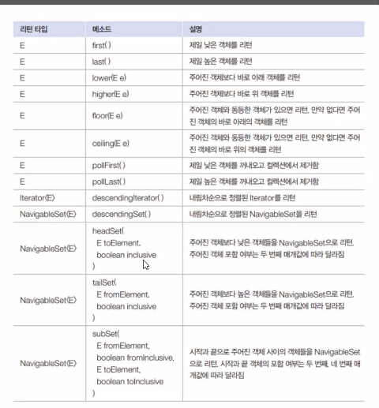
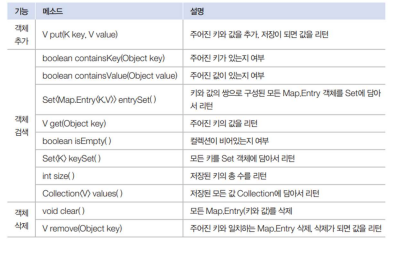
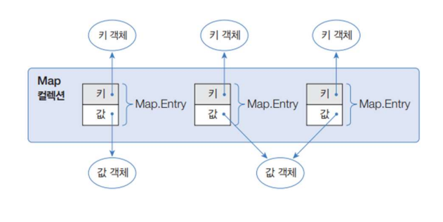
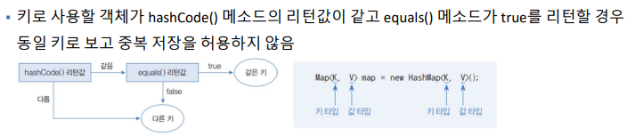
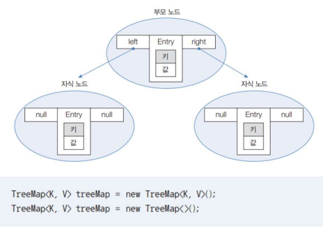
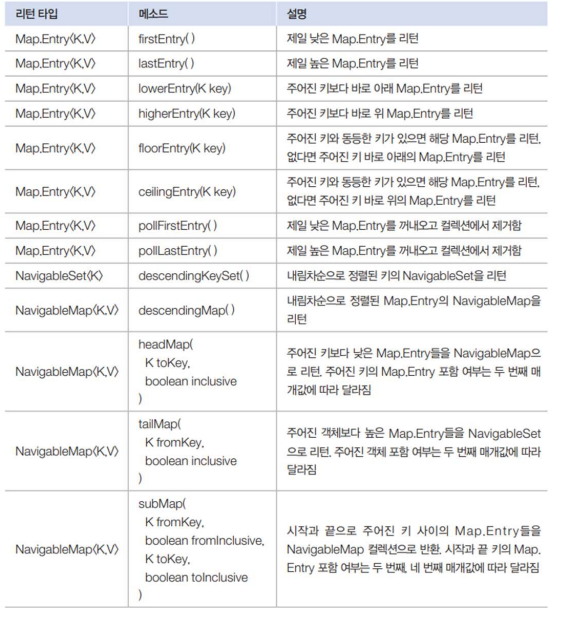

# Collection Framework

- 프레임워크 : 미리 준비되어진 구조나 기능
- 컬렉션 : 객체를 수집하고 저장해서 관리 (CRUD)

- map 은 collection implement는 아니지만 자료구조로 묶어서 설명
- collection 은 Iterable<E> 을 상속중
- list set 은 공통된 메소드가 존재 (상속중이기 때문에 collection을)

## List

### VO, Dao 활용
- Dao 를 활용하여 main 에서 VO 를 숨김
- 객체의 데이터와 기능을 분리시켜서 재사용성 증가, 서로의 영향력을 감소

- [`BoardExample`](ListExample%2FBoardExample)
  - 활용 예제

#### ArrayList, Vector, linkedList

- index 가 있다 --- 순서가 있다, 인덱스로 검색 삭제 기능 제공
- 중복 객체 허용
- 순서에 따라 객체를 관리한다.

- arraylist는 삽입할때마다 공간을 만들어서(미리 공간을 확보함) 삽입 시간이 오래걸림
- 

#### Vector

- 벡터는 arraylist와 동일한 내부 구조
- vector는 동기화된 메소드로 구성되어 있어 멀티스레드가 동시에 vector 메소드를 실핼 할 수 없다.
#### LinkedList

#### [`LinkedListExample.java`](ListExample%2FLinkedlistEx%2FLinkedListExample.java)
- linkedlist의 입출력이 빈번할 때 속도는 arraylist 보다 빠르다
- 공간을 이미 확보한 상태에서 index 계산이 아닌 서로 연결을 하는 구조라 삽입 속도가 빠름
  - 미리 데이터 공간을 미리 할당하지 않아도 됨
    - 배열은 **미리 데이터 공간을 할당** 해야 함
- node의 연결들
- head 값이 있기 때문에 링크드리스트의 시작 주소값을 인지 할 수 있음
- 단검
  - 연결을 위한 별도 데이터 공간이 필요하므로, 저장공간 효율이 높지 않음
  - 연결 정보를 찾는 시간이 필요하므로 접근 속도가 느림
  - 중간 데이터 삭제시, 앞뒤 데이터의 연결을 재구성해야 하는 부가적인 작업 필요
- 부가적인 기능이 필요함(중간에 넣기, 검색하기)

## Set
#### HashSet, TreeSet

### HashSet
- 중복 객체 비허용 , null 도 하나만 가능
- 순서 x

  
- 다른 객체라도 hashCode() 메소드의 리턴값이 같고, equals() 메소드가true를 리턴하면동일한 객체라고 판단하고 중복 저장하지 않음
- class Member 를 hashset에 사용할려면 hashcode 와 equals 오버라이딩 해야함
***
#### hash set 혹은 hashmap의 키값에 class를 사용한다면, 구별을 하기 위하여 hashcode 와 equal의 오버라이딩이 필수다.
#### hashcode는 String 값에 사용 가능하며, 기본 hashcode 함수는 주소값을 16진법 정수로 표현하는 것이다.

1. **hashCode() 메서드는 항상 해시 코드를 반환하지 않는다.**
위 예제처럼 hashCode() 메서드를 재정의하면, 사용자가 원하는 값을 반환하도록 수정할 수 있습니다. 하지만, hashCode() 메서드를 재정의했다고 객체의 내부 주소가 바뀌는 것은 아닙니다. 재정의되지 않은 hashCode() 메서드는 객체의 내부 주소를 해시 코드로 변환하는 기능만 수행합니다.

2. **객체의 내부 주소가 변경되면 해시 코드도 변경된다.** 재정의되지 않은 hashCode() 메서드는 객체의 내부 주소를 해시 값으로 변환하여 반환합니다. 만약, 객체의 내부 주소가 변경되면 hashCode() 메서드의 반환 결과도 달라집니다.

***
  - 따라서 Member.java 파일에서 동일 객체를 구분하기 위하여 (오버라이딩 안하면 각기 다른 주소를 가진 객체 이기 때문에) 입력바든 이름의 hashcode 와 age를 더 하는 구조로 동일 객체를 확인.
- [`Member.java`](SetExample%2FMember.java)

- `iterator` 활용하여 검색 해서 빼옴

#### [`iterator 및 set 코드 확인`](SetExample%2FHashSetEx01.java)

### TreeSet

- node를 이용한 사이클을 이루지 않도록 구성한 데이터 구조
- 탐색 알고리즘 구현을 위해 많이 사용

- 메소드

- [`TreeSet 예제`](TreeSetEx%2FTreeSetEx.java)

***
***
## Map
#### HashMap, HashTable, TreeMap, Properties

- 키와 값이 1대1 페어링 되어 있는 구조
- 키는 중복저장 안됨
- 키와 값으로 구성된 엔트리
- 키값에 클래스가 들어간다면, 객체의 비교 구분을 하기 위하여 hashcode와 equals의 오버라이딩을 해야한다! (hashset 오버라이딩 참고)

### HashMap

#### [`해쉬맵과 set 및 Iterator 활용 예제`](HashMapExample%2FHashMapMain.java)

### Hashtable
- 해쉬맵과 다르게 멀티스레드에서 안전하게 사용 가능
- 
### Properties
- 해쉬테이블 자식 클래스
- 키와 값을 String으로 가져옴
- key = value 구조의 텍스트파일(.properties) 정보를 가져옴
#### [PropertiesEx.java](app%2FPropertiesEx.java) -- 사용 예제

### TreeMap
- map.entry 에 left, right가 추가 된 구조
- SortedMap 인터페이스로 구현
- ket 기준으로 정렬 된다
- 정렬 순서는 숫자, 알파벳 대문자, 소문자, 한글 순

### 정렬 Comporable, Comparator

- String, Integer, Double 등 ---> compare() : 기본 오름차순
- 내림차순으로 하고 싶으면 매개변수 순서 바꾸면됨

#### Comparable
   - 정렬 수행할 때, 정렬기준이 되는 메서드를 정의해 놓는 인터페이스
   - Comporable 인터페이스를 
   - compareTo() 메소드를 원하는 정렬 기준대로 구현
   - 리턴되는 int값이 음수이면 현재 인스턴스가 비교대상인 인스턴스보다 작고, 양수이면 크고, 0 이면 같도록 하자

#### Comparator는 두 매개변수 객체를 비교하는 것이고, Comparable은 자기 자신과 매개변수 객체를 비교

- 메소드

#### [TreeMapEx 예제](TreeMapEx%2FTreeMapEx.java)
