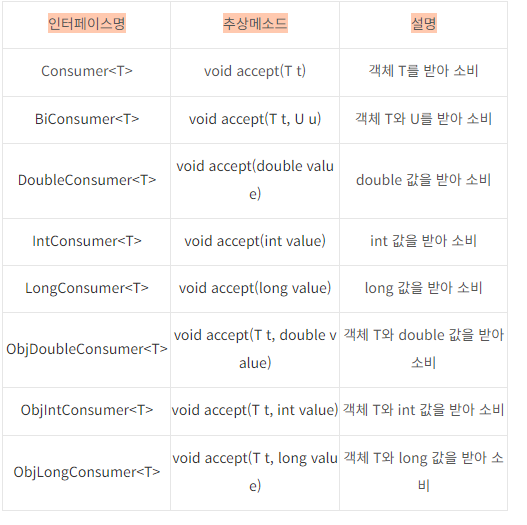
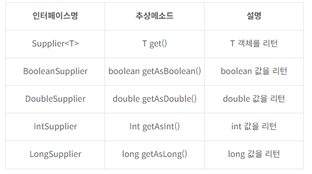
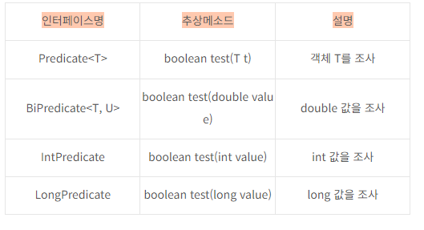
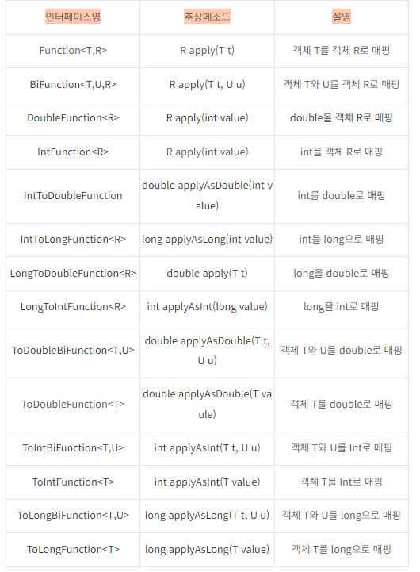

# 람다식


### 익명함수인 람다 표현식을 사용하여 메서드에 인수로 전달하거나 변수에 저장하여 데이터를 처리
  - parameters (param1, param2, ...)    - 매개변수 지정 (쉼표 구분 괄호로 묶은 0개 이상의 매개변수)
  - lamda operator ->      람다 본문에서 매개변수 리스트를 분리, 함수 시그니처와 본문 사이의 다리 역할
  - body {...}
  - - (매개변수, ...) -> {처리 내용}      람다식이 실행될 코드묶음
<br>
<br>

## 함수형 인터페이스
@FunctionalInterface

#### interface MathOperation{int operate(int a, int b); }     ==> SAM(single abstract method)

 - 선택사항이지만 인터페이스가 SAM 유지되도록 하는데 도움이 됩니다.


## 자바에서 람다표현식

- 람다표현식은 익명함수를 간결하게 표현하는 방법
- 람다표현식을 사용하면 메서드에 매개변수로 동작을 전달할 수 있기 때문에 코드의 표현력과 기능성을 향상시킬 수 있다.

## 자바에서 메서드 참조의 유형 4가지


1. 정적 메서드에 대한 참조
    - 클래스명 :: 메서드명    : 람다 표현식이 정적 메서드에 위임할때 유용 <br>
   // Lambda expression  <br>
    - Function<Integer, String> lambda = (x) -> String.valueOf(x);  <br>
   // Method reference  <br>
     Function<Integer, String> reference = String::valueOf;  <br>

2. 특정 객체의 인스턴스 메서드에 대한참조       Object::methodName  <br>
  // Lambda expression  <br>
    - Function<Integer, String> lambda = (str) -> str.length();  <br>
  // Method reference  <br>
      Function<Integer, String> reference = String::length;  <br>
3. 특정 타입의 임의 객체의 인스턴스 메서드에 대한 참조  :   ClassName::methodName
   // Lambda expression  <br>
    - BiFunction<String, String,Boolean> lambda = (str1,str2) -> str1.equals(str2);  <br>
   // Method reference  <br>
      BiFunction<String, String,Boolean> reference = String::equals;  <br>
4. 생성자에 대한 참조    :

ClassName::new

// Lambda expression

Supplier<List<String>> lambda = () -> new ArrayList<>();

// Method reference

Supplier<List<String>> reference = ArrayList::new;


<br>
<br>
### Consumer<T>
- void accept(T t)
- 객체 T를 받아 소비
```agsl
public class ConsumerExam {
    public static void main(String []args){
        Consumer<String> consumer = t -> System.out.println(t + "8");
            consumer.accept("Java");
            
            BiConsumer<String, String> bigConsumer = (t, u) -> System.out.println(t+u);
                bigConsumer.accept("Java", "8");
                
                DoubleConsumer doubleConsumer = d -> System.out.println("Java" + d);
                doubleConsumer.accept(8.0);
                
                ObjIntConsumer<String> objIntConsumer = (t, i) -> System.out.println(t + i);
                    objIntConsumer.accept("Java",8);
                    }
                    }
```

### Supplier
- 매개 값이 없고 리턴값이 있는 get() 메소드
-  실행 후 호출한 곳으로 데이터를 공급하는 역할

```agsl
public class SupplierExam {
    public static void main(String []args){
        IntSupplier intSupplier = () -> {
            int num = (int) (Math.random() * 6) + 1;
            return num;
        };
        
        int num = intSupplier.getAsInt();
        System.out.println("눈의 수: " + num);
    }
}
```


### Predicate
-  매개 변수와 boolean 리턴값이 있는 test() 메소드
- 매개값을 조사해서 true 또는 false를 리턴

```agsl
Predicate<String> isEmpty = String::isEmpty;
        System.out.println(isEmpty.test(""));
```
S
### Function<T,R>
- 매개변수, 리턴
- 할당된 람다 표현식은 `apply()` 메서드를 구현
### BiFunction<T,U,R> 인터페이스
- 매개변수1, 매개변수2, 반환타입 
- 할당된 람다 표현식은 `apply()` 메서드를 구현
```agsl
public static void main(String args[]) {
  BiFunction<Integer, Integer, String> biFunctionAdd =
          (num1, num2) ->  Integer.toString(num1 + num2);

  BiFunction<Integer, Integer, String> biFunctionMinus =
          (num1, num2) -> Integer.toString(num1 - num2);

  BiFunction<Integer, Integer, String> biFunctionMultiple =
          (num1, num2) -> Integer.toString(num1 * num2);

  System.out.println("100 + 50 = " + biFunctionAdd.apply(100, 50));
  System.out.println("100 - 50 = " + biFunctionMinus.apply(100, 50));
  System.out.println("100 * 50 = " + biFunctionMultiple.apply(100, 50));
}
```

- [`람다생성자 util.function 예제 코드`](LamdaConstructorEx.java)
> https://scshim.tistory.com/287 


