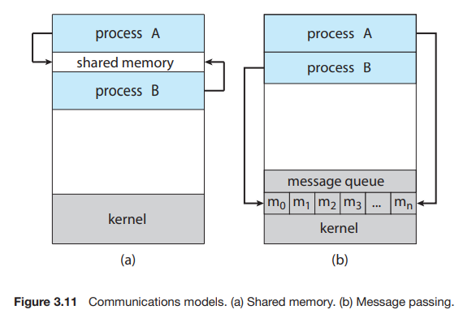

## 프로세스들의 연산들

- ### 부모 프로세스와 자식 프로세스

    - 프로세스는 고유 pid 를 가지고 있다.

1. 부모 프로세스 : 기존 프로세스
2. 자식 프로세스 : 기존 프로세스에서 새롭게 생성된 프로세스

#### 프로세스가 프로세스를 생성 시 존재하는 두가지 경우
- 부모 프로세스는 자식 프로세스 실행중에 같이 실행중이다.
- 부모 프로세스는 자식 프로세스 모두 종료 되기를 기다린다.

#### 새로운 프로세스의 주소 공간의 두가지 가능성
- 부모프로세스의 복제인 자식 프로세스 (같은 프로그램과 같은 데이터)
- 자식 프로세스가 새로운 프로그램을 실행

```agsl

#include <stdio.h>
#include <unistd.h>
#include <wait.h>

int main()
{
    pid_t pid;

    // 자식 프로세스 생성
    pid = fork();
    
    if(pid<0)   // 에러 발생
    {
        fprintf(stderr, "Fork Failed");
        return 1;
    }
    else if(pid==0) // 자식 프로세스인 경우
    {
        execlp("/bin/ls","ls",NULL);
    }
    else    // 부모 프로세스인 경우
    {
        wait(NULL); // 자식 프로세스가 종료될때까지 대기
        printf("Child Complete\n");
    }

    return 0;
}
```
-  fork() 함수를 호출하면 부모 프로세스는 자식 프로세스 번호를 반환받고 wait() 함수로 인하여 대기
- 자식 프로세스의 "ls" 명령어를 수행하고 부모 프로세스가 대기를 풀고 출력문을 수행 (exit() 함수는 명시해도 되지만 여기서는 숨겨서 표현)


### 프로세스 종료
- 프로세스는 마지막 문장을 실행할 떄 종료
- exit() 시스템 콜 : 운영체제가 강제 종료
- 운영체제는 프로세스가 종료되면 자원을 해제합니다 (메모리, 파일, I/O 버퍼 등)

#### 좀비(zombie) 프로세스
  - 실행이 종료되었지만 삭제되지 않은 프로세스들

#### 고아(orphan) 프로세스
  - 부모프로세스가 자식 프로세스 보다 먼저 종료된 프로세스


### fork()
- 새로운 프로세스는 fork() 시스템 콜에 의해 생성됨
- 자식 프로세스는 부모 프로세스의 복사본으로 구성됨
- 두 프로세스는 fork() 함수 호출 이후 명령문을 실행함
  - 부모 프로세스는 fork() 호출로 자식 프로세스의 프로세스 번호를 반환받음
  - 자식 프로세스는 부모 프로세스에게 프로세스 번호 0를 반환받음

- 부모 프로세스가 자식 프로세스 수행 후 하는 행동 2가지
  - 자식 프로세스 상관 없이 계속 수행
  - 자식 프로세스가 종료될 때까지 대기
***

# 프로세스간 통신 (Interprocess Communication, IPC)

### 프로세스 협력 이유
  - 데이터 정보 공유 목적
  - 계산 속도 증가
  - 모듈화

***



## 공유메모리
- 메세지 송수신
  - 생산자는 버퍼(buffer)에 정보를 넣음
  - 소비자는 버퍼를 비움 (정보를 소비함)
  - shared memory는 생산자와 소비자 프로세스들이 공유하는 메모리 공간임
  - 버퍼가 가득차면 생산자는 대기(wait)함
  - 버퍼가 비어있으면 소비자는 대기(wait)함
    
- 프로세스들은 공유 메모리 영역을 공유해야함
- 공유 메모리 영역에 접근하거나 조작하는 코드들은 애플리케이션 프로그램에 의해 명시적으로 작성되어야 함

## 메시지 전송 시스템에서의 IPC(IPC in Message-Passing Systems)

- 운영체제는 message-passing 기능을 통해서 각각의 프로세들이 통신하기 위해 API를 제공함
Message-Passing 기능의 두가지 기능
  - send(message)
  - receive(message)

- communication link , 프로세스 둘이 통신 하기 위해 필요
  - 통신 연결 종류 3개
    - Direct or indirect communication
    - Synchronous or asynchronous communication
    - Automatic or explicit(명시적) buffering

#### 직접 통신 (direct)

- 대칭 직접 통신
  - send(P, message) : 프로세스 P에게 메시지를 전송
  - receive(Q, message) : 프로세스 Q로부터 메시지를 수신

- 비대칭 직접 통신
  - send(P, message)— 프로세스 P에게 메시지를 전송
  - receive(id, message)— 아무 프로세스에게나 메세지 받음. 변수 ID 는 통신이 이루어진 프로세스 이름으로 설정
- 직접 통신 방식의 특징
  - 통신 링크가 자동 생성됨
  - 링크는 명시적으로 두개의 프로세스만이 연관되어 있음
  - 두 프로세스 사이에는  하나의 링크만이 존재
  - 단점 : 식별자 교체시 모든 식별자를 찾아 변경해야함


#### 간접 통신 (indirect)

- 메시지는 메일박스(mailboxes) 또는 포트(ports)라고 부르는 공간에 전송되거나 수신됨
- 메일박스는 추상적 객체로 보이며 프로세스에 의해 메세지를 저장 및 제거 가능

- 간접 통신 특징
  - 한 쌍의 프로세스들이 하나의 메일박스를 공유할때 연결
  - 연결은 두 개 이상의 프로세스 보다 연결되어 있을 수 있음
  - 메일박스에는 여러개 연결이 있을 수 있음
  - 메일박스 소유 프로세스와 사용자로 구별 가능
  - 메일박스 소유 프로세스가 종료되면, 메일박스 유저 프로세스들은 메일박스가 없어진걸 인지한다.
  - OS 고유 메일박스는 독립적으로 존재
- OS가 프로세스에 제공 기능
  - 메일박스 생성
  - 메일박스에 메세지 송수신
  - 메일박스 삭제


### 동기화

**프리미티브는 이용가능한 가장 단순한 요소들이다. 프리미티브는 주어진 기계(machine)의 프로그래머에게 이용가능한 가장 작은 처리(processing)의 단위이거나 언어에서 표현의 원자 요소가 될 수 있다.**

- 메세지 통신 옵션 (blocking , nonblocking 은 동기화와 비동기화 이다 )
  - Blocking send : 송신과정을 막는다 , 메시지가 수신과정이나 메일박스에 받아질 때 까지
  - nonblocking send : 송신과정은 메세지를 보내고 다른 일 수행
  - Blocking receive : 메시지를 사용할 수 있을 때까지 차단
  - Nonblocking receive : 수신자가 유효한 메세지나 null 을 수신

#### 메세지 임시 대기열 세가지 방법 (buffering)
- Zero capacity : 임시 대기열에 메세지 대기 불가능, 리시버가 메세지 받을 때까지 sender는 메세지 전송을 block 해야함
- Bounded capacity : 최대 n개의 메시지를 저장할 수 있습니다. 새 메시지를 보낼 때 큐가 꽉 차 있지 않으면 메시지는 큐에 들어가고 sender는 기다리지 않고 전송 가능, 메세지가 가득 차면 sender는 메세지 전송을 차단해야합니다.
- Unbounded capacity : sender는 절대 차단 하지 않습니다.
- 
