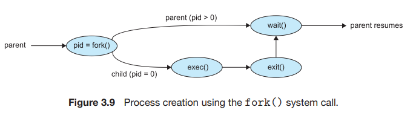

## 프로세스들의 연산들

- ### 부모 프로세스와 자식 프로세스

    - 프로세스는 고유 pid 를 가지고 있다.

1. 부모 프로세스 : 기존 프로세스
2. 자식 프로세스 : 기존 프로세스에서 새롭게 생성된 프로세스

#### 프로세스가 프로세스를 생성 시 존재하는 두가지 경우
- 부모 프로세스는 자식 프로세스 실행중에 같이 실행중이다.
- 부모 프로세스는 자식 프로세스 모두 종료 되기를 기다린다.

#### 새로운 프로세스의 주소 공간의 두가지 가능성
- 부모프로세스의 복제인 자식 프로세스 (같은 프로그램과 같은 데이터)
- 자식 프로세스가 새로운 프로그램을 실행

```agsl
#include <stdio.h>
#include <unistd.h>
#include <wait.h>

int main()
{
    pid_t pid;

    // 자식 프로세스 생성
    pid = fork();
    
    if(pid<0)   // 에러 발생
    {
        fprintf(stderr, "Fork Failed");
        return 1;
    }
    else if(pid==0) // 자식 프로세스인 경우
    {
        execlp("/bin/ls","ls",NULL);
    }
    else    // 부모 프로세스인 경우
    {
        wait(NULL); // 자식 프로세스가 종료될때까지 대기
        printf("Child Complete\n");
    }

    return 0;
}
```
-  fork() 함수를 호출하면 부모 프로세스는 자식 프로세스 번호를 반환받고 wait() 함수로 인하여 대기
- 자식 프로세스의 "ls" 명령어를 수행하고 부모 프로세스가 대기를 풀고 출력문을 수행 (exit() 함수는 명시해도 되지만 여기서는 숨겨서 표현)



#### 
fork 종료시 자식은 0 받고 부모는 자식의 프로세스 번호 리턴받음

