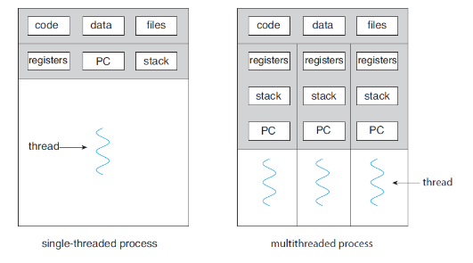
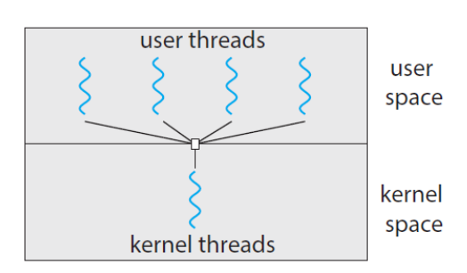
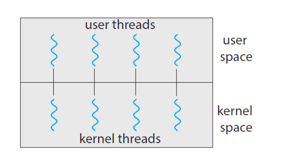
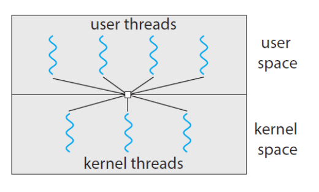

# 쓰레드 
- 한 프로세스안에서 동시에 여러 작업들을 수행할 수 있게 해주는 프로세스 안의 작은 프로세스
-  `쓰레드 ID`, `프로그램 카운터(Program Counter, PC)`, `레지스터 집합(Register Set)`, `스택(Stack)`으로 구성
- 같은 프로세스에 속한 다른 쓰레드와 `코드(code)`, `데이터(data) 영역`, `열린 파일`이나 신호와 같은 운영체제의 자원들을 공유


## 쓰레드 장점
- 응답성(Responsiveness) : 응용 프로그램이 긴 작업을 수행하더라도 프로그램의 수행이 계속되는 것을 허용함
- 자원 공유(Resource Sharing) : 본인이 속한 프로세스의 자원(code,data,files)들과 메모리를 공유가 가능
- 경제성(Economy) : 로세스 생성을 위해서 메모리와 자원을 할당하는 것은 비용이 많이 듭니다. 쓰레드는 프로세스 자원을 공유하기 때문에 쓰레드를 생성하고 문맥 교환(Context Switching)하는 것이 더 비용이 쌉니다.
- 다중 처리기 구조의 활용(Utilization of multiprocessor architectures) :  다중 CPU에서 다중 쓰레딩을 수행하면 병렬성이 증가

## 다중 쓰레드 모델

### 사용자 쓰레드와 커널 쓰레드의 관계
- 사용자 쓰레드는 커널 위에서 지원되며 커널의 개입 없이 관리
- 커널 쓰레드는 운영체제에 의해 직접 지원되고 관리

### 사용자 쓰레드와 커널 쓰레드 간에는 연관 관계
- 다대일 모델(Many-to-One Model)
  - 여러개의 사용자 수준 쓰레드를 하나의 커널 쓰레드에 매핑
  - 하나의 사용자 쓰레드가 블록되면 전체 프로세스가 봉쇄됨
  - 다중 쓰레드가 다중 처리기에서 수행되도 병렬로 작동 불가능
  
 <br>
  
  
- 일대일 모델(One-to-One Model)
  - 각각의 사용자 쓰레드가 각각의 커널 쓰레드에 매핑
  - 하나의 쓰레드가 블록되어도 다른 쓰레드가 수행 가능하기 때문에 많은 병렬성 제공
  - 다중 처리기에서 다중 쓰레드가 병렬로 수행되는 것을 허용
  - 단점 : 사용자 쓰레드를 생성할 때 커널 쓰레드도 생성되기 때문에 응용 프로그램의 성능이 저하됨


- 다대다 모델(Many-to-Many Model)
  - 여러 개의 사용자 수준 쓰레드를 그보다 작거나 같은 수의 커널 쓰레드로 매핑함
  - 하나의 사용자 쓰레드가 블록되어도 다른 사용자 쓰레드를 실행 시킬수 있음 (병렬성)
  - 개발자가 필요한 만큼의 사용자 쓰레드를 생성할 수 있음
  - 


- 다대다 모델의 변형, 두 수준 모델(Two-Level Model)
  - 두 수준 모델은 다대다 모델의 변형으로 많은 사용자 쓰레드를 적거나 같은 수의 커널 쓰레드로 매핑시키는 것을 유지하지만 하나의 사용자 쓰레드가 하나의 커널 쓰레드에 종속되도록 합니다

<br>
<br>

## 쓰레드 라이브러리
- 커널 지원없이 사용자 공간에서만 라이브러리를 제공
- 운영체제에 의해 지원되는 커널 수준 라이브러리를 구현

### POSIX Pthread
- Solaris, Linux, Mac OS 및 Tru64 UUNIX를 포함한 많은 시스템들이 Pthread 명세를 구현
```agsl
// the data shared by the threads
int sum;

// thread call this function
// java api에서는 run method
void * runner(void* param);

int main(int argc, char* argv[])
{
    pthread_t tid; // thread identifier
    pthread_attr_t attr;    // thread attributes

    if(argc!=2)
    {
        fprintf(stderr, "usage: a.out <integer value>\n");
        return -1;
    }
    if(atoi(argv[1])<0)
    {
        fprintf(stderr,"%d must be >= 0\n",atoi(argv[1]));
        return -1;
    }

    pthread_attr_init(&attr);    // attr 초기화
    pthread_create(&tid, &attr, runner, argv[1]);   // 쓰레드 생성
    pthread_join(tid, NULL);    // tid 쓰레드 대기

    printf("sum = %d\n", sum);
}

void *runner(void* param)
{
    int i, upper = atoi(param);
    sum = 0;
    for(i=0; i<=upper; i++)
    {
        sum += i;
    }
    pthread_exit(0);
}
```

- pthread_t tid : 생성할 쓰레드를 위한 식별자 선언, 각각의 쓰레드는 스택의 크기와 스케줄링 정보를 포함한 속성의 집합을 소유
- pthread_attr_t attr : 쓰레드를 위한 속성을 나타냄
- pthread_attr_init(&attr) : attr이 가리키는 주소에 속성을 지정함, 여기서 default 속성을 지정함
- pthread_create(&tid, &attr, runner, argv[1]) : 식별자, 속성, 실행할 함수, 실행할 함수의 매개변수를 지정하여 쓰레드를 생성함

### Java 쓰레드
- Thread 클래스를 상속받아 run() 메서드를 오버라이드 하는 방법
- Runnable 인터페이스를 구현하는 클래스를 정의하고 run 메서드를 구현하는 방법
```agsl
public class MyThread1 extends Thread{

	@Override
	public void run() {
		try 
		{
			while(true)
			{
				System.out.println("Hello, Thread!");
				Thread.sleep(500);
			}
		}
		catch(InterruptedException ie) {
			System.out.println("I'm interruptedException");
		}
	}
	
	public static void main(String[] args)
	{
		MyThread1 thread = new MyThread1();
		thread.start();
		System.out.println("Hello, my child");
	}
	
}
```

#### JVM(Java Virtual Machine)과 호스트 운영체제
- JVM에서 관리하는 Java 쓰레드 라이브러리로 생성한 쓰레드들은 각 운영체제에서 사용하는 다중 쓰레드 모델에 맞추어서 매핑되도록 수행합니다
- ava 프로그램이 JVM을 지원하는 어떠한 플랫폼에서도 작동할 수 있도록 하는 일관되고 추상적인 환경을 제공

## 쓰레드 이슈
- 다중 쓰레드 프로그램을 사용할때 고려해야할 점
### 1. 쓰레드의 fork() 및 exec() 시스템 콜 호출
- 다중 쓰레드 프로세스의 환경에서 한 쓰레드가 `fork()`를 수행하면
  1. 부모 프로세스가 사용하는 모든 쓰레드를 복사함
  2. 부모 프로세스에서 fork()를 호출한 쓰레드만 복사함
  - 응용프로그램에게 달려 있음
-  `exec()` 시스템 콜을 호출하면 별도의 프로세스 공간을 생성하지 않고 exec()의 매개변수로 지정한 프로세스로 대체
- exec() 실행의 결과로 생성되는 새로운 프로세스는 없고, exec()를 호출한 프로세스의 PID가 그대로 새로운 프로세스에 적용이 되며, exec()를 호출한 프로세스는 새로운 프로세스에 의해 덮어 쓰여지게 됩니다.
  

#### 만약 어떤 프로세스안의 쓰레드가 fork()를 호출한 다음 exec()를 호출한다면 어떻게 설계하는게 좋은가?
1. case 1 : 부모 프로세스가 사용하는 모든 쓰레드를 복사함
   - 결과 : 모든 쓰레드를 복사하고 exec() 호출하여 새로운 프로세스로 대체됨
2. case 2 : 부모 프로세스에서 fork()를 호출한 쓰레드만 복사함
   - 결과 : fork()를 호출한 쓰레드만 복사된 다음 exec()를 호출하여 새로운 프로세스로 대체됨

-  fork()할때 부모 프로세스의 모든 쓰레드를 복사할지 말지에 대해서 고려해야 합니다

### 2. 쓰레드 취소
- 쓰레드가 끝나기 전에 그것을 강제 종료시키는 행위
- 취소되어야 할 쓰레드를 `목적 쓰레드(target thread)`

- 목적 쓰레드 취소의 두가지 방식
  1. 비동기식 취소(asynchronous cancellation) : 한 쓰레드가 즉시 목적 쓰레드를 강제 종료
     - 적 쓰레드들이 갑자기 강제 종료가 된다면 할당된 자원들이 올바르게 해제되지 않을 수 있다.
     - 목적 쓰레드가 다른 쓰레드와 공유하는 자료 구조를 갱신하는 도중에 취소 요청이 올때 문제가 발생할 수 있습니다
     - 시스템 자원을 다 사용 가능한 상태로 만들지 못할 수 도 있기 때문에 목적 쓰레드의 비동기식 취소 방식은 문제가 될 수 있습니다.
  2. 지연 취소(deterred cancellation) : 목적 쓰레드가 주기적으로 자신이 강제 종료되어야 할 시기를 점검함.
     - 목적 쓰레드가 취소 에정이라고 표시하지만 실제 취소는 목적 쓰레드가 취소 여부를 결정하기 위하여 플래그를 검사한 이후에야 일어납니다
     - 쓰레드들은 자신이 취소되어도 안전하다고 판단되는 시점에 취소 여부를 검사할 수 있습니다 `취소점`

### 3. 쓰레드의 신호처리

-


