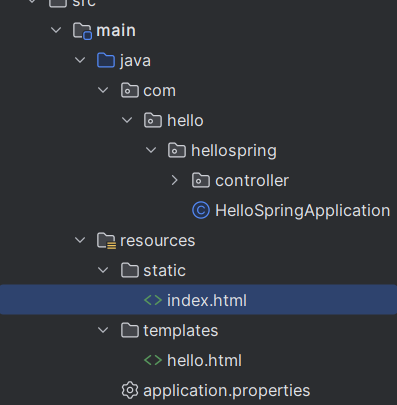
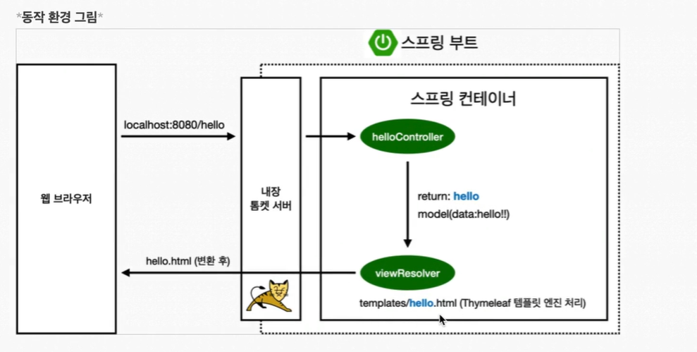
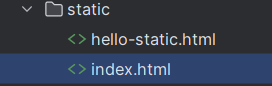
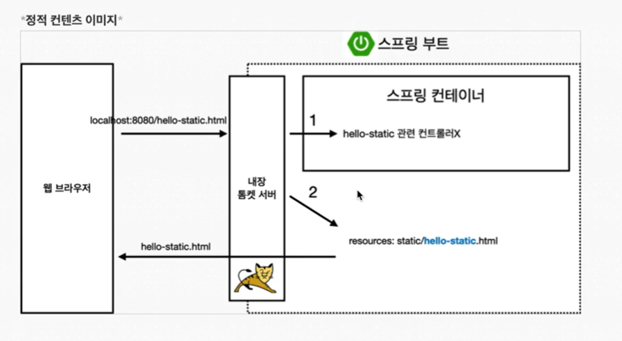
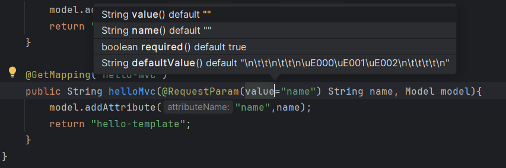
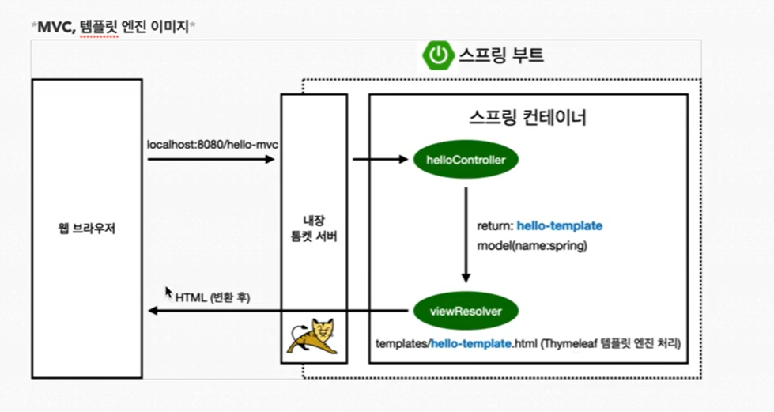
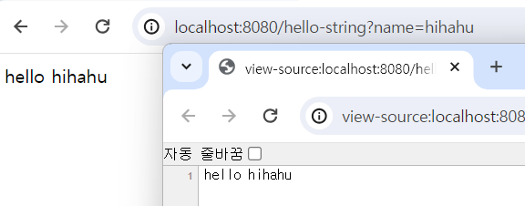
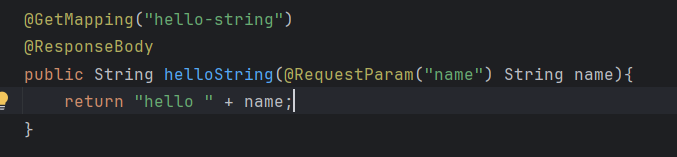
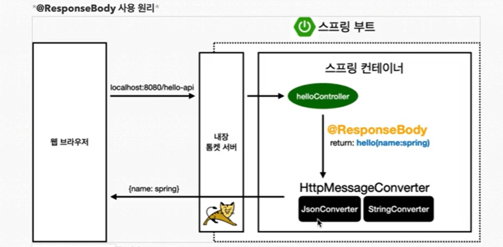

# Spring



- resource , static 에
```agsl
<!DOCTYPE HTML>
<html>
<head>
    <title>Hello</title>
    <meta http-equiv="Content-Type" content="text/html; charset=UTF-8" />
</head>
<body>
Hello
<a href="/hello">hello</a>
</body>
</html>
```


-template

```
<!DOCTYPE HTML>

<html xmlns:th="http://www.thymeleaf.org" >
<head>
    <title>Hello</title>
    <meta http-equiv="Content-Type" content="text/html; charset=UTF-8" />
</head>
<body>
<p th:text="'안녕하세요. ' + ${data}">안녕하세요. 손님</p>
</body>
</html>
```


- controller

```agsl
package com.hello.hellospring.controller;

import org.springframework.stereotype.Controller;
import org.springframework.ui.Model;
import org.springframework.web.bind.annotation.GetMapping;

@Controller
public class HelloController {
    @GetMapping("hello")
    public String hello(Model model){
        model.addAttribute("data","hello!!");
        return "hello";
    }
}

```


- hello을 controller에서 찾아본다 @hello
- return 에 맞는 html을 templates에서 찾아서 불러오고,
- 거기에 model에 맞는 키에 데이터 값을 저장해서 출력

<br>
<br>
<br>
<br>


## build

- `PS C:\Users\xioix\Desktop\java\hello-spring> ./gradlew build`
- `PS C:\Users\xioix\Desktop\java\hello-spring\build\libs> java -jar hello-spring-0.0.1-SNAPSHOT.jar`
- 이러면 서버가 8080에 켜짐
- 서버에 배포할때는 build 한 위 파일만 올려서 실행하면 된다.


<br>
<br>
<br>
<br>

- 정적 컨텐츠는 파일을 그대로 고객에게 전달
- mvc와 템플릿은 서버에서 좀 변형해서 html 제공
- API는 json 데이터포맷으로 제공

<br>
<br>

## Static Content


- static 영역에 html을 넣으면 고정 파일 볼 수 있다


<br>
<br>


- 처음에는 컨트롤러에서 찾아본다
- 없으면 static 영역에서 찾아본 후 돌려주는 것


<br>
<br>
<br>

## MVC와 템플릿 엔진

- view 는 화면 출력에만
- controller는 내부적인 계산만



- 기본이 값 요구라서


- 이렇게 name에 값을 줘야 작동한다.
- required = false 로하면 안줘도 실행은된다.


- mvc는 파일변환을 이렇게 작동
- viewresolver에게 return 값을 찾아보라고 해서 template를 검색함
<br>
<br>

## API 방식



- return 값만을 네트워크로 전달하는 방식
- http body에 값만 채워서 보낸다.

```agsl
@GetMapping("hello-api")
    @ResponseBody
    public Hello helloApi(@RequestParam("name") String name){
        Hello hello = new Hello();
        hello.setName(name);
        return hello;
    }
    //  JSON 형식으로 데이터를 return 해준다.
    static class Hello {
        private String name;

        public String getName() {
            return name;
        }

        public void setName(String name) {
            this.name = name;
        }
    }
```

- 객체는 json으로 데이터를 만들어서 보내는 것

- @ResponseBody 면 우선 다르게 작동함
- 객체냐 아니냐에 따라 converter 정해서 데이터를 바꿔줌


## 어노테이션 (Component)
- spring 에서는 service, controller, repostitory (애네들은 이미 내부적으로 @component를 가지고 있다)를 어노테이션 해주면
- 스프링 컨테이너에서 처음에 저장관리해준다.
- 스프링 컨테이너에 스프링 빈을 등록한다라 고 하며, 싱글톤으로 등록한다.

### Dependency Injection
- 서로 연결하는 부분에는 @Autowired 어노테이션을 추가해준다
- 스프링 내부에 있는 memberservice를 가져와서 연결해줌
- 스프링 빈끼리의 의존관계를 표현


### 컨포넌트 스캔
- @컨포넌트 애들을 스프링에서 시작할떄 컨테이너에 등록
- autowired를 통해 서로 연결관계를 자동 의존관계 설정해주는 것
<br>
<br>

## 자바코드로 직접 스프링 빈 등록하기
```agsl
@Configuration
public class SpringConfig {

    @Bean
    public MemberService memberService(){
        return new MemberService(memberRepository());
    }

    @Bean
    public MemberRepository memberRepository(){
        return new MemoryMemberRepository();
    }
}
```

- config 클래스에서 @Configuration 어노테이션으로 하나씩 이어준다
- controller는 config말고 어노테이션으로 처리하는게 좋다
- 위에 memberservice 생성시에 memberRepository 하는 걸로 @autowired 역할을 할 수 있다
- 나중에 memberRepository 쪽에 내부에 DB 연동 파일로 바꾼다고 할 때 편리하게 바꿀 수 있다.
- 바꿔야 할 부분은 인터페이스로 구현해서 이렇게 등록하면 편리하다
- 어노테이션으로 바꾼 것은 수정때 직접 다 바꿔야해서 번거로울 수 있다.


## db 연결 설정
```agsl
spring.datasource.url=jdbc:mysql://localhost:3306/testdb
spring.datasource.username=root
spring.datasource.password=0000
spring.datasource.driver-class-name=com.mysql.cj.jdbc.Driver

```
- resources 에 있는 application 에 작성할 것

```agsl

	implementation 'org.springframework.boot:spring-boot-starter-jdbc'
	implementation 'mysql:mysql-connector-java'

```

build gradle 에 두줄 추가하고 refresh 해서 새로 빌드


## 프론트와 백엔드 이유
### Node.js와 스프링 부트를 같이 사용하는 경우
- 프론트엔드 및 API 게이트웨이: Node.js는 주로 프론트엔드 서버나 API 게이트웨이 역할을 하여, 사용자의 요청을 받고 적절한 백엔드 서비스로 라우팅하는 데 사용될 수 있습니다. Node.js는 비동기 I/O를 통해 높은 수준의 동시성을 처리할 수 있으므로, 트래픽이 많은 웹 애플리케이션의 프론트엔드에 적합합니다.
- 백엔드 서비스: 스프링 부트는 강력한 타입 시스템과 다양한 엔터프라이즈 레벨의 기능을 제공하는 자바 기반의 프레임워크입니다. 데이터 처리, 복잡한 비즈니스 로직 구현, 트랜잭션 관리 등 백엔드 서비스에 주로 사용됩니다.
서버 운영 방식
- 독립적인 서버로 운영: 각 서비스(예: Node.js로 구현된 프론트엔드 서버, 스프링 부트로 구현된 백엔드 서비스)는 독립적으로 실행됩니다. 이들 서비스는 REST API, gRPC, 메시지 큐 등을 통해 서로 통신할 수 있습니다


